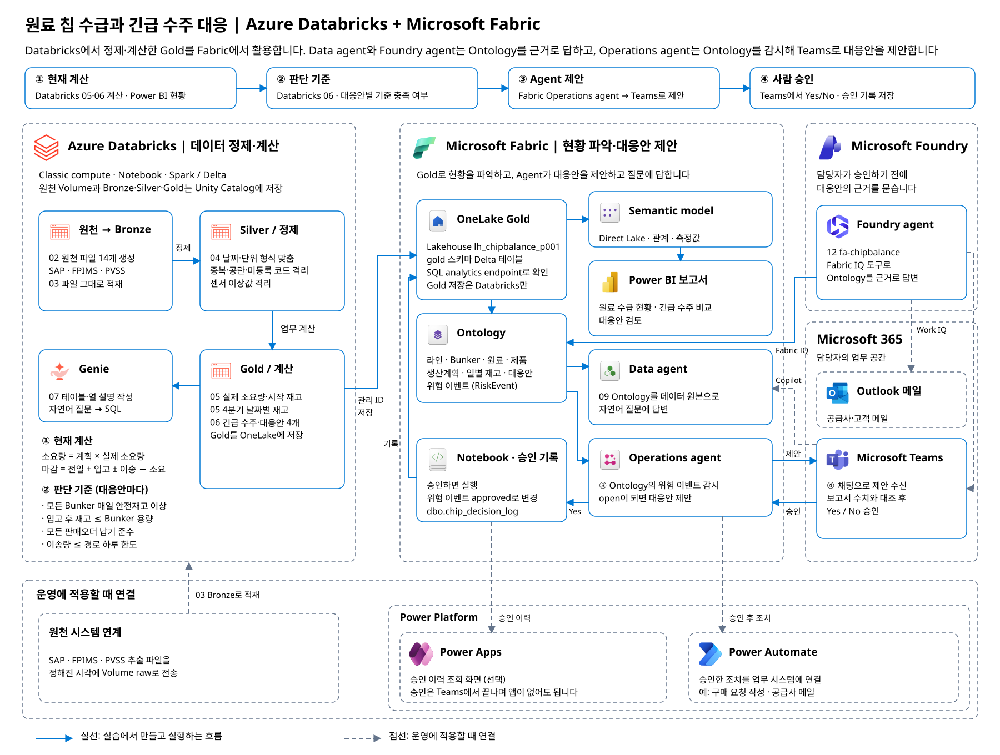

Workshop: 원료 칩 수급과 긴급 수주 대응
============================================================

필름 공장의 원료 칩 재고와 긴급 수주 대응을 주제로 한 hands-on Workshop입니다.

* **Azure Databricks:** SAP·FPIMS·PVSS 원천 파일을 만들고 메달리온 아키텍처(Bronze → Silver → Gold)로 정제·계산합니다. Gold는 Microsoft Fabric OneLake에 저장합니다(인증 방식: Managed Identity). Genie Code를 통해 Unity Catalog에 테이블·열 설명을 넣습니다. Genie agent 에게 다양한 질문들을 합니다.
* **Microsoft Fabric:** Gold로 Fabric IQ Ontology와 Power BI 보고서를 만들어 원료 수급 현황과 부족 지점을 파악합니다. data agent가 Ontology를 근거로 질문에 답합니다.
* **의사결정:** Fabric Operations agent가 Eventhouse에 들어온 위험 이벤트를 감시해 대응안을 Microsoft Teams로 제안하고, 담당자가 Teams에서 승인하면 Notebook이 승인 기록을 남깁니다.
* **Microsoft Foundry:** Foundry agent에 Fabric IQ 도구로 Ontology를 연결해, 담당자가 승인하기 전에 대응안의 근거를 묻습니다.

전체 구성
------------

gy의 위험 이벤트를 감시해 Microsoft Teams로 대응안을 제안하고, 담당자가 승인하면 Notebook이 승인 기록을 남깁니다. Microsoft Foundry의 Foundry agent는 Fabric IQ 도구로 Ontology를 읽어 대응안의 근거를 답하고, Work IQ 도구를 붙이면 Teams·Outlook 메일의 업무 맥락도 함께 봅니다(점선). Microsoft 365 Copilot·Cowork는 기본으로 들어 있는 Work IQ에 Fabric IQ 플러그인을 더해 Ontology를 함께 활용하고, Data agent는 Agent Store에 게시해 Teams에서 대화할 수 있습니다(점선).
   :width: 1000

`그림 크게 보기 <assets/architecture.png>`_

09장은 Ontology agent로, 11장은 Eventhouse ``eh_chipbalance``\ 를 거쳐 구성도와 같은 흐름을 실습합니다. 점선의 연결은 운영에 적용할 때 붙입니다. Foundry agent에 Work IQ 도구를 붙여 Teams·Outlook 메일의 업무 맥락을 함께 묻는 연결, Microsoft 365 Copilot·Cowork(기본으로 들어 있는 Work IQ에 Fabric IQ 플러그인을 더해 Ontology를 함께 활용), Data agent를 Microsoft 365 Copilot의 Agent Store에 게시해 Teams에서 대화하는 연결입니다.

실선은 실습에서 만들고 실행하는 흐름입니다. 점선의 원천 시스템 연계, Power Apps, Power Automate는 운영에 적용할 때 연결합니다. 승인은 Teams에서 끝나므로 Power Apps가 없어도 됩니다.

실습 순서
------------

* `00. 시나리오와 실습 순서 <docs/00-scenario.rst>`_ — 업무 상황, 원천 데이터, 계산 방식을 확인하고 실습 파일을 내려받습니다.
* `01. Databricks 접속과 설정 <docs/01-connect.rst>`_ — Notebook을 가져와 Serverless에서 실행하고, OneLake 연결을 확인합니다(인증 방식: Managed Identity).
* `02. 원천 데이터 만들기 <docs/02-source-data.rst>`_ — Notebook으로 SAP·FPIMS·PVSS 원천 파일 14개를 만들고, 원료·Bunker·생산계획의 관계를 확인합니다.
* `03. Bronze <docs/03-bronze.rst>`_ — 원천 파일을 그대로 Bronze 테이블로 적재합니다.
* `04. Silver <docs/04-silver.rst>`_ — 형식·단위를 맞추고 중복·공란·미등록 코드·센서 이상값을 격리합니다.
* `05. Gold와 OneLake <docs/05-gold-onelake.rst>`_ — 실제 소요량과 4분기 날짜별 재고를 계산해 Fabric Lakehouse에 저장합니다.
* `06. 긴급 수주와 대응안 <docs/06-emergency-order.rst>`_ — 긴급 수주를 반영하고, 대응안 4개를 판단 기준으로 확인해 추천안을 정합니다.
* `07. Unity Catalog 설명과 Genie <docs/07-genie.rst>`_ — Genie Code로 테이블·열 설명을 넣고, Genie에 한국어로 질문해 정답과 비교합니다.
* `08. Ontology <docs/08-ontology.rst>`_ — Ontology agent 프롬프트로 라인·Bunker·원료·생산계획의 관계를 만들고 점검한 뒤 Graph를 만듭니다.
* `09. Ontology agent에 질문하기 <docs/09-ontology-agent.rst>`_ — 업무 규칙을 Ontology 설명에 넣고, Genie와 같은 질문을 Ontology agent에 해 정답과 비교합니다.
* `10. Power BI 보고서 <docs/10-power-bi.rst>`_ — Direct Lake semantic model에 관계와 측정값을 넣고, 원료 수급 현황과 긴급 수주 대응안 보고서를 만듭니다.
* `11. Operations agent <docs/11-operations-agent.rst>`_ — Eventhouse에 위험 이벤트를 보내면 Operations agent가 대응안을 Teams로 제안하고, 승인하면 Notebook이 승인 기록을 남깁니다.
* `12. Foundry agent <docs/12-foundry-agent.rst>`_ — Microsoft Foundry 에이전트에 Fabric IQ 도구로 Ontology를 연결하고, 대응안의 근거 수치를 묻습니다.
* `13. 마무리 <docs/13-finish.rst>`_ — 만든 결과를 확인하고, 에이전트를 멈추고 용량을 정리합니다.

실습 파일
------------

``notebooks/ChipBalance.zip``\ 은 Databricks로 한 번에 가져오는 Notebook 8개입니다. 같은 내용을 ``notebooks/*.ipynb``\ 로도 볼 수 있습니다.
원천 데이터는 02장에서 Notebook을 실행해 만듭니다.
``fabric`` 폴더에는 10장의 semantic model 스크립트(``sm_chipbalance.tmdl``)와 보고서 테마(``chipbalance-theme.json``), 11장의 승인 기록 Notebook(``nb_record_decision.ipynb``)이 있습니다.

관리자에게 받을 값은 Databricks 주소와 참가자 번호(예: ``p001``)입니다.

관리자용
-----------

* `관리자 준비 가이드 <admin/README.rst>`_ — 환경 준비와 종료 후 정리 방법입니다. 참가자는 보지 않아도 됩니다.
* `데이터 설계 <admin/data-design.rst>`_ — 원천·Silver·Gold 테이블 구조, 계산 규칙, 예상 결과입니다.
* `구성도 아이콘 출처 <assets/icon-attribution.rst>`_ — 구성도에 쓴 공식 아이콘과 그림을 다시 만드는 방법입니다.
