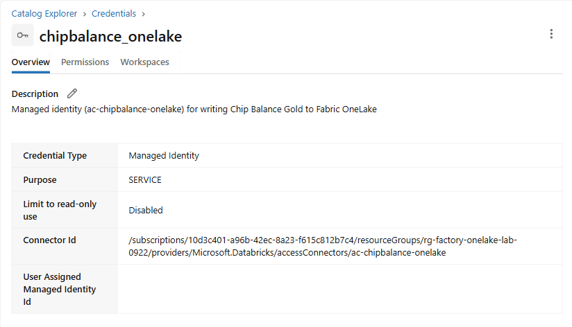
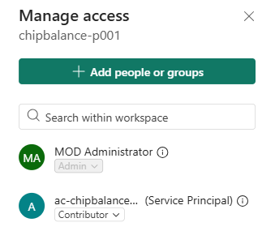

# 관리자 준비 가이드

[목차](../README.md)

Workshop 환경을 준비하고 정리하는 관리자용 문서입니다. 참가자는 이 문서를 보지 않아도 됩니다. 예시는 참가자 `p001` 기준입니다. 참가자마다 `pNNN` 부분을 바꿔 반복합니다. 데이터 구조와 예상 결과는 [데이터 설계](data-design.md)에 있습니다.

## 준비할 리소스

| 리소스 | 값 |
|----|----|
| Azure Databricks | Premium workspace, Unity Catalog 사용 |
| Unity Catalog | 참가자별 카탈로그 `lab_factory_pNNN`, 스키마 `chipbalance_pNNN`, 스키마 안의 Volume `raw` |
| Databricks Serverless | 참가자 Notebook 실행에 사용. `deltalake==1.6.6`은 `01_setup`이 Notebook 범위에 설치 |
| SQL warehouse | (선택) `chipbalance-pro` (이름), Serverless 또는 Pro, 2X-Small, 15분 자동 종료. 07장 Genie와 Catalog의 데이터 미리보기에 사용 |
| Managed Identity | Access Connector for Azure Databricks `ac-chipbalance-onelake`, Unity Catalog service credential `chipbalance_onelake_hyosung` |
| Microsoft Fabric | F 용량, 작업 영역 `chipbalance-pNNN`, Lakehouse `lh_chipbalance_pNNN` (Lakehouse schemas 켬) |
| Microsoft Teams | 참가자 계정에 Teams 라이선스, Teams 앱 **Fabric Operations Agent** 허용 (11장) |
| Microsoft Foundry | 참가자가 Foundry 리소스·프로젝트를 만들 Azure 리소스 그룹 (12장) |

## 예상 비용

실습 하루(약 7시간) 기준입니다. 참가자는 최대 10명이고, 강사 1명이 참가자 5명을 맡습니다. Sweden Central 종량제 소매가(USD, 2026년 9월 Azure 가격표) 기준이며, 계약 할인과 Microsoft 365·Power BI 라이선스 비용은 뺐습니다.

| 항목 | 계산 | 참가자 5명 (강사 1명) | 참가자 10명 (강사 2명) |
|----|----|----|----|
| Microsoft Fabric 용량 | 참가자마다 F16 하루(24시간): 16 CU × \$0.19 × 24 = \$72.96 | \$364.80 | \$729.60 |
| Databricks Serverless Notebook (DBU) | 참가자 1명이 02~07장을 실행하는 계획 비용 약 \$20. 실제 비용은 Serverless 사용 시간과 지역 단가에 따라 확인 | \$100 | \$200 |
| Databricks SQL warehouse `chipbalance-pro` | Genie·SQL·Catalog 미리보기에 사용. 아래 금액은 2X-Small Pro 기준 계획 예산이며, Serverless로 선택하면 해당 지역의 단가로 다시 계산 | \$5 | \$10 |
| Microsoft Foundry (`gpt-5` 토큰) | 12장 질문 몇 개, 참가자당 \$1 미만 | \$5 | \$10 |
| Storage (Unity Catalog, OneLake) | GB·월당 약 \$0.02 | \$1 미만 | \$1 미만 |
| **하루 합계** |  | **약 \$475** | **약 \$950** |

- Fabric 용량이 합계의 약 77%입니다. 실습이 끝나면 바로 일시 중지합니다. 일시 중지한 동안에는 용량 비용이 나오지 않습니다. 8시간만 켜면 F16 한 개가 \$24.32이므로 참가자 10명의 하루 합계는 약 \$460입니다.
- 강사 환경은 참가자 환경 하나를 함께 보는 것으로 보고 따로 더하지 않았습니다. 강사도 용량을 따로 쓰면 강사 1명당 약 \$95를 더합니다.
- 한국 중부(Korea Central)는 CU·시간당 \$0.21이라 F16 하루가 \$80.64입니다.
- Databricks 비용은 02~07장을 여러 번 다시 실행한 날의 값이라 넉넉하게 잡은 값입니다. Microsoft Defender for Cloud처럼 구독 설정에 따라 붙는 비용은 넣지 않았습니다.

위 금액은 명시한 지역·SKU·가동 시간의 계획 예시이며 현재 구독의 견적이나 성능 보장이 아닙니다. 참가자마다 F16을 만드는 것은 이 비용 예시의 배치 방식입니다. 작업 영역 여러 개를 한 용량에 할당할 수도 있으며, 동시 실행과 AI 사용량에 맞춰 관리자가 용량을 정합니다. 일시 중지해도 OneLake 저장소와 다른 Azure 리소스의 비용은 별도입니다.

## 1. Unity Catalog와 Serverless

Databricks 쪽 준비(2장의 service credential 등록, 이 장의 Catalog·스키마·Volume과 권한)는 Notebook `admin/00_admin_setup.ipynb`로 한 번에 할 수 있습니다. Databricks에서 **Import**로 가져와 설정값만 채워 실행합니다. Azure의 Access Connector와 Fabric 작업 영역·Lakehouse·Contributor 권한은 직접 만듭니다.

최초 준비에는 Notebook **1~5단계**를 순서대로 실행합니다. **6단계는 Genie를 사용할 때만** 05장의 Gold 생성 뒤에 실행하므로, 최초 준비에서 **Run all**로 선택 단계를 함께 실행하지 않습니다. Federation을 준비할 때 참가자별 Fabric 작업 영역 ID·Lakehouse ID도 실제 값으로 채웁니다.

1.  Pricing tier가 **Premium**인 Azure Databricks workspace를 Unity Catalog 메타스토어에 연결합니다.
2.  참가자의 Microsoft Entra ID 계정을 workspace에 추가합니다.
3.  SQL editor에서 Catalog, 스키마, Volume을 미리 만들고 참가자에게 사용 권한을 주는 방식을 권장합니다. 그러면 참가자는 메타스토어 수준의 생성 권한 없이 실습할 수 있습니다.

``` sql
CREATE CATALOG IF NOT EXISTS lab_factory_p001;
CREATE SCHEMA IF NOT EXISTS lab_factory_p001.chipbalance_p001
  COMMENT '원료 칩 수급 Workshop 참가자 p001: 원천 파일 Volume raw와 Bronze·Silver 테이블';
CREATE VOLUME IF NOT EXISTS lab_factory_p001.chipbalance_p001.raw;

GRANT USE CATALOG ON CATALOG lab_factory_p001 TO `p001@contoso.com`;
GRANT USE SCHEMA, CREATE TABLE, MODIFY, SELECT ON SCHEMA lab_factory_p001.chipbalance_p001 TO `p001@contoso.com`;
GRANT READ VOLUME, WRITE VOLUME ON VOLUME lab_factory_p001.chipbalance_p001.raw TO `p001@contoso.com`;
```

- Catalog 이름은 참가자 번호가 붙은 `lab_factory_pNNN`입니다. 같은 Unity Catalog 메타스토어에 연결된 Databricks workspace는 카탈로그를 공유하므로, 참가자(또는 실습 회차)마다 Catalog를 따로 두어 이름 충돌과 권한 문제를 피합니다.

- 메타스토어에 기본 저장소가 없으면 `CREATE CATALOG`에 `MANAGED LOCATION`을 지정합니다.

- Bronze·Silver 테이블은 참가자가 03~04 Notebook에서 만듭니다. Gold는 05~06 Notebook이 Unity Catalog가 아니라 Fabric Lakehouse(OneLake)에만 저장합니다.

- `01_setup`은 설정값을 검증하고 위 세 리소스에 `CREATE ... IF NOT EXISTS`를 실행합니다. 미리 만든 리소스는 바꾸지 않으며, 준비 후 `USE CATALOG`, `USE SCHEMA`, Volume 목록 조회까지 확인합니다.

- 관리자가 리소스를 미리 만들지 않고 참가자가 Notebook에서 자동 준비하게 하려면 참가자에게 누락 리소스별 생성 권한이 필요합니다.

  - Catalog가 없을 때: 메타스토어의 `CREATE CATALOG`. 메타스토어 기본 관리형 저장소가 없으면 관리자가 `MANAGED LOCATION`을 지정해 Catalog를 먼저 만드는 편이 안전합니다.
  - 스키마가 없을 때: Catalog의 `USE CATALOG`, `CREATE SCHEMA`.
  - Volume이 없을 때: Catalog의 `USE CATALOG` 및 스키마의 `USE SCHEMA`, `CREATE VOLUME`.
  - 준비 후 실습: 위 SQL 예시의 `USE CATALOG`, `USE SCHEMA`, `CREATE TABLE`, `MODIFY`, `SELECT`, `READ VOLUME`, `WRITE VOLUME`.

  생성 권한이나 메타스토어 설정이 부족하면 Notebook에서 Spark 원본 오류가 그대로 표시됩니다. 참가자에게 메타스토어 `CREATE CATALOG` 권한을 주지 않는 운영 환경에서는 위 사전 생성 흐름을 사용합니다.

참가자는 별도 Classic Compute 없이 Notebook의 기본 **Serverless**를 사용합니다.

- Unity Catalog가 켜져 있고 Notebook Serverless를 지원하는 지역인지 확인합니다. 지원 workspace에서는 Serverless가 기본 제공됩니다.
- 참가자에게 **Workspace access** entitlement를 줍니다. **Serverless compute access**라는 별도 entitlement를 만들거나 찾지 않습니다. [Serverless 요구 사항](https://learn.microsoft.com/azure/databricks/compute/serverless/)과 [entitlement 목록](https://learn.microsoft.com/azure/databricks/security/auth/entitlements)을 확인합니다.
- `01_setup` 첫 셀이 `deltalake==1.6.6`을 Notebook 범위에 설치하므로 Compute 라이브러리를 미리 설치하지 않습니다.

(선택) 07장의 Genie 확장을 쓸 때만 SQL warehouse를 하나 만들어 모든 참가자가 함께 씁니다. Genie Agent가 이 warehouse로 SQL을 실행합니다.

- **SQL Warehouses** \> **Create SQL warehouse**: 이름 `chipbalance-pro`, Type **Serverless**(네트워크 접근이 준비된 경우) 또는 **Pro**, Cluster size **2X-Small**, Auto stop 15분. 이름의 `pro`는 Type을 결정하지 않습니다.
- **Permissions**에서 참가자에게 **Can use**를 줍니다.
- 저장소에 private endpoint가 있으면 Serverless의 NCC와 private endpoint 접근을 먼저 준비합니다. 네트워크 구성이 없는 Serverless에서 접근이 실패할 수 있지만, private endpoint 저장소를 모두 지원하지 않는다는 뜻은 아닙니다. Pro를 고르는 경우에도 해당 Compute의 네트워크 접근을 확인합니다.
- Genie Code와 Genie Agent는 **Partner-powered AI features**가 켜져 있어야 합니다(계정 콘솔 **Settings** \> **Feature enablement**). 데이터 처리 지역 제한(**Enforce data processing within workspace Geography for AI features**)이 켜져 있으면 Genie Code를 쓸 수 없는 지역이 있습니다. 참가자에게는 Databricks SQL 사용 권한(**Databricks SQL access** entitlement)이 필요합니다.

(선택) 07장의 Genie는 Unity Catalog의 테이블만 읽습니다. Gold는 OneLake에만 있으므로, OneLake Lakehouse를 **Foreign catalog** `fabric_chipbalance_pNNN`으로 연결합니다. 복사하지 않고 읽기 전용으로 연결합니다. 이 연결은 `admin/00_admin_setup` Notebook의 6단계가 만듭니다. 05장에서 Gold를 만든 뒤에 실행하고, 06장까지 완료했을 때 `gold`에 21개 테이블이 있는지 SQL로 확인합니다.

- Fabric 테넌트 설정 3개를 켭니다: **Service principals can call Fabric public APIs**, **Users can access data stored in OneLake with apps external to Fabric**, **Use short-lived user-delegated SAS tokens**.
- 작업 영역 `chipbalance-pNNN`의 **Workspace settings** \> **Delegated Settings** \> **OneLake settings**에서 **Authenticate with OneLake user-delegated SAS tokens**를 켭니다.
- 2장의 Access Connector를 작업 영역의 **Contributor**로 추가합니다.
- Notebook 설정값에 참가자별 Fabric 작업 영역 ID와 Lakehouse ID(Lakehouse 주소 `.../lakehouses/<Lakehouse ID>`)를 넣습니다.
- 6단계가 storage credential(service credential과 다른 종류), 참가자별 Connection, Foreign catalog를 만들고 참가자에게 `USE CATALOG`, `USE SCHEMA`, `SELECT`를 줍니다. Connection은 만든 뒤 작업 영역을 바꿀 수 없어 참가자마다 따로 만듭니다.
- 관리자는 storage credential·Connection·Foreign catalog 생성과 권한 부여 권한이 있어야 합니다. 기존 객체의 Access Connector·작업 영역·Lakehouse가 설정값과 다르면 Notebook은 오류로 멈춥니다. 올바른 설정값·권한을 확인하고 다시 실행하며, 다른 참가자의 객체를 삭제하지 않습니다.
- OneLake Federation용 SQL warehouse는 **2025.40 이상**이어야 합니다. Classic Compute로 이 연결을 조회할 때는 **Databricks Runtime 18.0 이상, Standard access mode**가 필요합니다. Notebook Serverless는 버전 번호를 직접 선택하지 않습니다. 최신 [OneLake Federation 요구 사항](https://learn.microsoft.com/azure/databricks/query-federation/onelake)을 확인합니다.

## 2. Managed Identity와 service credential

Databricks는 Managed Identity로 OneLake에 Gold를 씁니다. 비밀번호나 client secret을 만들지 않습니다.

1.  Azure portal에서 **Access Connector for Azure Databricks**를 만듭니다.

    - 이름: `ac-chipbalance-onelake`, 지역: Databricks workspace와 같은 지역
    - **Managed identity**: System-assigned (기본값)

2.  Databricks **Catalog** \> **External data** \> **Credentials** \> **Create credential**을 누릅니다.

    - Credential type: **Service credential**
    - Credential name: `chipbalance_onelake_hyosung`
    - Access connector ID: Access Connector의 Resource ID (`/subscriptions/…/providers/Microsoft.Databricks/accessConnectors/ac-chipbalance-onelake`)

    **예상 결과:** `chipbalance_onelake_hyosung`의 **Overview**에 Credential Type **Managed Identity**, Purpose **SERVICE**와 Access Connector의 Resource ID가 보입니다.

    

3.  참가자에게 service credential 사용 권한을 줍니다.

    ``` sql
    GRANT ACCESS ON SERVICE CREDENTIAL `chipbalance_onelake_hyosung` TO `p001@contoso.com`;
    ```

    credential을 만든 소유자는 GRANT 없이 쓸 수 있습니다. 부여한 권한은 **Permissions** 탭에서 확인합니다.

4.  Fabric 작업 영역의 **Manage access**에서 `ac-chipbalance-onelake`를 검색해 **Contributor**로 추가합니다. Access Connector의 Managed Identity가 이 이름으로 보입니다.

    **예상 결과:** 목록에 `ac-chipbalance-onelake` (Service Principal)가 **Contributor**로 보입니다.

    

- service credential 하나를 모든 참가자가 함께 쓰면, 이 Managed Identity가 Contributor로 추가된 모든 작업 영역에 쓸 수 있습니다. 참가자별로 권한을 나누려면 참가자마다 Access Connector와 service credential을 따로 만듭니다.
- Notebook은 `dbutils.credentials.getServiceCredentialsProvider("chipbalance_onelake_hyosung")`로 토큰을 받습니다. Databricks Runtime 16.2 이상이 필요합니다.

## 3. Microsoft Fabric

1.  Fabric 용량을 만듭니다. **01~13장 전체 실습은 활성 유료 Fabric 용량에 작업 영역을 할당한 상태**를 전제로 합니다. AI 기능을 포함한 최소 SKU는 F2이며, 위 비용 예시는 참가자마다 F16을 사용하는 배치입니다. F2는 기능을 쓸 최소 SKU이지 동시 참가자 수를 보장하는 크기가 아니므로 예상 동시 실행량에 맞춰 용량을 준비합니다.
2.  참가자마다 작업 영역 `chipbalance-p001`을 만들고 위 용량에 할당합니다.
3.  작업 영역의 **Manage access**에서 참가자를 **Contributor**로 추가합니다.
4.  **New item** \> **Lakehouse**에서 `lh_chipbalance_p001`을 만듭니다. **Lakehouse schemas** 옵션을 켭니다.

참가자는 Power BI 보고서를 만들므로 Power BI 사용자 라이선스(Pro 등)가 필요합니다.

**Admin portal** \> **Tenant settings**에서 아래 설정을 켭니다. 위쪽 검색 창에서 키워드로 찾으면 빠릅니다.

| 설정 | 필요한 이유 |
|----|----|
| Users can access data stored in OneLake with apps external to Fabric | Databricks가 OneLake에 Gold 저장 |
| Service principals can call Fabric public APIs | Managed Identity가 Fabric 작업 영역 권한으로 접근 |
| Users can create Fabric items | 새 Ontology 환경을 포함한 Fabric 항목 생성 |
| Users can create Ontology items | Fabric IQ Ontology |
| Users can use Copilot, AI Agents and other AI experiences powered by Azure OpenAI | Power BI Copilot(10장), Ontology agent, Operations agent |
| Data sent to Azure OpenAI can be processed / stored outside your capacity's geographic region | 해당 지역에서 필요한 Copilot·AI 기능 사용. 조직의 지역 간 데이터 처리 정책에 따라 관리자가 승인 |

설정의 표시 이름은 UI 언어와 배포 상태에 따라 다를 수 있습니다. 참가자와 Managed Identity가 허용된 보안 그룹 범위에 포함되는지 확인합니다. [Ontology 테넌트 설정](https://learn.microsoft.com/fabric/iq/ontology/overview-tenant-settings), [Copilot 요구 사항과 지역](https://learn.microsoft.com/fabric/fundamentals/copilot-fabric-overview#available-regions), [Operations agent 요구 사항](https://learn.microsoft.com/fabric/real-time-intelligence/operations-agent#prerequisites)을 기준으로 점검합니다. 용량 생성·증설 뒤 Copilot 인식에 최대 24시간이 걸릴 수 있습니다.

Teams 관리 센터의 **Teams 앱** \> **앱 관리**에서 **Fabric Operations Agent**가 차단되어 있지 않은지 확인합니다. Operations agent는 이 앱의 **Fabric operations agent** 채팅으로 참가자에게 제안을 보냅니다.

## 4. Microsoft Foundry

12장에서 참가자가 Foundry 프로젝트 `chipbalance-pNNN`과 에이전트 `fa-chipbalance`를 만들고, Fabric IQ 도구로 Ontology `ont_chipbalance`를 연결합니다.

1.  Azure 구독과 리소스 그룹을 준비합니다. Foundry 리소스는 Agent Service와 사용할 모델을 지원하는 지역에 만듭니다. 리소스 그룹의 위치와 리소스 배포 지역은 별개입니다. Fabric과 같은 지역은 데이터 배치 정책에 따른 선택이지 연결의 필수 조건은 아닙니다.
2.  참가자에게 리소스 그룹의 **Contributor** 역할을 줍니다. 참가자가 Foundry 리소스 `fdy-chipbalance-pNNN`과 프로젝트를 직접 만듭니다. 관리자가 프로젝트를 미리 만들어 두려면 참가자에게 프로젝트의 **Foundry User**와 **Foundry Project Manager** 역할을 줍니다. Fabric IQ 연결을 만들 때 **Foundry Project Manager**가 필요합니다.
3.  `gpt-5` 등 Fabric IQ/MCP를 지원하는 모델의 배포 가용성과 구독 할당량을 확인합니다. 새 에이전트 화면의 기본 모델·자동 배포는 환경마다 다를 수 있으므로, 생성 뒤 연결된 모델 배포를 확인합니다.
4.  Fabric IQ 도구의 **managed OAuth** 또는 **BYO Microsoft Entra** 인증 경로를 준비합니다. 같은 계정으로 로그인한 것만으로 OAuth 연결·동의가 모두 준비되지는 않습니다. 최초 인증과 조직 동의 정책은 [Fabric IQ 인증·권한 요구 사항](https://learn.microsoft.com/azure/foundry/agents/how-to/tools/fabric-iq#authentication-and-security)에 따릅니다.

- Fabric IQ 도구는 로그인한 참가자의 Fabric 권한으로 Ontology를 읽습니다. 참가자는 작업 영역 `chipbalance-pNNN`의 **Contributor**이면 됩니다.
- Fabric IQ 도구가 Ontology에 주는 기능은 `ask_ontology`(질문을 Ontology에 넘겨 연결된 데이터로 답), `list_ontology_entities`, `list_ontology_rules`입니다. 12장 에이전트는 `ask_ontology`로 `OPT-2`를 반영한 BNK-L1-2의 최저 기말재고 같은 값을 답합니다. Ontology 엔드포인트의 도구 목록은 `https://api.fabric.microsoft.com/v1/mcp/dataPlane/workspaces/<작업 영역 ID>/items/<Ontology ID>/ontologyEndpoint`에 MCP `tools/list`를 보내 확인할 수 있습니다.
- 모델 토큰 비용 외에 Fabric IQ 도구가 실행하는 Fabric 쿼리·AI·Graph 사용량은 Fabric 용량을 소비합니다. Application Insights를 연결하면 수집·보관 비용도 별도입니다. 즉시 대화 실행 내역과 지속 저장되는 추적은 구분합니다.
- Work IQ의 조건은 연결 경로에 따라 다릅니다. API(A2A/REST/MCP)는 Copilot Credits 과금이고, 커넥터 기반 도구는 해당 커넥터가 Microsoft 365 Copilot 사용자 라이선스 등을 요구할 수 있습니다. [Work IQ 요구 사항](https://learn.microsoft.com/azure/foundry/agents/how-to/tools/work-iq#prerequisites)을 확인합니다. 12장에서는 추가 화면만 확인하고 취소합니다.

## 5. 네트워크

Databricks Serverless 환경에서 아래 주소로 HTTPS(443) 연결이 되어야 합니다.

- `onelake.dfs.fabric.microsoft.com`: Gold 저장
- `pypi.org`, `files.pythonhosted.org`: `01_setup` 첫 셀에서 `deltalake` 설치
- `login.microsoftonline.com`: Microsoft Entra 토큰 발급. 서비스별 연결에는 Fabric API·Kusto 엔드포인트 접근도 필요합니다.

Unity Catalog 저장소를 private endpoint로 연결했다면 Serverless가 저장소에 접근할 수 있도록 Network Connectivity Configuration(NCC)과 private endpoint를 구성합니다.

## 6. 참가자에게 알려 줄 값

- Databricks 주소 (예: `https://adb-<번호>.<번호>.azuredatabricks.net`)
- 참가자 번호(예: `p001`)
- GitHub 저장소 접근 권한 또는 저장소 ZIP 파일
- Foundry 프로젝트를 만들 구독과 리소스 그룹 (12장)

Unity Catalog 스키마와 Fabric 작업 영역·Lakehouse 이름은 참가자 번호로 정합니다. Service credential은 이 가이드에서 `chipbalance_onelake_hyosung`으로 고정한 공용 이름이며 참가자 번호로 생성되지 않습니다. 다른 이름이나 참가자별 credential을 준비했다면 `01_setup`의 `service_credential`에 넣을 값을 별도로 알려 줍니다.

전체 진행 전, 관리자 계정뿐 아니라 참가자 계정으로도 `01_setup` 실행과 OneLake 연결을 확인합니다. 06장 뒤 Gold 21개 테이블, 07장 정답 6개, 10장 모델 작성 권한, 11장 KQL 생성·Notebook 실행 권한, 12장 OAuth 동의·모델 배포까지 각 장의 조건을 확인합니다.

## 7. 종료 후 정리

1.  SQL warehouse `chipbalance-pro`를 **Stop**합니다. Serverless Notebook은 별도로 종료할 Compute가 없습니다.

2.  참가자마다 Operations agent `oa_chipbalance`가 **Stop** 상태인지 확인합니다. 시작 상태면 5분마다 조회하며 용량을 씁니다.

3.  (선택) 실습 데이터를 지웁니다. Fabric 항목은 용량을 일시 중지하기 전에 지웁니다.

    - Unity Catalog Catalog `lab_factory_pNNN`, 스키마 `chipbalance_pNNN`과 Volume `raw`
    - Genie 선택 단계를 만들었다면 Foreign catalog `fabric_chipbalance_pNNN`, Connection `onelake_connection_pNNN`. 다른 소비자가 없는지 확인한 뒤 해당 참가자의 객체만 지웁니다.
    - Fabric 작업 영역 `chipbalance-pNNN`: `oa_chipbalance`, `nb_record_decision`, `eh_chipbalance`, `rpt_chipbalance`, `sm_chipbalance`, `ont_chipbalance`(자동으로 만들어진 `ont_chipbalance_eh_…`, `ont_chipbalance_graph_…` 포함), `lh_chipbalance_pNNN`. 작업 영역을 지우면 한 번에 지워집니다.
    - Foundry: Azure portal의 리소스 그룹에서 Foundry 리소스 `fdy-chipbalance-pNNN`을 삭제합니다. 프로젝트, 에이전트 `fa-chipbalance`, 모델 배포, Fabric IQ 연결이 함께 지워집니다. 같은 이름으로 다시 만들려면 Azure portal에서 삭제된 Foundry 리소스를 제거(purge)합니다.

4.  Azure portal에서 Fabric 용량을 **Pause**합니다. Azure CLI로는 아래 명령을 씁니다.

    ``` powershell
    az resource invoke-action --action suspend --ids /subscriptions/<구독 ID>/resourceGroups/rg-factory-onelake-lab-0922/providers/Microsoft.Fabric/capacities/<용량 이름>
    ```

5.  Workshop 환경을 더 쓰지 않으면 Fabric 작업 영역 권한에서 `ac-chipbalance-onelake`를 뺍니다. 공용 service credential `chipbalance_onelake_hyosung`, Federation용 storage credential과 Access Connector는 모든 참가자의 Connection·사용 의존성이 없어졌을 때만 삭제합니다.

## 8. 유지보수

- Notebook 내용은 `src/notebooks/*.py`에서 고칩니다. `notebooks/*.ipynb`와 `notebooks/ChipBalance.zip`은 직접 고치지 않습니다.
- 원천 데이터는 `tools/generate_source_data.py`가 만들고, 예상 결과는 `tools/reference_pipeline.py`가 계산합니다.
- 고친 뒤 저장소 루트에서 아래 명령으로 다시 만들고 검사합니다.

``` powershell
python tools/generate_source_data.py
python tools/build_notebooks.py
python -m unittest discover tests
```

- 화면이 바뀌면 `assets/screenshots`의 같은 이름 파일을 교체합니다.

- 구성도는 `python tools/build_architecture.py`로 다시 만듭니다. 아이콘 출처는 [구성도 아이콘 출처](../assets/icon-attribution.md)에 있습니다.

- Ontology 연결 확인: 새 Ontology 환경의 `ont_chipbalance`를 Operations agent와 Data agent가 데이터 값까지 읽을 수 있게 되면 아래를 Ontology 기준으로 고칩니다. Foundry agent(12장)는 `ask_ontology`로 값을 읽습니다.

  - 09장: Ontology agent 대신 Data agent를 만들고 데이터 원본으로 `ont_chipbalance`를 연결합니다.
  - 11장: `oa_chipbalance`의 **Knowledge**를 `eh_chipbalance`에서 `ont_chipbalance`로 바꾸고, 위험 이벤트(RiskEvent)를 Ontology에서 감시합니다. Eventhouse 만들기 단계를 지우고 `nb_record_decision`은 Lakehouse에만 기록하게 고칩니다.
  - 구성도: Eventhouse 카드를 지우고, Ontology에서 Operations agent와 Data agent로 바로 잇습니다.

  확인 방법: Operations agent에서 **Knowledge**를 `ont_chipbalance`로 두고 **Generate playbook**이 성공하는지, Data agent에서 데이터 원본으로 `ont_chipbalance`를 추가할 수 있는지 봅니다.

  2026-10-02 실제 확인 결과: 두 곳 모두 아직 열리지 않았습니다.

  - Operations agent: **Generate playbook**이 "No playbook generated"로 끝나고, 에이전트는 Ontology의 스키마만 읽을 수 있다고 답합니다.
  - Data agent: `ont_chipbalance`를 추가하면 "Failed to add ontology"가 뜨고, 알림에 `Ontology support is not enabled.`가 남습니다.

  2026-10-09 Microsoft Learn 확인: Operations agent 문서(2026-09-14 갱신)는 Eventhouse 또는 Ontology를 Knowledge 원본으로 쓸 수 있다고 적고, Data agent 문서는 원본에 Ontology를 포함합니다. 이 환경에서 실제로 동작하는지는 아직 다시 확인하지 않았으므로, 위 확인 방법으로 다시 시도한 뒤 구성을 바꿉니다.
