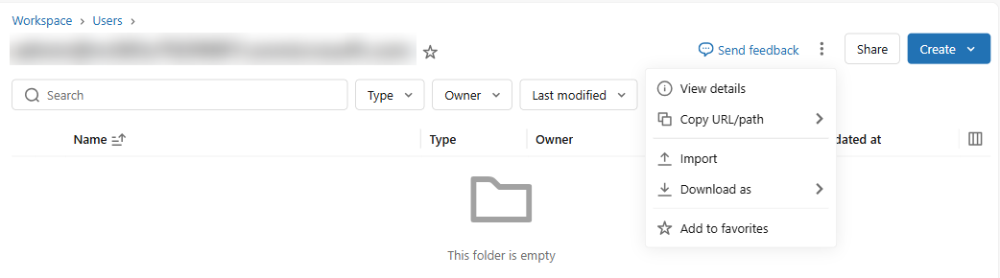
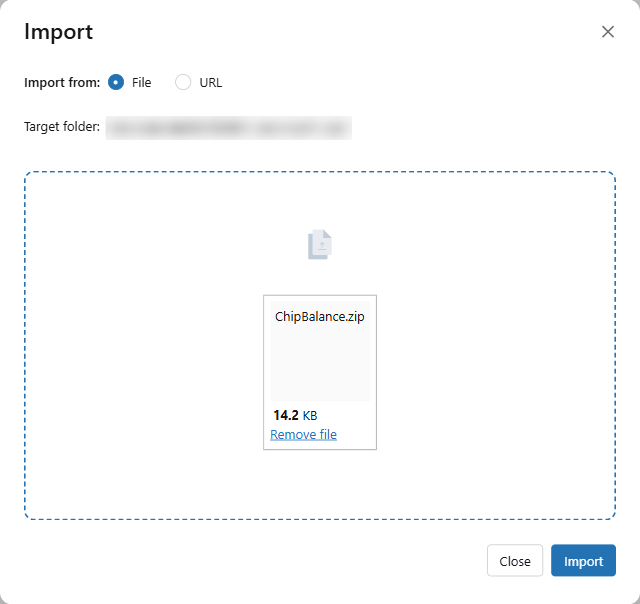
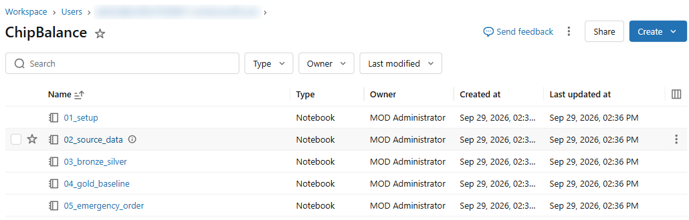
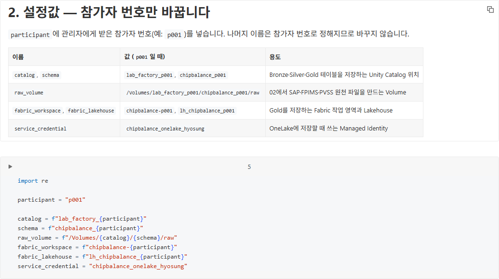
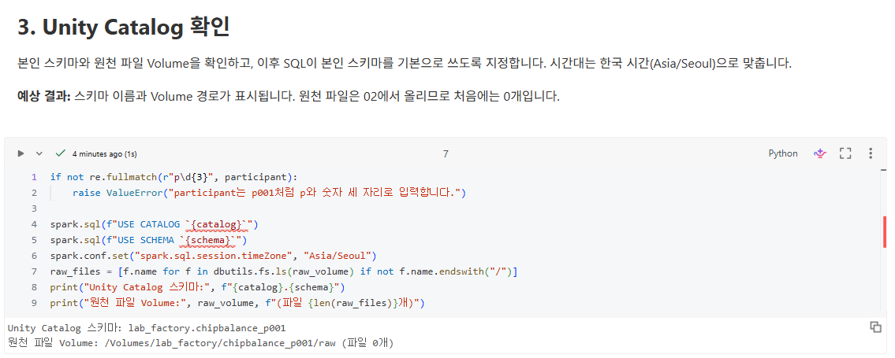
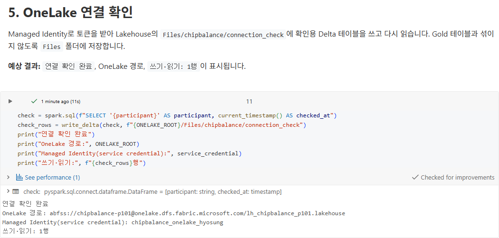
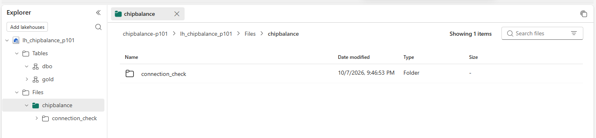

# 01. Databricks 접속과 설정

[목차](../README.md) \| 이전: [00. 시나리오와 실습 순서](00-scenario.md) \| 다음: [02. 원천 데이터 만들기](02-source-data.md)

Notebook을 Databricks로 가져오고 Serverless에 연결한 뒤, `01_setup`에 참가자 번호를 입력해 Unity Catalog와 OneLake 연결을 확인합니다. OneLake에 저장할 때는 Managed Identity를 씁니다. 비밀번호나 키는 입력하지 않습니다.

관리자에게 받을 값은 두 가지입니다.

- Databricks 주소
- 참가자 번호 (예: `p001`)

## 1. Databricks 접속

1.  관리자에게 받은 Databricks 주소를 브라우저에서 엽니다.
2.  회사 계정(Microsoft Entra ID)으로 로그인합니다.

**예상 결과:** 화면 왼쪽에 **Workspace**, **Catalog**, **Compute** 메뉴가 보입니다.

## 2. Notebook 가져오기

1.  왼쪽 메뉴에서 **Workspace**를 누릅니다. 본인 홈 폴더(이메일 이름)가 열립니다.

2.  폴더 제목 오른쪽의 **⋮** 버튼을 누르고 **Import**를 누릅니다.

    

3.  **Import** 창에서 **File**이 선택된 상태로 **browse**를 누릅니다.

4.  00장에서 압축을 푼 폴더의 `notebooks\ChipBalance.zip`을 고릅니다.

5.  **Import**를 누릅니다.

    

**예상 결과:** 오른쪽 위에 **Successful import**가 잠깐 보이고, 홈 폴더에 `ChipBalance` 폴더가 생깁니다. 폴더를 열면 Notebook 8개가 있습니다.

| Notebook | 장 | 하는 일 |
|----|----|----|
| `01_setup` | 01 | 설정값과 OneLake 저장 함수. 다른 Notebook이 첫 코드 셀 `%run ./01_setup`으로 불러옵니다. |
| `02_source_data` | 02 | SAP·FPIMS·PVSS 원천 파일 14개 만들기 |
| `03_bronze`, `04_silver`, `05_gold` | 03~05 | 메달리온 아키텍처: Bronze → Silver → Gold, Gold를 OneLake에 저장 |
| `06_emergency_order` | 06 | 긴급 수주와 대응안 계산 |
| `07_answers` | 07 | OneLake의 Gold로 질문 6개의 정답 계산 |
| `source_systems` | 02 | 원천 데이터 생성 함수. `02_source_data`가 불러오며 직접 실행하지 않습니다. |

Notebook끼리 `%run`으로 불러오므로 8개를 같은 폴더에 둡니다.

## 3. Serverless 연결

1.  `ChipBalance` 폴더에서 `01_setup`을 엽니다.
2.  오른쪽 위 Compute 목록에 **Serverless**가 선택되어 있는지 확인합니다. 다른 Compute가 선택되어 있으면 목록을 열고 **Serverless**를 고릅니다.

**예상 결과:** 오른쪽 위 Compute 목록에 **Serverless**가 표시됩니다. 처음 셀을 실행할 때 Serverless 환경이 시작되므로 잠시 기다릴 수 있습니다.

## 4. 참가자 번호 입력

**2. 설정값 — 참가자 번호만 바꿉니다** 아래 코드 셀의 첫 줄 `participant = "p001"`에서 `p001`을 본인 번호로 바꿉니다. 나머지 이름은 참가자 번호로 정해지므로 바꾸지 않습니다.

| 이름 | 값 (`p001`일 때) | 용도 |
|----|----|----|
| `catalog`, `schema` | `lab_factory_p001`, `chipbalance_p001` | Bronze·Silver 테이블 위치 (Unity Catalog). Gold는 OneLake에 저장 |
| `raw_volume` | `/Volumes/lab_factory_p001/chipbalance_p001/raw` | 02장에서 원천 파일을 만드는 곳 |
| `fabric_workspace`, `fabric_lakehouse` | `chipbalance-p001`, `lh_chipbalance_p001` | Gold를 저장하는 Fabric 작업 영역과 Lakehouse |
| `service_credential` | `chipbalance_onelake_hyosung` | OneLake에 저장할 때 쓰는 Managed Identity |

## 5. 셀 실행

맨 위 코드 셀을 누르고 **Shift+Enter**로 한 셀씩 실행합니다. 위쪽 **Run all**로 한 번에 실행해도 됩니다.

1.  **1. Serverless 준비**

    OneLake에 Delta 형식으로 저장할 때 필요한 `deltalake==1.6.6`을 Notebook 범위에 설치합니다. **예상 결과:** 설치가 완료되거나 `Requirement already satisfied`가 표시됩니다.

2.  **3. Unity Catalog 확인**

    설정값을 검증하고 Catalog `lab_factory_p001`, 스키마 `chipbalance_p001`, Volume `raw`가 없으면 `CREATE ... IF NOT EXISTS`로 준비한 뒤 실제 접근까지 확인합니다. 관리자가 리소스를 미리 만들었다면 기존 리소스를 그대로 사용합니다.

    **예상 결과:** 스키마 `lab_factory_p001.chipbalance_p001`과 Volume 경로 `/Volumes/lab_factory_p001/chipbalance_p001/raw`가 표시됩니다.

    

3.  **4. OneLake 저장 함수**

    결과는 출력되지 않습니다. 오류 없이 끝나면 됩니다. 이 셀은 05·06장에서 Gold를 저장할 함수를 만듭니다. 저장할 때마다 service credential `chipbalance_onelake_hyosung`에서 Managed Identity 토큰을 받아 씁니다.

4.  **5. OneLake 연결 확인**

    **예상 결과:** `연결 확인 완료`, OneLake 경로, `쓰기·읽기: 1행`이 표시됩니다.

    

## 6. Fabric에서 확인하기

1.  새 브라우저 탭에서 Fabric을 엽니다: <https://app.fabric.microsoft.com>
2.  왼쪽 **Workspaces**에서 작업 영역 `chipbalance-p001`을 열고, Lakehouse `lh_chipbalance_p001`을 엽니다.
3.  왼쪽 **Explorer**에서 **Files** \> `chipbalance`를 펼칩니다.

**예상 결과:** `connection_check` 폴더가 보입니다. 5번 셀이 Managed Identity로 OneLake에 쓴 결과입니다.

## Managed Identity로 저장하는 방식

- 관리자가 Azure에 Access Connector(`unity-catalog-access-connector`)를 만들었습니다. 이 리소스에는 Managed Identity가 붙어 있습니다.
- 이 Managed Identity를 Unity Catalog service credential `chipbalance_onelake_hyosung`로 등록하고, 참가자에게 사용 권한을 주었습니다.
- Fabric 작업 영역 `chipbalance-p001`에는 이 Managed Identity를 Contributor로 추가했습니다.
- Notebook은 `dbutils.credentials.getServiceCredentialsProvider`로 토큰을 받아 OneLake에 씁니다. 토큰은 화면에 표시하지 않습니다.
- 관리자가 설정한 화면은 [관리자 준비 가이드](../admin/README.md)의 "2. Managed Identity와 service credential"에 있습니다.

## Troubleshooting

- 셀을 실행할 수 없거나 Serverless 시작 오류가 나면 3단계에서 **Serverless**가 선택되어 있는지 확인합니다.
- "participant는 p001처럼 …" 오류가 나면 4단계에서 참가자 번호를 고치고 그 셀부터 다시 실행합니다.
- `CREATE CATALOG`, `CREATE SCHEMA`, `CREATE VOLUME` 오류가 나면 Spark가 표시한 원본 오류를 관리자에게 알립니다. 관리자는 리소스를 미리 만들고 접근 권한을 주거나, Notebook 자동 준비에 필요한 생성 권한과 메타스토어 기본 관리형 저장소를 확인합니다.
- `USE CATALOG`, `USE SCHEMA`, Volume 목록 조회 오류가 나면 관리자가 `USE CATALOG`, `USE SCHEMA`, `READ VOLUME`, `WRITE VOLUME` 권한을 확인합니다.
- "service credential … 사용 권한" 오류가 나면 오류 메시지를 관리자에게 알립니다.
- "deltalake 설치에 실패했습니다" 오류가 나면 **1. Serverless 준비** 셀의 설치 오류를 관리자에게 알립니다.

## 다음 단계

[02. 원천 데이터 만들기](02-source-data.md)
