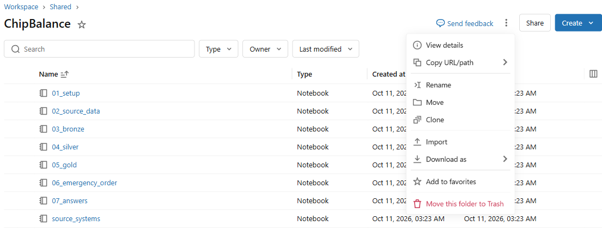
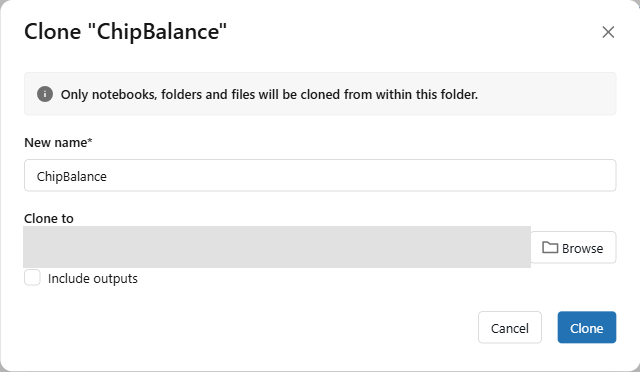
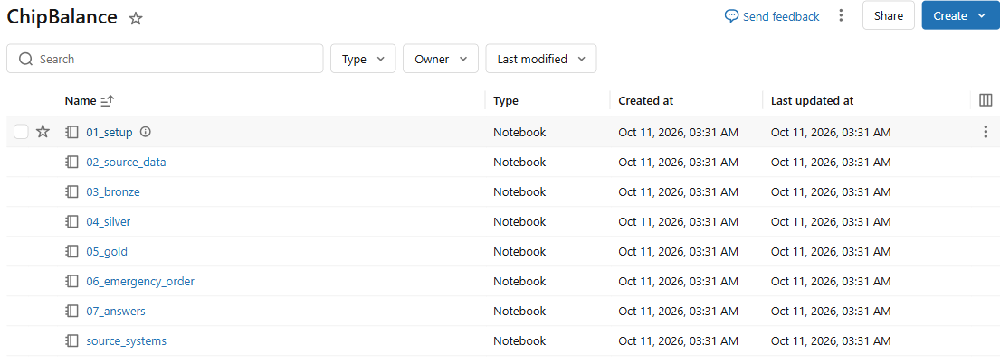

# 01. Databricks 접속과 설정

[목차](../README.md) \| 이전: [00. 시나리오와 실습 순서](00-scenario.md) \| 다음: [02. 원천 데이터 만들기](02-source-data.md)

00장에서 본 시나리오를 실행할 Notebook을 준비합니다. 이 장의 목표는 **본인의 Databricks 저장 위치에 접근하고, Fabric OneLake에 쓴 데이터를 다시 읽을 수 있는지 확인하는 것**입니다. 원천 데이터 생성과 재고 계산은 다음 장부터 진행합니다.

**Shared 원본 복제 → Serverless 선택 → 참가자 번호 입력 → 셀 실행 → Fabric에서 저장 결과 확인** 순서로 진행합니다.

## 시작 전 준비

- 관리자가 준비한 Databricks **Workspace → Shared → ChipBalance** 원본 폴더와 읽기·복제 권한
- 관리자에게 받은 Databricks 주소, 실습 계정과 참가자 번호(예: `p001`)
- 관리자가 준비한 **활성 유료 Fabric 용량**, 본인 작업 영역·Lakehouse와 접근 권한

문서·캡처의 참가자 번호는 예시입니다. 코드에는 **본인 번호**를 넣고, 화면에서도 그 번호의 작업 영역과 Lakehouse를 선택합니다. 비밀번호·키·토큰은 Notebook에 입력하지 않습니다.

## 1. Databricks 접속

1.  관리자에게 받은 Databricks 주소를 브라우저에서 엽니다.
2.  회사 계정(Microsoft Entra ID)으로 로그인합니다.

**예상 결과:** 화면 왼쪽에 **Workspace**, **Catalog**, **Compute** 메뉴가 보입니다.

## 2. Shared 원본을 본인 Home에 복제

관리자가 Shared에 준비한 **원본 폴더 하나**를 각자 본인 Home으로 복제합니다. 참가자가 ZIP을 내려받거나 Import하지 않습니다. **Shared 원본에서는 참가자 번호를 고치거나 셀을 실행하지 않습니다.**

1.  왼쪽 **Workspace**를 누릅니다. 탐색 트리에서 **Workspace → Shared**를 펼치고 `ChipBalance`를 엽니다. **Shared with me**와는 다른 폴더입니다.

2.  상단 경로가 **Workspace → Shared**, 폴더 제목이 **ChipBalance**인지 확인합니다. **폴더 제목 오른쪽 ⋮ → Clone**을 누릅니다. 개별 Notebook 행의 메뉴가 아니라 **폴더 전체의 메뉴**를 사용합니다.

    

3.  **Clone "ChipBalance"** 창에서 다음과 같이 설정합니다.

    | 설정 | 입력·선택 |
    |---|---|
    | **New name** | 기본값 `(Clone) ChipBalance`를 `ChipBalance`로 바꿉니다. |
    | **Clone to** | **Browse**를 누르고 **본인의 Home**을 선택합니다. 아래 방법을 따릅니다. **Workspace/Shared에 그대로 두지 않습니다.** |
    | **Include outputs** | 체크를 해제합니다. 실행 결과 없이 Notebook만 복제합니다. |

    **Home 선택 방법:** Browse에서 **For you → Suggested** 아래 **본인 이메일 이름의 폴더**를 선택합니다. 그 폴더가 Home입니다. 목록에 없으면 **All → Workspace → Users → 본인 이메일 폴더**로 찾습니다. 본인 계정이 맞는지 확인하고 **Close browser**를 누릅니다. 이 버튼은 목적지 선택 영역만 닫으며 브라우저 탭을 닫는 것이 아닙니다.

    **이미 Home에 ChipBalance가 있다면:** 기존 폴더를 덮어쓰거나 지우지 않습니다. Browse에서 본인 Home을 선택한 뒤 **Create folder**로 새 실습용 폴더를 만들고, 그 안에 `ChipBalance`를 복제합니다.

4.  **Clone to**가 Shared가 아닌 본인 Home(또는 그 안의 새 실습 폴더)인지 다시 확인하고 **Clone**을 누릅니다.

    

    캡처의 개인 목적지 경로는 가렸습니다. 화면에서는 **본인 계정의 폴더인지 직접 확인**합니다.

5.  왼쪽 **Home**으로 이동해 새로 생긴 `ChipBalance`를 엽니다. 새 실습용 폴더 안에 복제했다면 그 폴더부터 엽니다.

**확인할 결과:** **본인 Home의 복제본**에 `01_setup`, `02_source_data`, `03_bronze`, `04_silver`, `05_gold`, `06_emergency_order`, `07_answers`, `source_systems`의 **8개**가 있습니다. 아래는 실제 Shared 원본을 개인 폴더에 복제한 결과입니다.

이후 모든 단계는 **본인 복제본**에서 진행합니다. 다른 Notebook이 `%run ./01_setup`으로 공통 설정과 저장 함수를 불러오므로 **8개를 같은 폴더에 둡니다.** `source_systems`는 02장에서 불러오는 보조 Notebook이며 따로 실행하지 않습니다.

## 3. Serverless 연결

1.  **본인 Home에 복제한** `ChipBalance` 폴더에서 `01_setup`을 엽니다.
2.  오른쪽 위 Compute 목록에 **Serverless**가 선택되어 있는지 확인합니다. 다른 Compute가 선택되어 있으면 목록을 열고 **Serverless**를 고릅니다.

**확인할 결과:** 오른쪽 위에 **Serverless**가 표시됩니다. 별도 클러스터를 만들지 않습니다. 첫 셀을 실행할 때 환경 시작에 시간이 걸릴 수 있습니다.

## 4. 참가자 번호 입력

1.  **본인 복제본**의 **2. 설정값 — 참가자 번호만 바꿉니다** 아래 코드 셀을 찾습니다. 상단 경로가 Shared이면 Home의 복제본으로 이동합니다.
2.  `participant = "p001"`의 `p001`을 본인 번호로 바꿉니다.
3.  `catalog`, `schema`, `raw_volume`, `fabric_workspace`, `fabric_lakehouse`는 코드가 번호에 맞춰 정하므로 직접 고치지 않습니다. `service_credential`은 공용 이름 `chipbalance_onelake_hyosung`을 유지합니다. 관리자가 다른 credential 이름을 안내한 경우에만 그 값을 입력합니다.

번호를 넣으면 아래 위치를 사용합니다. **접근할 수 있는 다른 참가자의 위치가 아니라 본인 위치인지** 확인합니다.

| 저장 위치 | 예시 (`p001`) | 저장할 내용 |
|----|----|----|
| Databricks Unity Catalog Volume | `/Volumes/lab_factory_p001/chipbalance_p001/raw` | 02장의 원천 파일 |
| Databricks Unity Catalog 스키마 | `lab_factory_p001.chipbalance_p001` | 03·04장의 Bronze·Silver 테이블 |
| Fabric OneLake Lakehouse | `chipbalance-p001` → `lh_chipbalance_p001` | 05·06장의 Gold 테이블 |

## 5. 셀 실행

설정을 고친 뒤 Notebook 맨 위로 돌아가 **Shift+Enter**로 한 셀씩 실행합니다. **설정값 셀도 빠뜨리지 않습니다.** 위쪽 **Run all**로 한 번에 실행해도 됩니다. 오류가 나면 다음 Notebook으로 넘어가지 않고 아래 Troubleshooting을 확인합니다.

화면의 실행 셀 번호가 아니라 **Notebook에 적힌 절 제목**을 기준으로 확인합니다.

1.  **1. Serverless 준비** — OneLake 저장에 필요한 `deltalake==1.6.6`을 설치합니다. 설치 완료 또는 `Requirement already satisfied`를 확인합니다.

2.  **2. 설정값** — 앞에서 입력한 참가자 번호와 이름을 변수로 적용합니다. 출력 없이 끝납니다.

3.  **3. Unity Catalog 확인** — 본인 Catalog·스키마·Volume에 접근할 수 있는지 확인합니다. 관리자가 미리 만든 리소스는 그대로 사용하고, 없는 리소스는 권한이 있을 때 준비합니다.

    **확인할 결과:** 본인 번호가 들어간 스키마 이름과 Volume 경로가 표시됩니다.

    

4.  **4. OneLake 저장 함수** — 다음 장에서 사용할 함수를 준비합니다. **출력이 없는 것이 정상**이며, 오류 없이 끝나는지 확인합니다.

5.  **5. OneLake 연결 확인** — 확인용 데이터 1행을 Lakehouse의 `Files/chipbalance/connection_check`에 쓰고 다시 읽습니다.

    **확인할 결과:** `연결 확인 완료`, 본인의 OneLake 경로, `쓰기·읽기: 1행`이 표시됩니다. 이때는 연결만 확인하며 Gold 테이블을 만들지는 않습니다.

    

## 6. Fabric에서 확인하기

1.  새 브라우저 탭에서 Fabric을 엽니다: <https://app.fabric.microsoft.com>
2.  같은 실습 계정으로 로그인하고 **Workspaces / 작업 영역**에서 본인 작업 영역 `chipbalance-p001`을 엽니다. 유형이 **Lakehouse**인 `lh_chipbalance_p001`을 선택합니다. 같은 이름의 SQL 분석 엔드포인트와 구분합니다.
3.  왼쪽 **Explorer**에서 **Files** \> `chipbalance`를 펼칩니다.

**확인할 결과:** `connection_check` 폴더가 보입니다. 앞의 **5. OneLake 연결 확인**에서 실제로 저장한 결과입니다. 연결 확인 데이터는 **Files**에, 이후 만들 Gold 테이블은 **Tables → gold**에 저장합니다.

## 이 장의 완료 기준

**본인 Home의 복제본**에 있는 8개 Notebook, 본인 Unity Catalog 위치, OneLake의 **쓰기·읽기 1행**, Fabric의 `connection_check` 폴더를 확인했으면 준비가 끝났습니다.

OneLake 저장 인증은 관리자가 준비한 **Managed Identity와 service credential**을 사용합니다. 참가자가 별도의 비밀번호·키를 만들 필요는 없습니다. 관리자 설정은 [관리자 준비 가이드](../admin/README.md)의 "2. Managed Identity와 service credential"에서 확인합니다.

## Troubleshooting

- 셀을 실행할 수 없거나 Serverless 시작 오류가 나면 3단계에서 **Serverless**가 선택되어 있는지 확인합니다.
- "participant는 p001처럼 …" 오류가 나면 4단계에서 참가자 번호를 고치고 그 셀부터 다시 실행합니다.
- `CREATE CATALOG`, `CREATE SCHEMA`, `CREATE VOLUME` 오류가 나면 Spark가 표시한 원본 오류를 관리자에게 알립니다. 관리자는 리소스를 미리 만들고 접근 권한을 주거나, Notebook 자동 준비에 필요한 생성 권한과 메타스토어 기본 관리형 저장소를 확인합니다.
- `USE CATALOG`, `USE SCHEMA`, Volume 목록 조회 오류가 나면 관리자가 `USE CATALOG`, `USE SCHEMA`, `READ VOLUME`, `WRITE VOLUME` 권한을 확인합니다.
- "service credential … 사용 권한" 오류가 나면 오류 메시지를 관리자에게 알립니다.
- "deltalake 설치에 실패했습니다" 오류가 나면 **1. Serverless 준비** 셀의 설치 오류를 관리자에게 알립니다.
- Shared에 `ChipBalance`가 없거나 **Clone**이 비활성화되면 관리자에게 원본 준비·읽기 권한과 본인 Home의 생성 권한을 확인합니다. 다른 사람의 Home이나 Shared에 복제하지 않습니다.
- 복제할 때 같은 이름이 있다는 오류가 나면 **Browse → 본인 Home → Create folder**로 새 실습 폴더를 만든 뒤 그 안에 복제합니다. 기존 실습물을 삭제하지 않습니다.
- Fabric에 본인 작업 영역·Lakehouse가 없거나 연결 오류가 나면 실습 계정·참가자 번호가 맞는지 확인한 뒤 관리자에게 리소스와 권한 준비를 확인합니다. 다른 참가자의 번호로 바꾸어 진행하지 않습니다.

## 다음 단계

[02. 원천 데이터 만들기](02-source-data.md)
