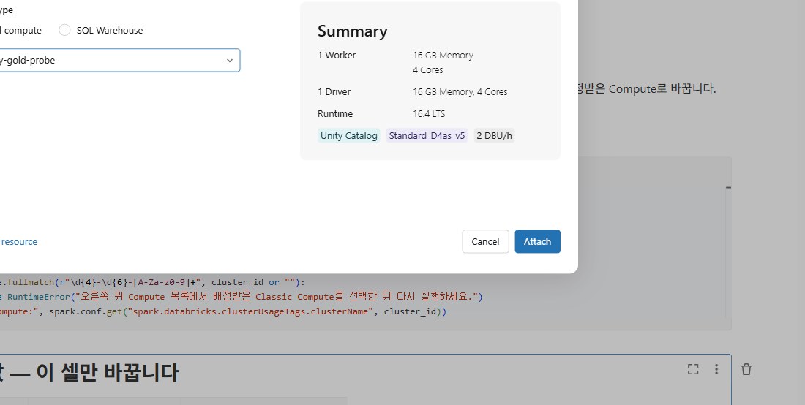

01. Databricks 접속과 설정
==================================

`목차 <../README.rst>`_ | 이전: `00. 시나리오와 실습 순서 <00-scenario.rst>`_ | 다음: `02. 원본 데이터 만들기 <02-source-data.rst>`_

Databricks에 Notebook 5개를 가져오고, ``01_setup``\ 에 본인 설정값을 입력해 실행합니다.

1. Databricks 접속
---------------------

#. 관리자에게 받은 Databricks 주소를 브라우저에서 엽니다.
#. 회사 계정(Microsoft Entra ID)으로 로그인합니다.

**예상 결과:** 화면 왼쪽에 **Workspace**, **Catalog**, **Compute** 등의 메뉴가 보입니다.

2. 폴더 만들기
-----------------

#. 왼쪽 메뉴에서 **Workspace**\ 를 누릅니다.
#. **Users** > 본인 이메일 폴더를 엽니다.
#. 오른쪽 위 **Create** > **Folder**\ 를 누릅니다.
#. 이름에 ``ChipBalance``\ 를 입력하고 **Create**\ 를 누릅니다.

**예상 결과:** 본인 이메일 폴더 아래에 ``ChipBalance`` 폴더가 생깁니다.

3. Notebook 가져오기
-----------------------

#. ``ChipBalance`` 폴더를 엽니다.
#. 폴더의 **⋮** 메뉴(또는 폴더를 오른쪽 클릭)에서 **Import**\ 를 누릅니다.
#. **Import** 창에서 **File**\ 을 선택합니다.
#. 00장에서 압축을 푼 ``notebooks`` 폴더의 .ipynb 파일 5개를 모두 선택합니다.
   파일을 창에 끌어 놓거나 **browse**\ 를 눌러 고릅니다. 한 번에 선택되지 않으면 파일마다 반복합니다.
#. **Import**\ 를 누릅니다.

**예상 결과:** 폴더에 ``01_setup``, ``02_source_data``, ``03_bronze_silver``, ``04_gold_baseline``,
``05_emergency_order`` Notebook 5개가 보입니다.

Notebook 5개는 같은 폴더에 둡니다. 02~05 Notebook은 첫 코드 셀 ``%run ./01_setup``\ 으로 설정값을 불러옵니다.

4. Compute 연결
------------------

#. ``01_setup``\ 을 엽니다.
#. 오른쪽 위 Compute 목록을 열고 **More…**\ 를 누릅니다.
#. **Attach to an existing compute resource** 창에서 **General compute**\ 를 선택합니다.
#. 목록에서 배정받은 Classic Compute를 선택합니다.
#. 오른쪽 **Summary**\ 에서 Runtime이 16.4 LTS인지 확인하고 **Attach**\ 를 누릅니다.

**예상 결과:** 오른쪽 위 Compute 목록에 배정받은 Compute 이름이 표시됩니다.

Serverless는 사용하지 않습니다. Compute가 중지되어 있으면 시작하는 데 몇 분 걸립니다.

5. 설정값 찾기
-----------------

``01_setup``\ 에 넣을 값 네 개를 준비합니다.

#. 새 브라우저 탭에서 Fabric을 엽니다: https://app.fabric.microsoft.com
#. 왼쪽 **Workspaces**\ 에서 본인 작업 영역(예: ``factory-p001``)을 엽니다.
#. Lakehouse ``lh_factory_p001``\ 을 엽니다.
#. 브라우저 주소 창에서 작업 영역 ID와 Lakehouse ID를 복사합니다.

.. code-block:: text

   https://app.fabric.microsoft.com/groups/<작업 영역 ID>/lakehouses/<Lakehouse ID>?experience=...

* ``groups/`` 뒤의 값이 작업 영역 ID입니다.
* ``lakehouses/`` 뒤의 값(``?`` 앞까지)이 Lakehouse ID입니다.
* 두 ID는 ``xxxxxxxx-xxxx-xxxx-xxxx-xxxxxxxxxxxx`` 형식입니다.
* 참가자 번호와 secret scope 이름은 관리자 안내를 확인합니다.

6. 설정값 입력
-----------------

``01_setup``\ 의 **2. 설정값 — 이 셀만 바꿉니다** 아래 코드 셀에 네 값을 입력합니다.
값은 큰따옴표 안에 넣고, ``catalog``\ 는 바꾸지 않습니다.

.. list-table::
   :header-rows: 1
   :widths: 35 65

   * - 변수
     - 넣을 값
   * - ``participant``
     - 참가자 번호 (예: ``p001``)
   * - ``fabric_workspace_id``
     - 5단계에서 복사한 작업 영역 ID
   * - ``fabric_lakehouse_id``
     - 5단계에서 복사한 Lakehouse ID
   * - ``secret_scope``
     - 관리자가 알려 준 secret scope 이름

.. image:: ../assets/screenshots/d01-settings.png
   :alt: 2. 설정값 셀. participant에 p001, secret_scope에 관리자가 알려 준 이름을 넣었고, 두 ID 값은 가려져 있습니다.
   :width: 1100

입력한 내용은 자동으로 저장됩니다. 02~05 Notebook이 이 값을 그대로 사용합니다.

7. 셀 실행
-------------

#. 맨 위 셀을 선택하고 **Shift+Enter**\ 를 누릅니다. 셀이 실행되고 다음 셀로 이동합니다.
#. 같은 방법으로 마지막 셀까지 하나씩 실행합니다. 위쪽의 **Run all**\ 로 한 번에 실행해도 됩니다.
#. **1. Compute 확인** 셀의 결과를 봅니다.

   **예상 결과:** ``Compute:`` 뒤에 배정받은 Compute 이름이 표시됩니다.

   .. image:: ../assets/screenshots/d01-compute-check.png
      :alt: 1. Compute 확인 셀. 결과에 Compute: 뒤로 배정받은 Compute 이름이 표시됩니다.
      :width: 1100

#. **3. 설정값 검사**\ 부터 **7. OneLake 저장 함수**\ 까지의 코드 셀은 화면에 결과를 출력하지 않습니다.
   오류 없이 끝나면 됩니다.
#. **8. 설정 확인** 셀의 결과를 봅니다.

   **예상 결과:** 아래 세 줄이 표시됩니다. ``p001`` 자리에는 본인 참가자 번호가 나옵니다.

   .. code-block:: text

      설정 확인 완료
      Unity Catalog 스키마: lab_factory.lab_p001
      원본 파일 폴더: /Volumes/lab_factory/lab_p001/raw/chip_balance

   .. image:: ../assets/screenshots/d01-setup-done.png
      :alt: 8. 설정 확인 셀. 설정 확인 완료, Unity Catalog 스키마 lab_factory.lab_p001, 원본 파일 폴더 경로가 표시됩니다.
      :width: 1100

문제가 생기면
----------------

* **1. Compute 확인** 셀에서 "배정받은 Classic Compute를 선택한 뒤 다시 실행하세요" 오류가 나면
  4단계로 돌아가 배정받은 Compute를 선택하고 다시 실행합니다.
* "설정값을 확인하세요" 오류가 나면 메시지에 나온 값을 **2. 설정값** 셀에서 고치고, 그 셀부터 다시 실행합니다.
* 스키마나 Volume 권한 오류(``PERMISSION_DENIED`` 등)가 나면 오류 메시지를 관리자에게 알립니다.

다음 단계
------------

`02. 원본 데이터 만들기 <02-source-data.rst>`_
