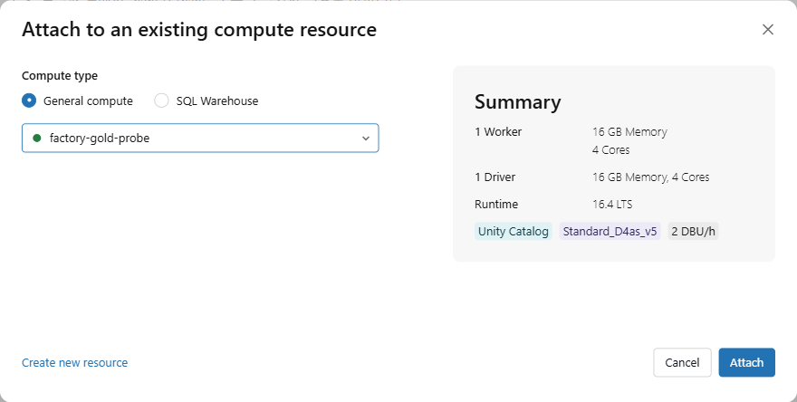

01. Databricks 접속과 설정
==================================

`목차 <../README.rst>`_ | 이전: `00. 시나리오와 실습 순서 <00-scenario.rst>`_ | 다음: `02. 원천 데이터 올리기 <02-source-data.rst>`_

Notebook 5개를 Databricks로 가져오고, ``01_setup``\ 에 참가자 번호를 입력해 Unity Catalog와 OneLake 연결을 확인합니다.
OneLake에 저장할 때는 관리 ID(Managed Identity)를 씁니다. 비밀번호나 키는 입력하지 않습니다.

관리자에게 받을 값은 세 가지입니다.

* Databricks 주소
* 참가자 번호 (예: ``p001``)
* 배정받은 Compute 이름

1. Databricks 접속
---------------------

#. 관리자에게 받은 Databricks 주소를 브라우저에서 엽니다.
#. 회사 계정(Microsoft Entra ID)으로 로그인합니다.

**예상 결과:** 화면 왼쪽에 **Workspace**, **Catalog**, **Compute** 메뉴가 보입니다.

2. Notebook 가져오기
-----------------------

#. 왼쪽 메뉴에서 **Workspace**\ 를 누릅니다. 본인 홈 폴더(이메일 이름)가 열립니다.
#. 폴더 제목 오른쪽의 **⋮** 버튼을 누르고 **Import**\ 를 누릅니다.

   .. image:: ../assets/screenshots/d01-import-menu.png
      :alt: 홈 폴더 제목 오른쪽 ⋮ 메뉴. View details, Copy URL/path, Import, Download as, Add to favorites 가운데 Import가 있습니다.
      :width: 800

#. **Import** 창에서 **File**\ 이 선택된 상태로 **browse**\ 를 누릅니다.
#. 00장에서 압축을 푼 폴더의 ``notebooks\ChipBalance.zip``\ 을 고릅니다.
#. **Import**\ 를 누릅니다.

   .. image:: ../assets/screenshots/d01-import-dialog.png
      :alt: Import 창. Import from은 File, 가운데에 ChipBalance.zip 14.2 KB가 선택되어 있고 오른쪽 아래에 Import 버튼이 있습니다.
      :width: 500

**예상 결과:** 홈 폴더에 ``ChipBalance`` 폴더가 생깁니다. 폴더를 열면 Notebook 5개가 있습니다.

.. image:: ../assets/screenshots/d01-folder.png
   :alt: ChipBalance 폴더. 01_setup, 02_source_data, 03_bronze_silver, 04_gold_baseline, 05_emergency_order Notebook 5개가 보입니다.
   :width: 800

02~05 Notebook은 첫 코드 셀 ``%run ./01_setup``\ 으로 설정값을 불러오므로 5개를 같은 폴더에 둡니다.

3. Compute 연결
------------------

#. ``ChipBalance`` 폴더에서 ``01_setup``\ 을 엽니다.
#. 오른쪽 위 Compute 목록(처음에는 **Serverless**)을 누르고 **More…**\ 를 누릅니다.
#. **Attach to an existing compute resource** 창에서 **General compute**\ 를 선택하고, 목록에서 배정받은 Compute를 고릅니다.
#. 오른쪽 **Summary**\ 에서 Runtime이 **16.4 LTS**\ 인지 확인하고 **Attach**\ 를 누릅니다.

**예상 결과:** 오른쪽 위 Compute 목록에 배정받은 Compute 이름이 초록색 점과 함께 보입니다.
Compute가 중지되어 있으면 시작하는 데 3~5분 걸립니다.

4. 참가자 번호 입력
----------------------

**2. 설정값 — 참가자 번호만 바꿉니다** 아래 코드 셀의 첫 줄 ``participant = "p001"``\ 에서 ``p001``\ 을 본인 번호로 바꿉니다.
나머지 이름은 참가자 번호로 정해지므로 바꾸지 않습니다.

.. image:: ../assets/screenshots/d01-settings.png
   :alt: 2. 설정값 셀. 설명 표와 코드 셀이 있고, 코드 셀 첫 줄은 participant = "p001"입니다. 아래 줄에서 catalog, schema, raw_volume, fabric_workspace, fabric_lakehouse, service_credential이 정해집니다.
   :width: 900

.. list-table::
   :header-rows: 1
   :widths: 30 35 35

   * - 이름
     - 값 (``p001``\ 일 때)
     - 용도
   * - ``schema``
     - ``lab_factory.chipbalance_p001``
     - Bronze·Silver 테이블 위치 (Unity Catalog)
   * - ``raw_volume``
     - ``/Volumes/lab_factory/chipbalance_p001/raw``
     - 02장에서 원천 파일을 올리는 곳
   * - ``fabric_workspace``, ``fabric_lakehouse``
     - ``chipbalance-p001``, ``lh_chipbalance_p001``
     - Gold를 저장하는 Fabric 작업 영역과 Lakehouse
   * - ``service_credential``
     - ``chipbalance_onelake``
     - OneLake에 저장할 때 쓰는 관리 ID

5. 셀 실행
-------------

맨 위 코드 셀을 누르고 **Shift+Enter**\ 로 한 셀씩 실행합니다. 위쪽 **Run all**\ 로 한 번에 실행해도 됩니다.

#. **1. Compute 확인**

   **예상 결과:** ``Compute:`` 뒤에 배정받은 Compute 이름, ``Runtime:`` 뒤에 ``16.4.x``\ 가 표시됩니다.

   .. image:: ../assets/screenshots/d01-compute.png
      :alt: 1. Compute 확인 셀. 결과에 Compute: factory-gold-probe와 Runtime: 16.4.x-scala2.12가 표시됩니다.
      :width: 900

#. **3. Unity Catalog 확인**

   **예상 결과:** 스키마 ``lab_factory.chipbalance_p001``\ 과 Volume 경로가 표시됩니다. 원천 파일은 02장에서 올리므로 ``파일 0개``\ 입니다.

   .. image:: ../assets/screenshots/d01-uc.png
      :alt: 3. Unity Catalog 확인 셀. 결과에 Unity Catalog 스키마: lab_factory.chipbalance_p001과 원천 파일 Volume: /Volumes/lab_factory/chipbalance_p001/raw (파일 0개)가 표시됩니다.
      :width: 900

#. **4. OneLake 저장 함수**

   결과는 출력되지 않습니다. 오류 없이 끝나면 됩니다.
   이 셀은 04·05장에서 Gold를 저장할 함수를 만듭니다. 저장할 때마다 service credential ``chipbalance_onelake``\ 에서
   관리 ID 토큰을 받아 씁니다.

#. **5. OneLake 연결 확인**

   **예상 결과:** ``연결 확인 완료``, OneLake 경로, ``쓰기·읽기: 1행``\ 이 표시됩니다.

   .. image:: ../assets/screenshots/d01-connection.png
      :alt: 5. OneLake 연결 확인 셀. 결과에 연결 확인 완료, OneLake 경로 abfss://chipbalance-p001@onelake.dfs.fabric.microsoft.com/lh_chipbalance_p001.lakehouse, 관리 ID(service credential) chipbalance_onelake, 쓰기·읽기 1행이 표시됩니다.
      :width: 900

6. Fabric에서 확인하기
--------------------------

#. 새 브라우저 탭에서 Fabric을 엽니다: https://app.fabric.microsoft.com
#. 왼쪽 **Workspaces**\ 에서 작업 영역 ``chipbalance-p001``\ 을 열고, Lakehouse ``lh_chipbalance_p001``\ 을 엽니다.
#. 왼쪽 **Explorer**\ 에서 **Files** > ``chipbalance``\ 를 펼칩니다.

**예상 결과:** ``connection_check`` 폴더가 보입니다. 5번 셀이 관리 ID로 OneLake에 쓴 결과입니다.

.. image:: ../assets/screenshots/d01-fabric-files.png
   :alt: Fabric Lakehouse lh_chipbalance_p001. Explorer에서 Files > chipbalance > connection_check 폴더가 보이고, 가운데 목록에도 connection_check 폴더가 있습니다.
   :width: 1000

관리 ID로 저장하는 방식
--------------------------

* 관리자가 Azure에 Access Connector(``ac-chipbalance-onelake``)를 만들었습니다. 이 리소스에는 관리 ID가 붙어 있습니다.
* 이 관리 ID를 Unity Catalog service credential ``chipbalance_onelake``\ 로 등록하고, 참가자에게 사용 권한을 주었습니다.
* Fabric 작업 영역 ``chipbalance-p001``\ 에는 이 관리 ID를 Contributor로 추가했습니다.
* Notebook은 ``dbutils.credentials.getServiceCredentialsProvider``\ 로 토큰을 받아 OneLake에 씁니다. 토큰은 화면에 표시하지 않습니다.

문제가 생기면
----------------

* **1. Compute 확인**\ 에서 "배정받은 Classic Compute를 선택한 뒤 다시 실행하세요" 오류가 나면 3단계로 돌아갑니다.
* "participant는 p001처럼 …" 오류가 나면 4단계에서 참가자 번호를 고치고 그 셀부터 다시 실행합니다.
* ``SCHEMA_NOT_FOUND``, ``PERMISSION_DENIED`` 같은 Unity Catalog 오류나 "service credential … 사용 권한" 오류가 나면
  오류 메시지를 관리자에게 알립니다.
* "Compute에 deltalake 라이브러리가 없습니다" 오류가 나면 관리자에게 알립니다.

다음 단계
------------

`02. 원천 데이터 올리기 <02-source-data.rst>`_
