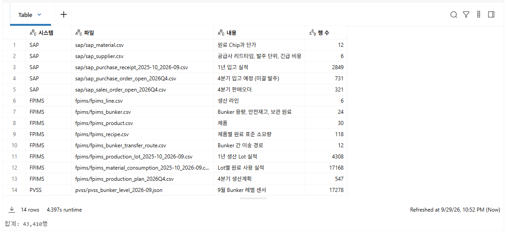
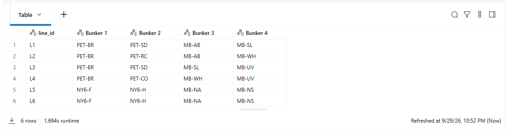
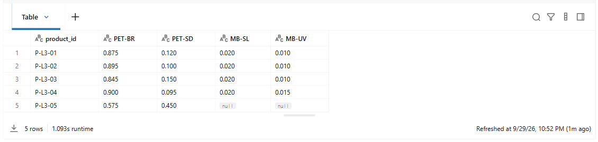
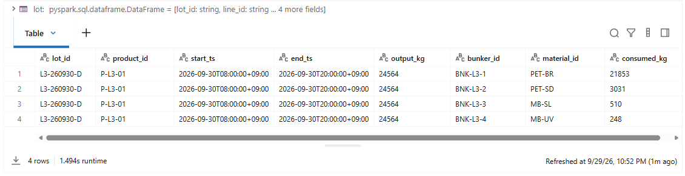
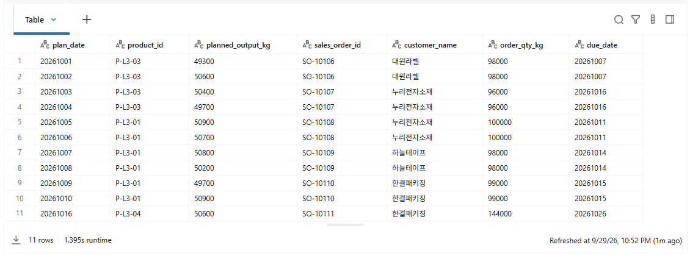
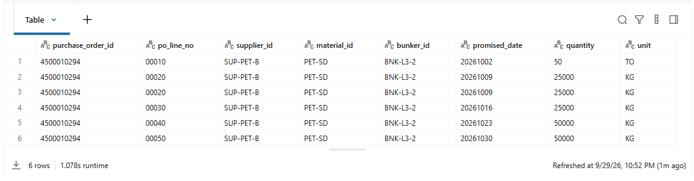
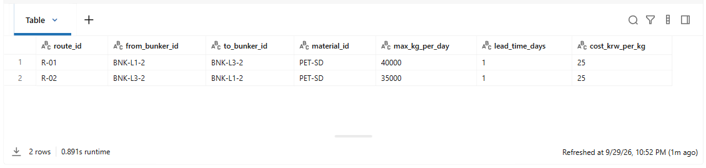
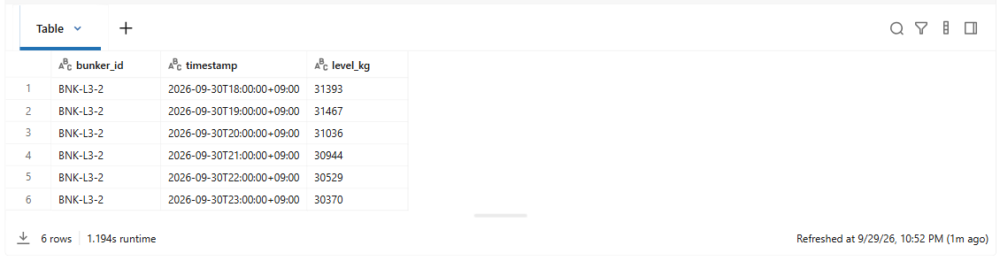
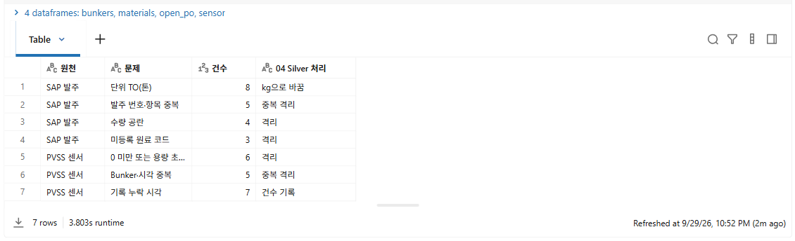
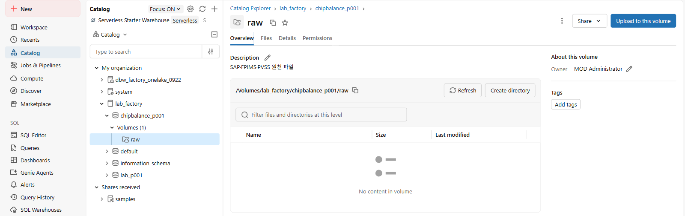

# 02. 원천 데이터 만들기

[목차](../README.md) \| 이전: [01. Databricks 접속과 설정](01-connect.md) \| 다음: [03. Bronze](03-bronze.md)

`02_source_data`로 SAP·FPIMS·PVSS에서 추출한 것과 같은 형식의 원천 파일 14개를 Unity Catalog Volume `raw`에 만들고, 파일 내용과 데이터 관계를 확인합니다. 이 파일이 메달리온 아키텍처의 시작점입니다. 03장에서 이 파일을 Bronze 테이블로 적재합니다.

원천 파일은 `source_systems` Notebook이 공장 한 곳의 1년 운영을 시간 순서대로 계산해 만듭니다. 생산 Lot, 원료 사용, 입고, Bunker 레벨이 같은 운영에서 나오므로 서로 맞습니다. 실제 추출 파일처럼 톤 단위, 중복, 수량 공란, 미등록 코드, 센서 누락·튐도 들어 있습니다.

## 1. Notebook 열고 Serverless 확인

1.  `ChipBalance` 폴더에서 `02_source_data`를 엽니다.
2.  오른쪽 위 Compute 목록에 **Serverless**가 선택되어 있는지 확인합니다.

**예상 결과:** 오른쪽 위 Compute 목록에 **Serverless**가 표시됩니다.

## 2. 셀 실행

위에서부터 **Shift+Enter**로 한 셀씩 실행합니다. 위쪽 **Run all**로 한 번에 실행해도 됩니다. 전체 실행에 2분쯤 걸립니다.

1.  **1. 설정과 생성기 불러오기**

    `%run ./01_setup`이 설정값과 OneLake 저장 함수를, `%run ./source_systems`가 데이터 생성 함수를 불러옵니다.

    **예상 결과:** 01에서 본 결과가 다시 표시되고, 맨 아래에 `연결 확인 완료`가 보입니다. `source_systems` 셀은 결과 없이 끝납니다.

2.  **2. 원천 파일 만들기**

    `raw` Volume 아래 `sap`, `fpims`, `pvss` 폴더에 파일 14개를 만듭니다. 다시 실행하면 같은 내용으로 새로 만듭니다.

    **예상 결과:** 표 14행, 아래에 `합계: 43,410행`

    

3.  **3. 파일 사이의 관계**

    원료 칩 수급은 Bunker마다 날짜별로 **시작 재고 + 입고 예정 − 생산계획이 쓸 원료**를 계산합니다. 셀 위의 표에서 파일이 어떤 키로 이어지는지 확인하고, 셀을 실행해 파일을 읽는 함수 `read_raw`를 만듭니다.

    **예상 결과:** 결과 없이 끝납니다.

4.  **4. 라인과 Bunker**

    라인 6개에 Bunker가 4개씩 있고, Bunker 하나에는 원료 칩 한 종류만 보관합니다.

    **예상 결과:** 6행. L1과 L3의 Bunker 2(`BNK-L1-2`, `BNK-L3-2`)가 모두 `PET-SD`를 보관합니다.

    

5.  **5. L3 제품의 레시피**

    제품 1kg을 만들 때 드는 원료 칩의 표준량(kg/kg)입니다.

    **예상 결과:** 5행. `P-L3-05`(반광택 75μm 후막)는 PET-SD가 `0.450`으로 다른 L3 제품(0.095~0.150)보다 3배 이상 많고, MB-SL·MB-UV를 쓰지 않아 `null`로 보입니다.

    

6.  **6. 생산 실적: Lot과 원료 사용**

    라인은 주간(08~20시)과 야간(20~08시) Lot으로 생산하고, Lot마다 Bunker에서 꺼내 쓴 원료가 기록됩니다.

    **예상 결과:** 4행. 9월 30일 L3 주간 Lot `L3-260930-D`는 `P-L3-01`을 24,564kg 생산하면서 PET-SD를 3,031kg 썼습니다. 레시피 기준(24,564 × 0.120 = 2,948kg)보다 조금 많습니다. 이 차이가 실제 손실이며 05장에서 계산합니다.

    

7.  **7. L3 생산계획과 판매오더**

    10월 1~16일 L3 생산계획에 판매오더의 고객과 납기를 붙여 봅니다. 같은 제품을 며칠씩 이어서 생산하고, 판매오더 하나를 1~3일에 나눠 채웁니다.

    **예상 결과:** 11행. 10월 10일 다음 계획이 10월 16일입니다. 10월 11~15일은 계획이 없는 예비일입니다. 모든 행에서 생산일(`plan_date`)이 납기(`due_date`)보다 앞섭니다.

    

8.  **8. BNK-L3-2 입고 예정**

    SAP 미결 발주 가운데 10월에 `BNK-L3-2`로 들어올 PET-SD입니다. 공급사 세미폴리머(`SUP-PET-B`)는 금요일마다 납품합니다.

    **예상 결과:** 6행. 10월 2일 줄은 수량이 `50`, 단위가 `TO`(톤)입니다. 10월 9일 `00020` 줄은 두 번 나옵니다. 04장에서 톤은 kg으로 바꾸고, 중복은 한 줄만 남깁니다.

    

9.  **9. Bunker 간 이송 경로**

    같은 원료를 보관하는 Bunker 사이에는 원료를 옮기는 경로가 있습니다.

    **예상 결과:** 2행. `R-01`은 `BNK-L1-2`에서 `BNK-L3-2`로 하루 40,000kg까지 1일 걸려 옮기고, 비용은 kg당 25원입니다.

    

10. **10. 레벨 센서와 시작 재고**

    PVSS 센서는 Bunker 재고(kg)를 1시간마다 기록합니다. 9월 30일 23시 값이 10월 1일 시작 재고입니다.

    **예상 결과:** 6행. `BNK-L3-2`의 9월 30일 23시 값은 `30370`kg입니다.

    

11. **11. 정리가 필요한 행**

    원천 파일에는 그대로 계산하면 결과가 틀어지는 행이 있습니다. 04장에서 Silver를 만들 때 고치거나 격리합니다.

    **예상 결과:** 7행. 단위 TO 8, 발주 번호·항목 중복 5, 수량 공란 4, 미등록 원료 코드 3, 센서 0 미만 또는 용량 초과 6, 센서 중복 5, 센서 기록 누락 7

    

## 3. Volume에서 파일 확인

1.  왼쪽 메뉴에서 **Catalog**를 누릅니다.
2.  `lab_factory_p001` \> `chipbalance_p001` \> **Volumes** \> `raw`를 차례로 펼치고 `sap` 폴더를 누릅니다.

**예상 결과:** `raw` 아래에 `fpims`, `pvss`, `sap` 폴더가 있고, `sap` 폴더에 CSV 파일 5개가 보입니다.



## 정리: 긴급 수주와 연결되는 데이터

긴급 수주 제품 `P-L3-05`가 쓰는 PET-SD는 원천 데이터에서 이렇게 이어집니다.

``` text
PVSS 센서 9/30 23시 30,370kg ──▶ BNK-L3-2의 10월 1일 시작 재고
FPIMS 생산계획 × 레시피 ──▶ 날마다 BNK-L3-2에서 빠지는 PET-SD
SAP 미결 발주 ──▶ 10월 2일 50톤(50,000kg), 10월 9일 25,000kg 입고
FPIMS 이송 경로 R-01 ──▶ BNK-L1-2에서 하루 40,000kg까지 받을 수 있음
긴급 오더 P-L3-05 100,000kg ──▶ PET-SD가 100,000kg × 0.450 = 45,000kg 이상 더 필요
```

05장에서 이 값으로 Bunker 24개의 날짜별 재고를 계산하고, 06장에서 긴급 수주를 반영합니다.

## Troubleshooting

- **1. 설정과 생성기 불러오기**에서 오류가 나면 01장 **Troubleshooting**을 확인합니다.
- `PERMISSION_DENIED`처럼 Volume 쓰기 오류가 나면 오류 메시지를 관리자에게 알립니다.
- 셀을 여러 번 실행해도 됩니다. **2. 원천 파일 만들기**는 매번 같은 파일을 새로 만듭니다.

## 다음 단계

[03. Bronze](03-bronze.md)
