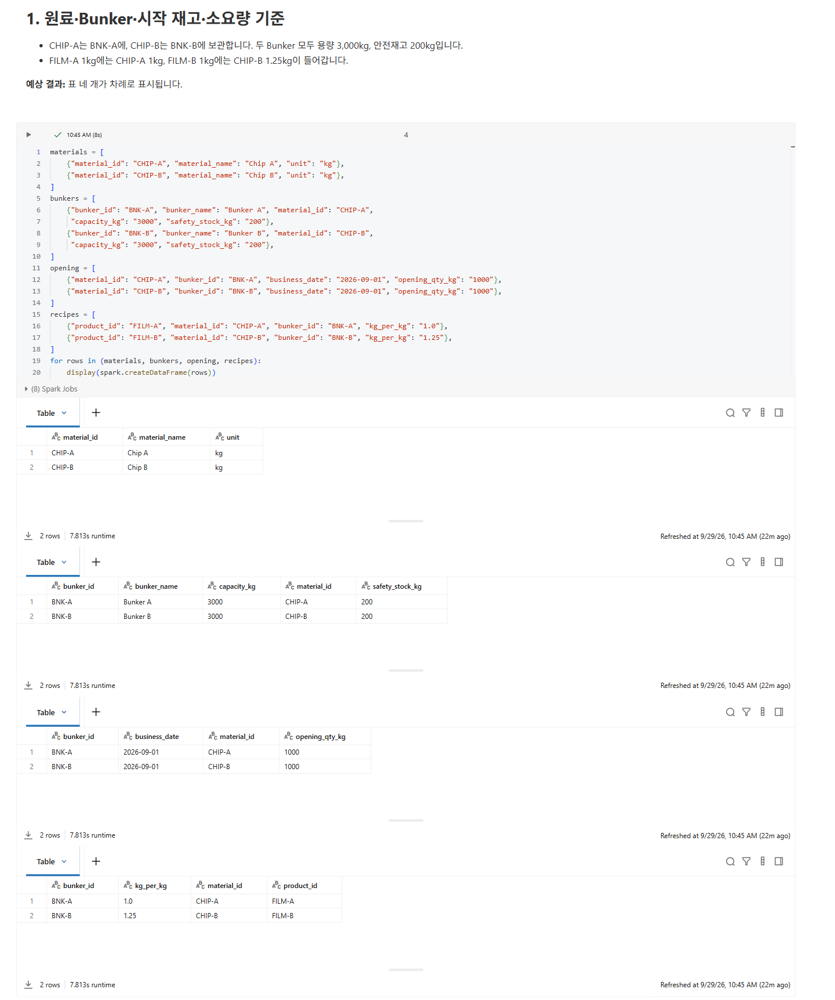
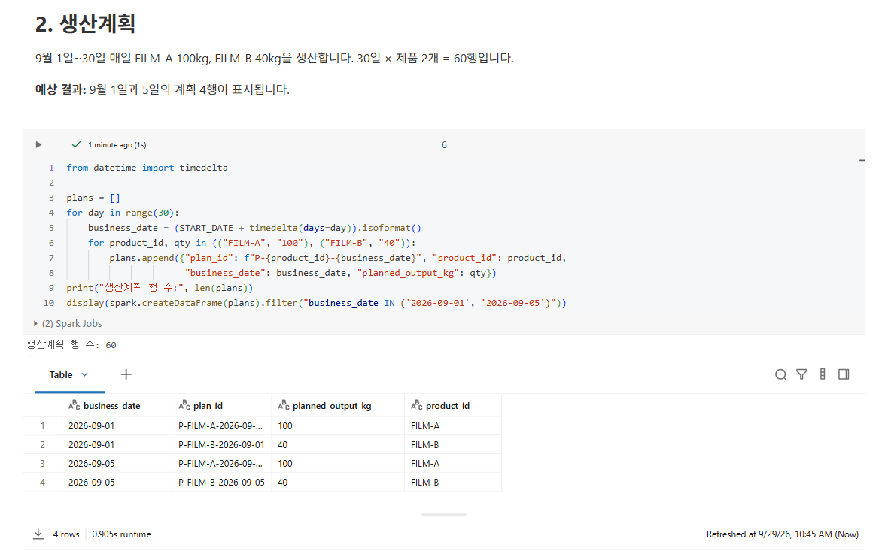
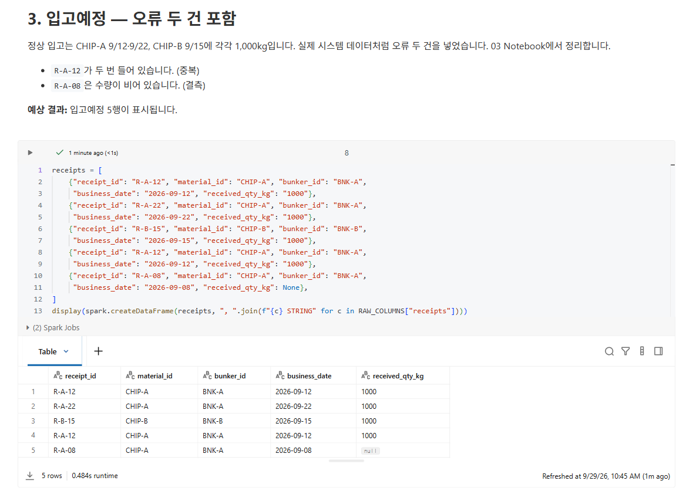
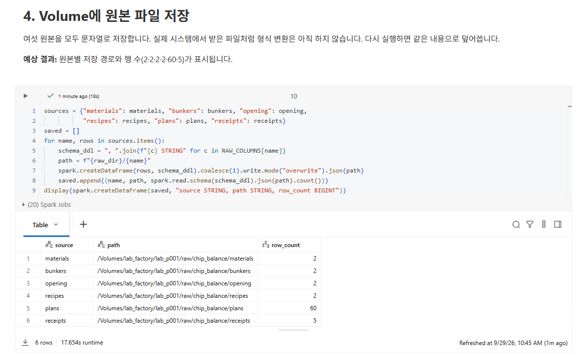

02. 원본 데이터 만들기
==============================

`목차 <../README.rst>`_ | 이전: `01. Databricks 접속과 설정 <01-connect.rst>`_ | 다음: `03. Bronze와 Silver <03-bronze-silver.rst>`_

실제 시스템(FPIMS·PVSS·SAP)에 연결하지 않고, ``02_source_data``\ 에서 2026년 9월 교육용 데이터 6종을 만듭니다.
만든 데이터는 Unity Catalog Volume에 JSON 파일로 저장합니다.

.. list-table::
   :header-rows: 1
   :widths: 20 60 20

   * - 원본
     - 내용
     - 행 수
   * - materials
     - 원료 Chip
     - 2
   * - bunkers
     - Bunker와 용량·안전재고
     - 2
   * - opening
     - 9월 1일 시작 재고
     - 2
   * - recipes
     - 제품 1kg 생산에 필요한 Chip kg
     - 2
   * - plans
     - 일별 제품 생산계획
     - 60
   * - receipts
     - 원료 입고예정 (오류 2건 포함)
     - 5

시작하기
-----------

#. 왼쪽 **Workspace** > ``ChipBalance`` 폴더에서 ``02_source_data``\ 를 엽니다.
#. 오른쪽 위 Compute 이름이 01장에서 연결한 Compute인지 확인합니다.
   다르면 01장 4단계처럼 **More…** > **General compute**\ 에서 배정받은 Compute를 선택합니다.
#. 맨 위부터 셀을 하나씩 **Shift+Enter**\ 로 실행합니다.
   첫 코드 셀 ``%run ./01_setup``\ 이 설정값과 공통 함수를 불러옵니다.

**예상 결과:** ``%run ./01_setup`` 셀이 오류 없이 끝납니다.

1. 원료·Bunker·시작 재고·소요량 기준
---------------------------------------

**화면에서 볼 것:** 표 네 개가 차례로 나옵니다.

* materials: CHIP-A, CHIP-B
* bunkers: BNK-A에는 CHIP-A, BNK-B에는 CHIP-B. 용량(``capacity_kg``) 3000, 안전재고(``safety_stock_kg``) 200
* opening: 2026-09-01 시작 재고 1000
* recipes: FILM-A 1kg에 CHIP-A 1.0, FILM-B 1kg에 CHIP-B 1.25

**예상 결과:** 표 네 개가 모두 2행입니다.

2. 생산계획
--------------

**화면에서 볼 것:** 9월 1일~30일 매일 FILM-A 100kg, FILM-B 40kg을 생산하는 계획입니다. 30일 × 제품 2개 = 60행입니다.
화면에는 9월 1일과 5일의 계획만 보여 줍니다. 9월 5일은 07장에서 긴급 오더로 바꿔 계산하는 날입니다.

**예상 결과:** ``생산계획 행 수: 60``\ 과 4행짜리 표가 표시됩니다.

3. 입고예정 — 오류 두 건 포함
--------------------------------

**화면에서 볼 것:** 정상 입고는 3건입니다. CHIP-A는 9/12(``R-A-12``)와 9/22(``R-A-22``),
CHIP-B는 9/15(``R-B-15``)에 각각 1,000kg이 들어옵니다.
여기에 실제 시스템 데이터에서 자주 보는 오류 두 건을 일부러 넣었습니다.

* ``R-A-12``\ 가 한 번 더 들어 있습니다. (중복)
* ``R-A-08``\ 은 수량(``received_qty_kg``)이 비어 있어 ``null``\ 로 보입니다. (결측)

두 오류는 03장에서 정리합니다.

**예상 결과:** 입고예정 5행이 표시됩니다.

4. Volume에 원본 파일 저장
-----------------------------

**화면에서 볼 것:** 원본 6종을 JSON 파일로 저장하고, 저장한 파일을 다시 읽은 행 수를 보여 줍니다.
값은 모두 문자열로 저장합니다. 실제 시스템에서 받은 파일처럼 형식 변환은 아직 하지 않습니다.
저장 위치는 ``/Volumes/lab_factory/lab_p001/raw/chip_balance/<원본 이름>``\ 입니다.

**예상 결과:** 원본별 저장 경로(``path``)와 행 수(``row_count``) 2·2·2·2·60·5가 표시됩니다.

이 Notebook은 다시 실행하면 같은 내용으로 덮어씁니다. 중간에 오류가 나면 처음부터 다시 실행해도 됩니다.

(선택) 저장된 파일 보기
--------------------------

왼쪽 **Catalog** > ``lab_factory`` > ``lab_p001`` > **Volumes** > ``raw``\ 를 엽니다.
``chip_balance`` 폴더 아래에 원본별 폴더 6개가 있습니다.

다음 단계
------------

`03. Bronze와 Silver <03-bronze-silver.rst>`_
