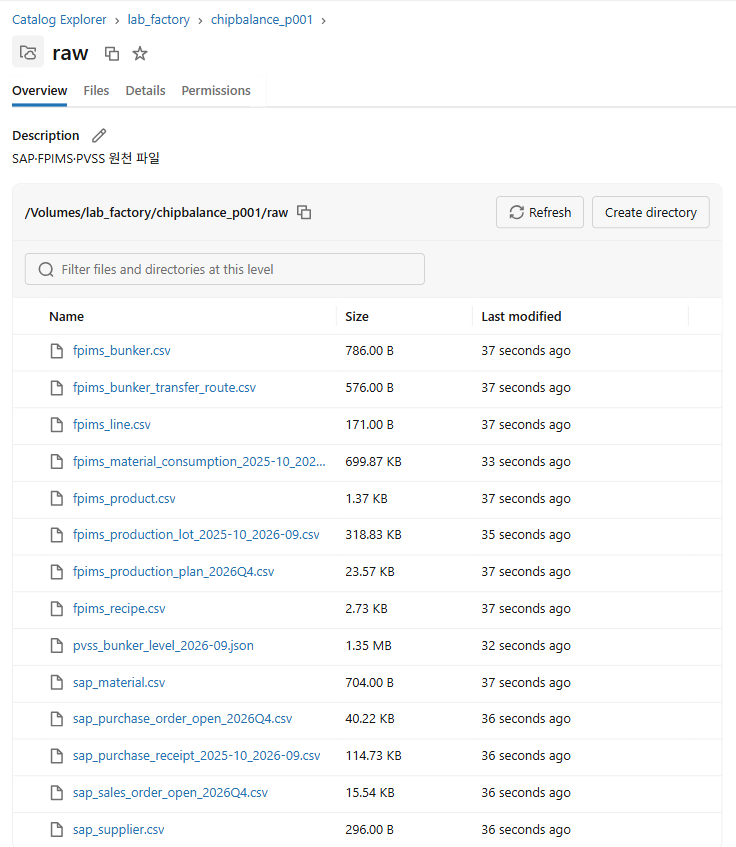
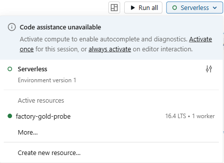

02. 원천 데이터 올리기
==========================

`목차 <../README.rst>`_ | 이전: `01. Databricks 접속과 설정 <01-connect.rst>`_ | 다음: `03. Bronze와 Silver <03-bronze-silver.rst>`_

SAP·FPIMS·PVSS에서 추출한 원천 파일 14개를 Unity Catalog Volume ``raw``\ 에 올리고, ``02_source_data``\ 로 파일 내용과 데이터 관계를 확인합니다.
이 장에서는 테이블을 만들지 않습니다. Bronze 테이블은 03장에서 만듭니다.

1. Volume 열기
-----------------

#. 왼쪽 메뉴에서 **Catalog**\ 를 누릅니다.
#. 카탈로그 목록에서 ``lab_factory`` > ``chipbalance_p001`` > **Volumes**\ 를 차례로 펼치고 ``raw``\ 를 누릅니다.

**예상 결과:** 가운데에 ``/Volumes/lab_factory/chipbalance_p001/raw`` 경로와 **No content in volume**\ 이 보입니다.
오른쪽 위에 **Upload to this volume** 버튼이 있습니다.

.. image:: ../assets/screenshots/d02-volume.png
   :alt: Catalog 화면. 왼쪽 목록에서 lab_factory > chipbalance_p001 > Volumes > raw가 선택되어 있고, 가운데에 /Volumes/lab_factory/chipbalance_p001/raw 경로와 No content in volume, 오른쪽 위에 Upload to this volume 버튼이 있습니다.
   :width: 1000

2. 파일 14개 올리기
----------------------

#. 오른쪽 위 **Upload to this volume**\ 을 누릅니다.
#. **Upload files to a volume in Unity Catalog** 창에서 **browse** > **Select files**\ 를 누릅니다.

   .. image:: ../assets/screenshots/d02-upload-browse.png
      :alt: Upload files to a volume in Unity Catalog 창. browse 메뉴가 열려 Select files와 Select folder가 보입니다. 아래 Destination volume은 /Volumes/lab_factory/chipbalance_p001/raw입니다.
      :width: 700

#. 00장에서 압축을 푼 폴더의 ``data`` 폴더를 엽니다. **Ctrl+A**\ 로 파일 14개를 모두 선택하고 **열기**\ 를 누릅니다.
#. 창에 파일 목록이 보이고 **No conflicts detected**\ 가 표시되면 **Upload**\ 를 누릅니다.
   **Destination volume**\ 은 ``/Volumes/lab_factory/chipbalance_p001/raw`` 그대로 둡니다.

   .. image:: ../assets/screenshots/d02-upload-files.png
      :alt: 파일을 고른 뒤의 업로드 창. fpims_bunker_transfer_route.csv, fpims_bunker.csv, fpims_line.csv 등 파일 목록과 No conflicts detected가 보이고, 오른쪽 아래 Upload 버튼이 활성화되어 있습니다.
      :width: 700

**예상 결과:** 오른쪽에 **Upload summary: 14 files uploaded**\ 가 보입니다. 요약 창 오른쪽 위 **X**\ 로 닫으면 파일 목록에 14개가 있습니다.

.. note::

   **Select folder**\ 로 올리면 ``raw`` 아래에 ``data`` 폴더가 생깁니다. 파일은 ``raw`` 바로 아래에 있어야 합니다.

3. Notebook 열고 Compute 연결
-------------------------------

#. 왼쪽 메뉴 **Workspace**\ 에서 본인 홈 폴더 > ``ChipBalance`` > ``02_source_data``\ 를 엽니다.
#. 오른쪽 위 Compute 목록을 누르고 **Active resources**\ 에서 배정받은 Compute를 고릅니다.
   목록에 없으면 **More…**\ 를 눌러 01장 3단계처럼 연결합니다.

**예상 결과:** 오른쪽 위 Compute 목록에 배정받은 Compute 이름이 초록색 점과 함께 보입니다.

4. 셀 실행
-------------

위에서부터 **Shift+Enter**\ 로 한 셀씩 실행합니다. 위쪽 **Run all**\ 로 한 번에 실행해도 됩니다. 전체 실행에 1분쯤 걸립니다.

#. **1. 설정 불러오기**

   ``%run ./01_setup``\ 이 01 Notebook을 실행해 설정값과 함수를 불러옵니다. 01에서 본 결과가 다시 표시됩니다.

   **예상 결과:** ``원천 파일 Volume:`` 뒤에 ``(파일 14개)``, 맨 아래에 ``연결 확인 완료``\ 가 보입니다.

   .. image:: ../assets/screenshots/d02-cell-setup.png
      :alt: 1. 설정 불러오기 셀의 결과 일부. Unity Catalog 스키마 lab_factory.chipbalance_p001, 원천 파일 Volume /Volumes/lab_factory/chipbalance_p001/raw (파일 14개), 연결 확인 완료가 보입니다.
      :width: 800

#. **2. 파일 14개 확인**

   파일마다 행 수를 세어 추출할 때의 행 수와 비교합니다.

   **예상 결과:** 표 14행, ``확인`` 열이 모두 ``OK``, 아래에 ``합계: 41,412행``

   .. image:: ../assets/screenshots/d02-cell-files.png
      :alt: 2. 파일 14개 확인 결과. 시스템, 파일, 내용, 행 수, 추출 행 수, 확인 열이 있는 14행 표이고 확인 열은 모두 OK입니다. 아래에 합계 41,412행이 표시됩니다.
      :width: 900

#. **3. 라인과 Bunker**

   라인마다 Bunker가 4개 있고, Bunker 하나에는 원료 Chip 한 종류만 보관합니다.

   **예상 결과:** 6행. L1과 L3의 Bunker 2가 모두 ``PET-SD``\ 를 보관합니다. 같은 원료이므로 ``BNK-L1-2``\ 에서 ``BNK-L3-2``\ 로 옮길 수 있습니다.

   .. image:: ../assets/screenshots/d02-cell-bunker.png
      :alt: 3. 라인과 Bunker 결과. line_id, Bunker 1~4 열이 있는 6행 표입니다. L1과 L3의 Bunker 2가 PET-SD입니다.
      :width: 700

#. **4. 제품별 원료 소요량 기준**

   제품 1kg을 만들 때 원료 Chip이 몇 kg 드는지 보여 주는 FPIMS 표준값입니다.

   **예상 결과:** L3 제품 5행. ``P-L3-05``\ 의 PET-SD는 ``0.600``\ 으로, 다른 L3 제품(0.095~0.150)보다 4배 이상 많습니다.

   .. image:: ../assets/screenshots/d02-cell-recipe.png
      :alt: 4. 제품별 원료 소요량 기준 결과. product_id와 MB-SL, MB-UV, PET-BR, PET-SD 열이 있는 5행 표입니다. P-L3-05의 PET-SD는 0.600, PET-BR은 0.420입니다.
      :width: 700

#. **5. L3 생산계획과 PET-SD 소요량**

   ``pet_sd_std_kg``\ 는 생산량 × PET-SD 표준 소요량으로, 그날 ``BNK-L3-2``\ 에서 빠져나갈 PET-SD 양입니다.

   **예상 결과:** 11행. 10월 2일 ``P-L3-05`` 생산에 PET-SD 29,760kg이 듭니다. 다른 날은 4,674~7,620kg입니다.
   10월 10일 다음 행이 10월 16일입니다. 10월 11~15일은 계획이 없는 예비일입니다.

   .. image:: ../assets/screenshots/d02-cell-plan.png
      :alt: 5. L3 생산계획과 PET-SD 소요량 결과. plan_date, product_id, planned_output_kg, sales_order_id, pet_sd_std_kg 열이 있는 11행 표입니다. 20261002 행은 P-L3-05, 49600, 29760이고, 20261010 다음 행이 20261016입니다.
      :width: 800

#. **6. BNK-L3-2 입고 예정**

   SAP 미결 발주 가운데 10월에 ``BNK-L3-2``\ 로 들어올 PET-SD입니다.

   **예상 결과:** 6행. 첫 입고는 10월 7일 ``POQ4-0339`` 50,000kg (공급사 ``SUP-PET-B``)입니다.

   .. image:: ../assets/screenshots/d02-cell-po.png
      :alt: 6. BNK-L3-2 입고 예정 결과. purchase_order_id, supplier_id, material_id, bunker_id, promised_date, quantity, unit 열이 있는 6행 표입니다. 첫 행은 POQ4-0339, SUP-PET-B, PET-SD, 20261007, 50000, KG입니다.
      :width: 900

#. **7. Bunker 간 이송 경로**

   같은 원료를 보관하는 Bunker 사이에 원료를 옮길 수 있는 경로입니다.

   **예상 결과:** 2행. ``R-01``\ 은 ``BNK-L1-2``\ 에서 ``BNK-L3-2``\ 로 하루 40,000kg까지 옮길 수 있고, 1일 걸리며, 비용은 kg당 25원입니다.

   .. image:: ../assets/screenshots/d02-cell-route.png
      :alt: 7. Bunker 간 이송 경로 결과. R-01은 BNK-L1-2에서 BNK-L3-2로 PET-SD 하루 40000kg, 1일, kg당 25원이고, R-02는 반대 방향 35000kg입니다.
      :width: 900

#. **8. 레벨 센서와 시작 재고**

   PVSS 센서는 Bunker 재고(kg)를 1시간마다 기록합니다. 9월 30일 마지막 정상값을 10월 1일 시작 재고로 씁니다.

   **예상 결과:** 6행. ``BNK-L3-2``\ 의 9월 30일 23시 값은 106,000kg입니다.

   .. image:: ../assets/screenshots/d02-cell-sensor.png
      :alt: 8. 레벨 센서와 시작 재고 결과. BNK-L3-2의 2026-09-30 18시부터 23시까지 6행이고, 23시 level_kg는 106000입니다.
      :width: 600

#. **9. 품질 이슈 미리 보기**

   원천 파일에는 그대로 계산하면 결과가 틀어지는 행이 있습니다. 03장에서 Silver를 만들 때 이 행을 고치거나 격리합니다.

   **예상 결과:** 7행. 발주 중복 5, 수량 없음 4, 단위 TO 8, 미등록 원료 3, 센서 범위 초과 6, 센서 중복 5, 센서 기록 누락 7

   .. image:: ../assets/screenshots/d02-cell-quality.png
      :alt: 9. 품질 이슈 미리 보기 결과. 원천, 이슈, 건수, 03장 처리 열이 있는 7행 표입니다. 건수는 위에서부터 5, 4, 8, 3, 6, 5, 7입니다.
      :width: 700

정리: 긴급 오더와 연결되는 데이터
-----------------------------------

긴급 오더 제품 ``P-L3-05``\ 가 쓰는 PET-SD는 원천 데이터에서 이렇게 이어집니다.

.. code-block:: text

   PVSS 센서 9/30 23시 106,000kg ──▶ BNK-L3-2의 10월 1일 시작 재고
   FPIMS 생산계획 × 소요량 기준 ──▶ 날마다 BNK-L3-2에서 빠지는 양 (10/2 P-L3-05 29,760kg)
   SAP 미결 발주 ──▶ 10월 7일 첫 입고 50,000kg
   FPIMS 이송 경로 R-01 ──▶ BNK-L1-2에서 하루 40,000kg까지 받을 수 있음
   긴급 오더 P-L3-05 100,000kg ──▶ PET-SD 60,000kg이 더 필요 (100,000kg × 0.600)

04장에서 이 값으로 Bunker 24개의 날짜별 재고를 계산하고, 07장에서 긴급 오더를 반영합니다.

문제가 생기면
----------------

* ``Volume에 없는 파일: …`` 오류가 나면 2단계로 돌아가 빠진 파일을 올립니다.
* 같은 파일을 다시 올릴 때는 업로드 창에서 **Overwrite files with the same filename**\ 을 켭니다.
* ``확인`` 열에 ``다름``\ 이 보이면 원천 파일을 Excel 등으로 열어 저장하지 않았는지 확인합니다.
  압축을 푼 원본 파일을 다시 올리고 셀을 다시 실행합니다.
* **1. 설정 불러오기**\ 에서 오류가 나면 01장 **문제가 생기면**\ 을 확인합니다.

다음 단계
------------

`03. Bronze와 Silver <03-bronze-silver.rst>`_
