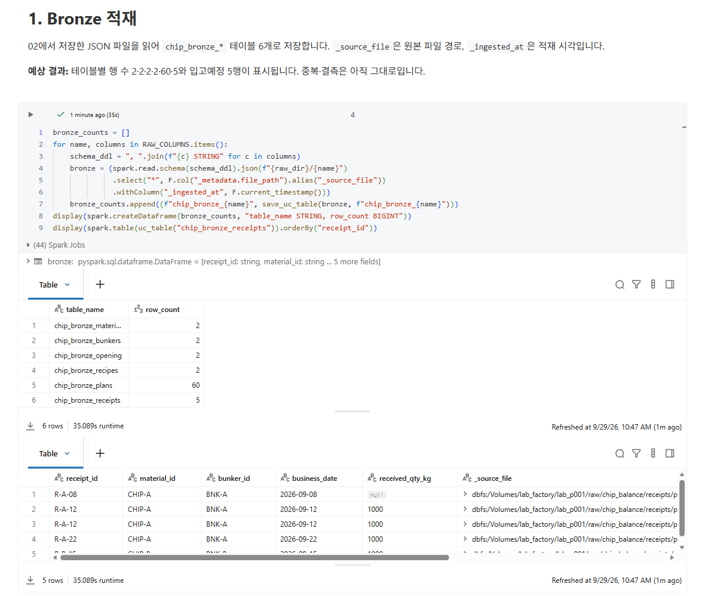
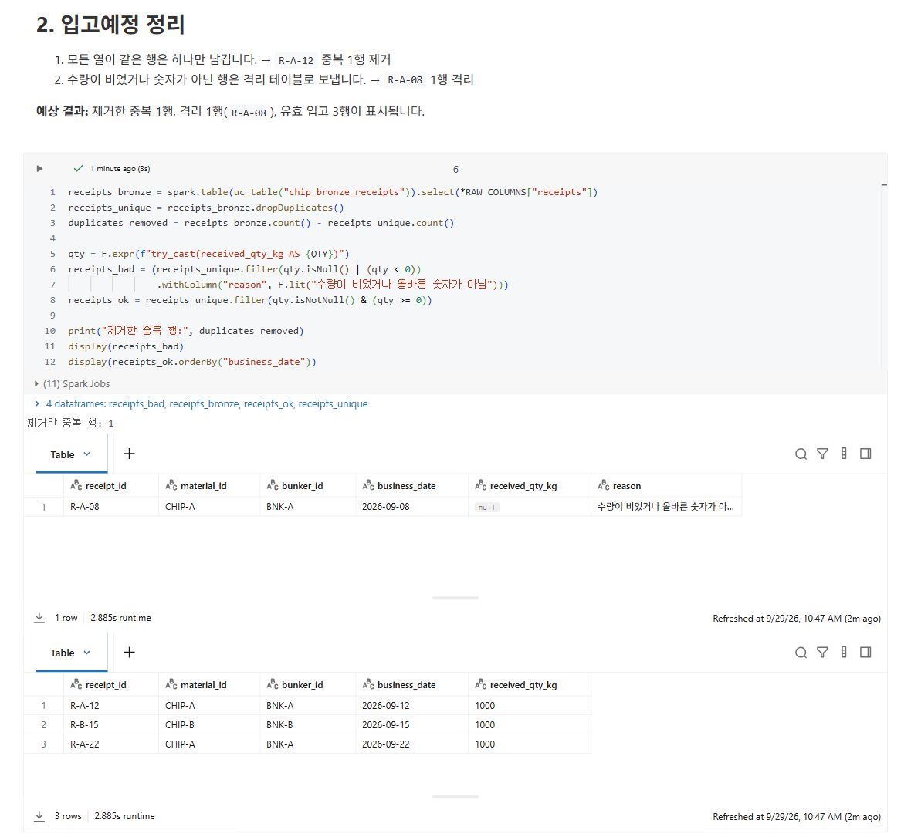
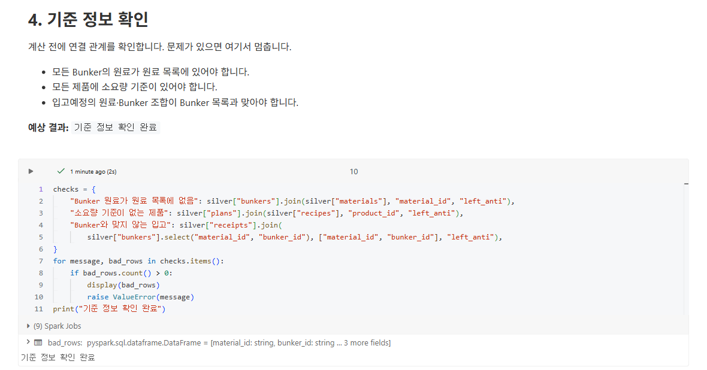
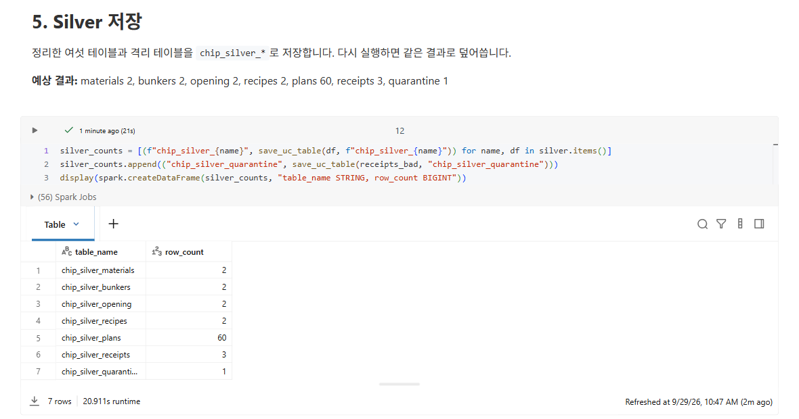

03. Bronze와 Silver
==========================

`목차 <../README.rst>`_ | 이전: `02. 원본 데이터 만들기 <02-source-data.rst>`_ | 다음: `04. Gold 계산과 OneLake 저장 <04-gold-onelake.rst>`_

``03_bronze_silver``\ 에서 02장의 JSON 파일을 테이블로 적재하고, 계산에 쓸 수 있게 정리합니다.

* **Bronze**\ 는 원본 파일을 바꾸지 않고 그대로 테이블에 넣은 것입니다. 파일 경로와 적재 시각만 붙입니다.
* **Silver**\ 는 Bronze에서 중복을 지우고 결측 행을 격리한 뒤, 날짜·수량을 계산할 수 있는 형식으로 바꾼 것입니다.

테이블은 모두 본인 스키마 ``lab_factory.lab_p001``\ 에 저장됩니다.

시작하기
-----------

#. ``ChipBalance`` 폴더에서 ``03_bronze_silver``\ 를 엽니다.
#. 오른쪽 위 Compute 이름이 배정받은 Compute인지 확인합니다.
#. 맨 위부터 셀을 하나씩 **Shift+Enter**\ 로 실행합니다.

**예상 결과:** ``%run ./01_setup`` 셀이 오류 없이 끝납니다.

1. Bronze 적재
-----------------

**화면에서 볼 것:** JSON 파일을 읽어 ``chip_bronze_*`` 테이블 6개로 저장합니다.
``_source_file``\ 은 원본 파일 경로, ``_ingested_at``\ 은 적재 시각입니다.
아래쪽 입고예정 표에는 중복 ``R-A-12``\ 와 수량이 빈 ``R-A-08``\ 이 아직 그대로 있습니다.

**예상 결과:** 테이블별 행 수 2·2·2·2·60·5와 입고예정 Bronze 5행이 표시됩니다.

2. 입고예정 정리
-------------------

**화면에서 볼 것:** 입고예정을 두 단계로 정리합니다.

#. 모든 열이 같은 행은 하나만 남깁니다. → ``R-A-12`` 중복 1행을 지웁니다.
#. 수량이 비었거나 숫자가 아닌 행은 격리합니다. → ``R-A-08`` 1행을 격리합니다.

격리한 행은 버리지 않고 ``chip_silver_quarantine`` 테이블에 사유와 함께 남깁니다. 나중에 원인을 확인할 수 있습니다.

**예상 결과:** ``제거한 중복 행: 1``, 격리 1행(``R-A-08``), 유효 입고 3행(``R-A-12``, ``R-B-15``, ``R-A-22``)이 표시됩니다.

3. 형식 바꾸기
-----------------

**화면에서 볼 것:** 문자열을 계산할 수 있는 형식으로 바꿉니다.

* 날짜 → DATE
* 수량(kg) → DECIMAL(18,3)
* 제품 1kg당 Chip 소요량 → DECIMAL(18,6)

**예상 결과:** 입고예정의 열 형식이 표시됩니다. ``business_date``\ 는 date, ``received_qty_kg``\ 는 decimal(18,3)입니다.

.. image:: ../assets/screenshots/d03-types.png
   :alt: 3번 셀 결과. 입고예정의 열 형식에서 business_date는 date, received_qty_kg는 decimal(18,3)입니다.
   :width: 1100

4. 기준 정보 확인
--------------------

**화면에서 볼 것:** 계산하기 전에 데이터 사이의 연결을 확인합니다. 문제가 있으면 해당 행을 보여 주고 여기서 멈춥니다.

* Bunker의 원료가 모두 원료 목록에 있는지
* 생산계획의 제품마다 소요량 기준이 있는지
* 입고예정의 원료·Bunker 조합이 Bunker 목록과 맞는지

**예상 결과:** ``기준 정보 확인 완료``\ 가 표시됩니다.

5. Silver 저장
-----------------

**화면에서 볼 것:** 정리한 6개 테이블과 격리 테이블을 ``chip_silver_*``\ 로 저장합니다. 다시 실행하면 같은 결과로 덮어씁니다.

**예상 결과:** materials 2, bunkers 2, opening 2, recipes 2, plans 60, receipts 3, quarantine 1

(선택) Catalog에서 테이블 보기
---------------------------------

#. 왼쪽 **Catalog**\ 를 누릅니다.
#. ``lab_factory`` > ``lab_p001`` > **Tables**\ 를 펼칩니다.

**예상 결과:** ``chip_bronze_*`` 6개와 ``chip_silver_*`` 7개가 보입니다.
테이블 이름을 누르면 열 목록과 형식을 볼 수 있습니다.

다음 단계
------------

`04. Gold 계산과 OneLake 저장 <04-gold-onelake.rst>`_
