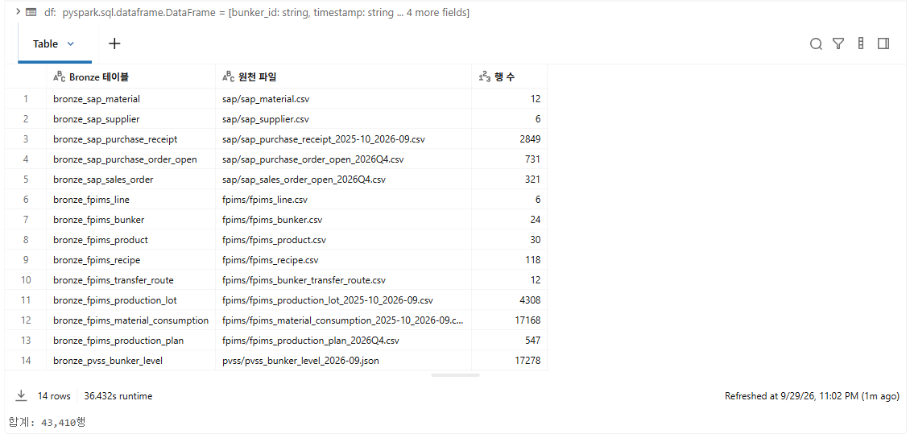
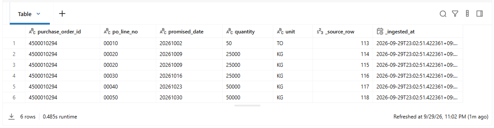
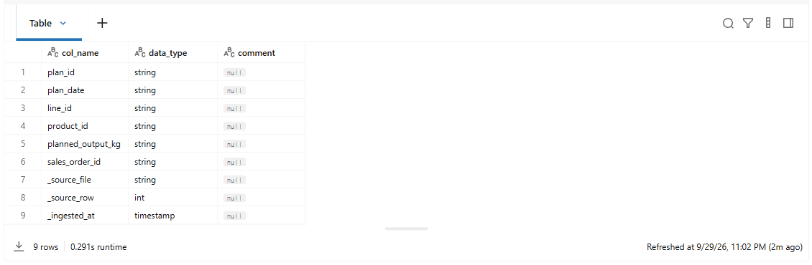

# 03. Bronze

[목차](../README.md) \| 이전: [02. 원천 데이터 만들기](02-source-data.md) \| 다음: [04. Silver](04-silver.md)

02장에서 본 `50 TO`와 중복 발주 행을 지금 고쳐도 될까요? **이 장에서는 먼저 원본 그대로 남깁니다.** `03_bronze`로 원천 파일 14개를 Unity Catalog의 Bronze 테이블 14개로 적재하고, 파일 내용이 바뀌지 않았는지 확인합니다.

원천 값은 문자로 두고, 어느 파일의 몇 번째 행인지(`_source_file`, `_source_row`)와 적재 시각(`_ingested_at`)을 붙입니다. 다음 장의 정제 결과가 이상하면 **Bronze의 원본 행으로 돌아가 비교**할 수 있습니다.

**시작 전:** 02장의 파일 14개·43,410행이 본인의 `raw` Volume에 있어야 합니다. 이 장의 저장 위치는 본인 Unity Catalog 스키마이며 테이블 이름은 `bronze_*`입니다.

## 1. Notebook 열고 실행

1.  `ChipBalance` 폴더에서 `03_bronze`를 엽니다.
2.  오른쪽 위 Compute 목록에 **Serverless**가 선택되어 있는지 확인합니다. (02장 1단계와 같습니다.)
3.  위에서부터 **Shift+Enter**로 한 셀씩 실행합니다. 위쪽 **Run all**로 전체를 실행한 뒤 아래 결과를 확인해도 됩니다. 실행 시간은 약 1–2분이며 환경에 따라 달라질 수 있습니다.

## 2. 셀별 결과 확인

1.  **1. 설정 불러오기**

    **예상 결과:** 01에서 본 결과가 다시 표시되고, 맨 아래에 `연결 확인 완료`가 보입니다.

2.  **2. 파일과 Bronze 테이블**

    파일 하나가 Bronze 테이블 하나가 됩니다. 테이블 이름은 `bronze_<시스템>_<내용>`입니다. 셀은 파일을 읽어 원천 위치와 적재 시각을 붙이는 함수 `read_raw`를 만듭니다.

    **예상 결과:** 결과 없이 끝납니다.

3.  **3. Bronze 테이블 만들기**

    파일마다 Delta 테이블로 저장합니다. 다시 실행하면 테이블을 덮어씁니다.

    **예상 결과:** 표 14행, 아래에 `합계: 43,410행`. 02장에서 만든 파일의 행 수와 같습니다.

    

4.  **4. 원본 그대로인지 확인**

    `bronze_sap_purchase_order_open`에서 `BNK-L3-2`의 10월 입고 예정을 봅니다. 02장 **8. BNK-L3-2 입고 예정**과 같은 내용이어야 합니다.

    **예상 결과:** 6행. 10월 2일 줄은 여전히 `50` `TO`이고, 10월 9일 `00020` 줄이 두 번 있습니다. `_source_row`는 원천 파일의 몇 번째 행인지 알려 줍니다(113–118).

    

5.  **5. 열 형식 확인**

    Bronze는 형식을 바꾸지 않으므로 날짜와 수량도 문자(`string`)입니다. 04장에서 날짜·숫자 형식으로 바꿉니다.

    **예상 결과:** 9행. `plan_date`, `planned_output_kg`가 `string`이고, 붙인 열 `_source_row`는 `int`, `_ingested_at`은 `timestamp`입니다.

    

## 이 장의 완료 기준

Bronze 테이블 **14개·합계 43,410행**이 원천 파일과 같고, 입고 예정에 **`50 TO`와 중복 2행이 그대로** 남아 있으며 날짜·수량이 `string`이면 완료입니다. 중복이 남아 있는 것은 오류가 아니라 이 장의 목적입니다. 다음 04장에서 계산에 맞는 형식으로 바꾸고 문제 행을 격리합니다.

## Troubleshooting

- `PATH_NOT_FOUND`처럼 파일을 찾지 못한다는 오류가 나면 02장 `02_source_data`를 다시 실행합니다.
- 행 수가 다르면 02장 **2. 원천 파일 만들기**부터 다시 실행한 뒤 이 Notebook을 다시 실행합니다.

## 다음 단계

[04. Silver](04-silver.md)
