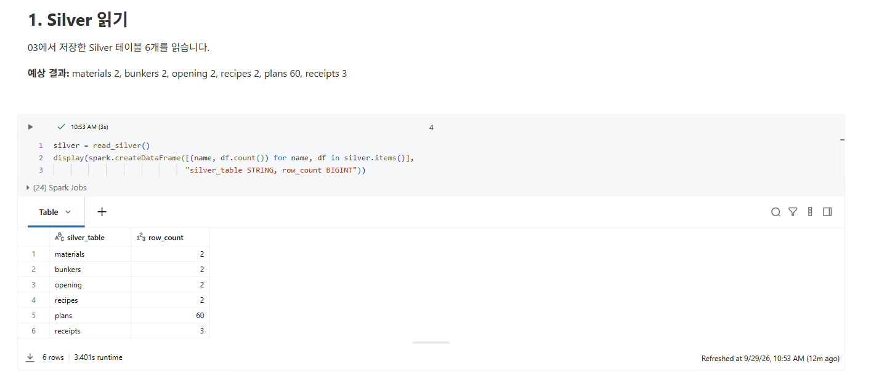
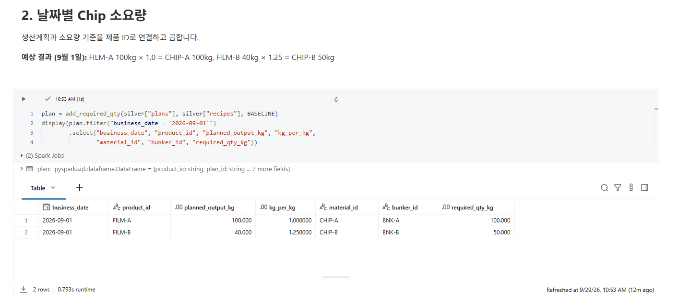
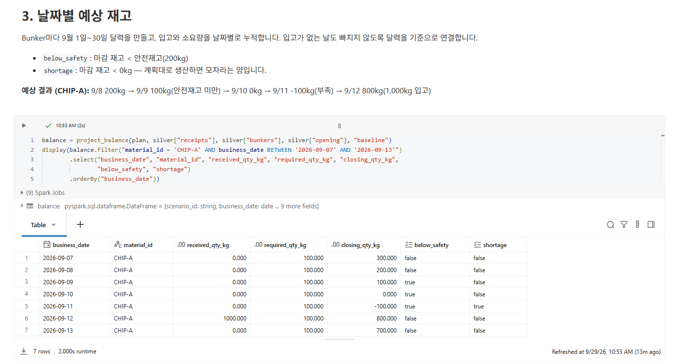
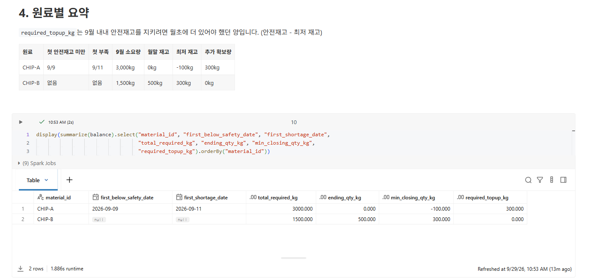
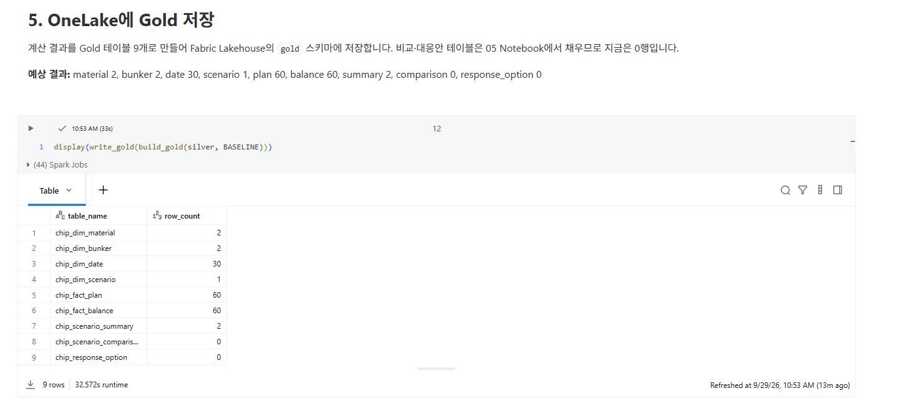
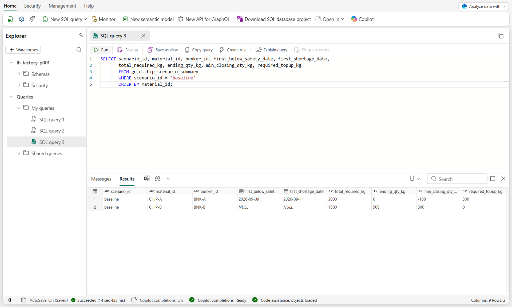

04. Gold 계산과 OneLake 저장
====================================

`목차 <../README.rst>`_ | 이전: `03. Bronze와 Silver <03-bronze-silver.rst>`_ | 다음: `05. Power BI 보고서 <05-power-bi.rst>`_

``04_gold_baseline``\ 에서 기준 계획의 9월 날짜별 원료 재고를 계산하고, 결과(Gold)를 Fabric Lakehouse에 저장합니다.
그다음 Fabric에서 저장된 테이블을 확인합니다.

.. code-block:: text

   Chip 소요량 = 생산계획(제품 kg) × 제품 1kg당 Chip 소요량
   당일 마감 재고 = 전일 마감 재고 + 당일 입고 − 당일 Chip 소요량
   안전재고 미만(below_safety) = 마감 재고 < 200kg
   부족(shortage) = 마감 재고 < 0kg
   추가 확보량(required_topup_kg) = max(0, 안전재고 − 9월 최저 마감 재고)

A. Databricks에서 계산하고 저장하기
--------------------------------------

#. ``ChipBalance`` 폴더에서 ``04_gold_baseline``\ 을 엽니다.
#. 오른쪽 위 Compute 이름이 배정받은 Compute인지 확인합니다.
#. 맨 위부터 셀을 하나씩 **Shift+Enter**\ 로 실행합니다.

**예상 결과:** ``%run ./01_setup`` 셀이 오류 없이 끝납니다.

1. Silver 읽기
~~~~~~~~~~~~~~~~~

**예상 결과:** materials 2, bunkers 2, opening 2, recipes 2, plans 60, receipts 3

2. 날짜별 Chip 소요량
~~~~~~~~~~~~~~~~~~~~~~~~

**화면에서 볼 것:** 생산계획과 소요량 기준을 제품 ID로 연결하고 곱합니다. 화면에는 9월 1일만 보여 줍니다.

**예상 결과:** FILM-A 100kg × 1.0 = CHIP-A 100kg, FILM-B 40kg × 1.25 = CHIP-B 50kg

3. 날짜별 예상 재고
~~~~~~~~~~~~~~~~~~~~~~

**화면에서 볼 것:** Bunker마다 9월 1일~30일 달력을 만들고 입고와 소요량을 날짜별로 누적합니다.
입고가 없는 날도 빠지지 않습니다. 화면에는 CHIP-A의 9월 7일~13일을 보여 줍니다.

**예상 결과:** CHIP-A 마감 재고가 300 → 200 → 100 → 0 → −100 → 800 → 700kg으로 바뀝니다.

* 9/8 200kg: 안전재고와 같으므로 ``below_safety``\ 는 false입니다.
* 9/9 100kg: 처음으로 안전재고 미만입니다. (``below_safety`` = true)
* 9/11 −100kg: 처음으로 부족합니다. (``shortage`` = true) 계획대로 생산하면 100kg이 모자랍니다.
* 9/12 800kg: ``R-A-12`` 1,000kg이 생산 전에 들어와 다시 안전재고 이상이 됩니다.

4. 원료별 요약
~~~~~~~~~~~~~~~~~

**예상 결과:** 원료별 1행씩 2행이 표시됩니다. 빈 날짜는 ``null``\ 로 보입니다.

.. list-table::
   :header-rows: 1
   :widths: 50 25 25

   * - 항목 (열 이름)
     - CHIP-A
     - CHIP-B
   * - 첫 안전재고 미만일 (``first_below_safety_date``)
     - 2026-09-09
     - 없음 (null)
   * - 첫 부족일 (``first_shortage_date``)
     - 2026-09-11
     - 없음 (null)
   * - 9월 소요량 (``total_required_kg``)
     - 3,000kg
     - 1,500kg
   * - 월말 재고 (``ending_qty_kg``)
     - 0kg
     - 500kg
   * - 최저 마감 재고 (``min_closing_qty_kg``)
     - −100kg
     - 300kg
   * - 추가 확보량 (``required_topup_kg``)
     - 300kg
     - 0kg

CHIP-A는 9월 1일에 300kg이 더 있었다면 9월 내내 안전재고를 지킬 수 있었습니다. (200 − (−100) = 300)

5. OneLake에 Gold 저장
~~~~~~~~~~~~~~~~~~~~~~~~~

**화면에서 볼 것:** Databricks가 Gold 테이블 9개를 Fabric Lakehouse ``lh_factory_p001``\ 의 ``gold`` 스키마에 직접 저장합니다.
Fabric은 저장된 테이블을 자동으로 인식하므로 Fabric에서 테이블을 따로 만들지 않습니다.
인증 정보는 secret scope에서 읽으며 화면에 표시하지 않습니다. 저장에는 1분 정도 걸립니다.

**예상 결과:** 테이블 9개의 이름과 행 수가 표시됩니다. (아래 표의 "04 실행 후" 열)

Gold 테이블 9개
------------------

07장에서 ``05_emergency_order``\ 를 실행하면 같은 테이블을 기준 계획과 긴급 오더 결과로 덮어씁니다.

.. list-table::
   :header-rows: 1
   :widths: 30 46 12 12

   * - 테이블
     - 내용
     - 04 실행 후
     - 05 실행 후
   * - ``chip_dim_material``
     - 원료 Chip
     - 2
     - 2
   * - ``chip_dim_bunker``
     - Bunker와 용량·안전재고
     - 2
     - 2
   * - ``chip_dim_date``
     - 9월 1일~30일 날짜
     - 30
     - 30
   * - ``chip_dim_scenario``
     - 시나리오 (기준 계획, 긴급 오더)
     - 1
     - 2
   * - ``chip_fact_plan``
     - 날짜·제품별 생산량과 Chip 소요량
     - 60
     - 120
   * - ``chip_fact_balance``
     - 날짜·Bunker별 입고, 소요량, 마감 재고, 안전재고 미만·부족 표시
     - 60
     - 120
   * - ``chip_scenario_summary``
     - 시나리오·원료별 요약 (첫 안전재고 미만일, 첫 부족일, 추가 확보량 등)
     - 2
     - 4
   * - ``chip_scenario_comparison``
     - 기준 계획과 긴급 오더 비교
     - 0
     - 2
   * - ``chip_response_option``
     - 긴급 오더 대응안과 판단 기준 충족 여부
     - 0
     - 3

B. Fabric에서 확인하기
-------------------------

1. Lakehouse에서 테이블 보기
~~~~~~~~~~~~~~~~~~~~~~~~~~~~~~~

#. Fabric(https://app.fabric.microsoft.com)에서 왼쪽 **Workspaces**\ 를 누르고 본인 작업 영역(예: ``factory-p001``)을 엽니다.
#. 항목 목록에서 Lakehouse ``lh_factory_p001``\ 을 엽니다.
#. 왼쪽 **Explorer**\ 에서 **Tables** > ``gold``\ 를 펼칩니다.

   **예상 결과:** ``chip_``\ 으로 시작하는 테이블 9개가 보입니다. 이름이 길면 뒷부분이 잘려 보입니다.
   같은 Lakehouse에 다른 테이블이 있어도 이 Workshop에서는 ``chip_`` 테이블만 사용합니다.

   .. image:: ../assets/screenshots/f04-lakehouse-tables.png
      :alt: Lakehouse Explorer. lh_factory_p001 > Tables > gold 아래에 chip_dim_bunker, chip_dim_date, chip_dim_material, chip_dim_scenario, chip_fact_balance, chip_fact_plan, chip_response_option, chip_scenario_comparison, chip_scenario_summary 테이블 9개가 보입니다.
      :width: 300

#. ``chip_scenario_summary``\ 를 누릅니다.

   **예상 결과:** 가운데에 미리보기가 열리고 기준 계획(``baseline``)의 CHIP-A, CHIP-B 2행이 보입니다.

2. SQL로 확인하기
~~~~~~~~~~~~~~~~~~~~

#. 왼쪽에서 작업 영역 ``factory-p001``\ 을 다시 눌러 항목 목록으로 돌아갑니다.
#. ``lh_factory_p001`` 바로 아래 줄에 있는 같은 이름의 항목 중 **Type**\ 이 **SQL analytics endpoint**\ 인 항목을 엽니다.
#. 위쪽 **New SQL query**\ 를 누릅니다.
#. 아래 SQL을 붙여 넣고 **Run**\ 을 누릅니다.

.. code-block:: sql

   SELECT scenario_id, material_id, bunker_id, first_below_safety_date, first_shortage_date,
          total_required_kg, ending_qty_kg, min_closing_qty_kg, required_topup_kg
   FROM gold.chip_scenario_summary
   WHERE scenario_id = 'baseline'
   ORDER BY material_id;

**예상 결과:** 아래 **Results**\ 에 2행이 나오고, 아래쪽에 **Succeeded**\ 가 표시됩니다. 값은 A의 **4. 원료별 요약** 결과와 같습니다.

``Invalid object name`` 오류가 나거나 왼쪽 목록에 ``chip_`` 테이블이 보이지 않으면,
Home 도구 모음 맨 앞의 **Sync metadata from the Lakehouse** 아이콘을 누르고 잠시 기다린 뒤 다시 **Run**\ 을 누릅니다.
(아이콘에 마우스를 올리면 이름이 보입니다.)

다음 단계
------------

`05. Power BI 보고서 <05-power-bi.rst>`_
