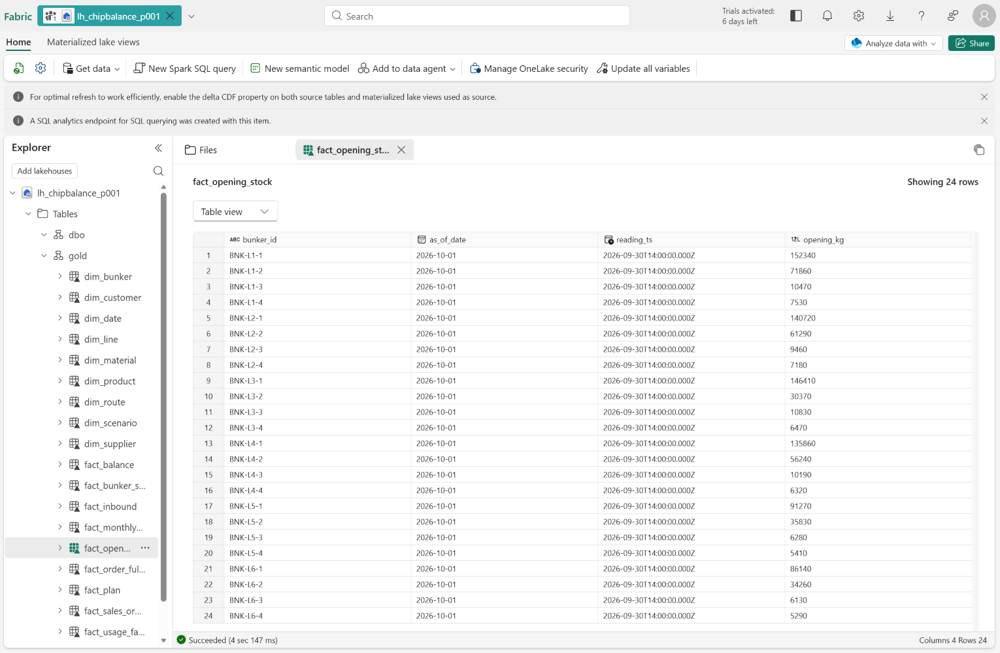
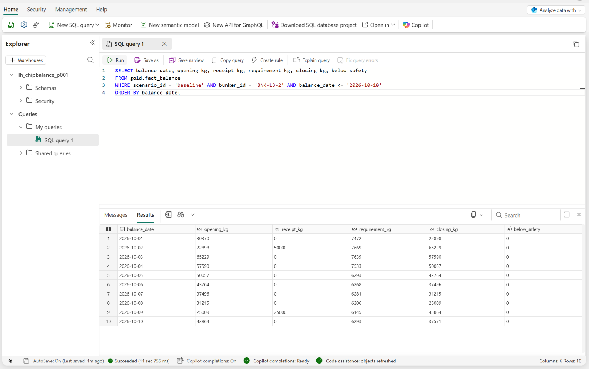

05. Gold와 OneLake
=====================

`목차 <../README.rst>`_ | 이전: `04. Silver <04-silver.rst>`_ | 다음: `06. 긴급 오더와 대응안 <06-emergency-order.rst>`_

``05_gold``\ 로 Silver 테이블에서 Bunker별·날짜별 원료 Balance를 계산해 Gold 테이블 18개를 만들고, Fabric Lakehouse(OneLake)에 저장합니다.
Fabric은 이 Gold로 Ontology와 Power BI 보고서를 만들고, Ontology agent와 Operations agent가 Ontology를 근거로 동작합니다.

.. list-table::
   :header-rows: 1
   :widths: 8 62 30

   * - 순서
     - 계산
     - Gold 테이블
   * - 1
     - 기준 정보 정리 (라인, Bunker, 원료, 제품, 공급사, 고객, 이송 경로, 날짜, 시나리오)
     - ``gold_dim_*``
   * - 2
     - 1년 실적으로 제품별 실제 원료 소요량
     - ``gold_fact_usage_factor``
   * - 3
     - 공급사별 평균 입고 지연 → 입고 예정일
     - ``gold_dim_supplier``, ``gold_fact_inbound``
   * - 4
     - 9월 30일 23시 센서 값 → 시작 재고
     - ``gold_fact_opening_stock``
   * - 5
     - 생산계획 × 실제 소요량 → 날짜별 Bunker 사용량, 날짜별 재고
     - ``gold_fact_balance``
   * - 6
     - Bunker별 위험 요약, 판매오더 납기
     - ``gold_fact_bunker_summary``, ``gold_fact_order_fulfillment``

이 장에서는 **현재 계획**\ (시나리오 ``baseline``)만 계산합니다. 긴급 오더는 06장에서 같은 방식으로 계산합니다.

1. Notebook 열고 실행
------------------------

#. ``ChipBalance`` 폴더에서 ``05_gold``\ 를 엽니다.
#. 오른쪽 위 Compute 목록에서 배정받은 Compute를 고릅니다.
#. 위에서부터 **Shift+Enter**\ 로 한 셀씩 실행합니다. 위쪽 **Run all**\ 로 한 번에 실행해도 됩니다. 전체 실행에 3~4분 걸립니다.

2. 셀별 결과 확인
--------------------

#. **1. 설정 불러오기**

   **예상 결과:** 01에서 본 결과가 다시 표시되고, 맨 아래에 ``연결 확인 완료``\ 가 보입니다.

#. **2. 기준 정보 (Dimension)**

   보고서와 Ontology에서 이름과 속성을 보여 줄 기준 정보 테이블을 만듭니다. 날짜는 4분기(10월 1일~12월 31일) 92일입니다.

   **예상 결과:** 결과 없이 끝납니다.

#. **3. 실제 원료 소요량**

   제품 1kg을 만들 때 실제로 쓴 원료(kg)를 1년 실적으로 구합니다. ``실제 소요량 = 원료 사용량 합계 ÷ 생산량 합계``\ 이며 소수 6자리로 반올림합니다.
   Balance는 레시피 기준이 아닌 실제 소요량으로 계산합니다.

   **예상 결과:** L3 제품의 PET-SD 5행. ``P-L3-05``\ 의 실제 소요량은 ``0.463237``\ 로 레시피 기준 ``0.450000``\ 보다 2.94% 많습니다.

   .. image:: ../assets/screenshots/d05-usage.png
      :alt: 3. 실제 원료 소요량 결과. product_id, material_id, std_kg_per_kg, actual_kg_per_kg, loss_pct, consumed_kg, output_kg 열이 있는 5행 표입니다. P-L3-05의 PET-SD는 std 0.450000, actual 0.463237, loss_pct 2.94입니다.
      :width: 900

#. **4. 공급사 입고 지연과 입고 예정일**

   1년 입고 실적에서 공급사마다 ``실제 입고일 − 약속일``\ 의 평균을 구하고, 반올림한 일수를 **계획 지연일**\ 로 씁니다.
   ``입고 예정일 = 발주 약속일 + 계획 지연일``\ 입니다.

   **예상 결과:** 6행. 계획 지연일은 ``SUP-PET-A`` 0, ``SUP-PET-B`` 0, ``SUP-MB-A`` 1, ``SUP-NY-A`` 1, ``SUP-NY-B`` 2, ``SUP-ADD-A`` 3일입니다.

   .. image:: ../assets/screenshots/d05-supplier.png
      :alt: 4. 공급사 입고 지연 결과. supplier_id, supplier_name, receipt_count, avg_delay_days, planning_delay_days 열이 있는 6행 표입니다. SUP-ADD-A 기능성첨가는 평균 2.69일, 계획 지연 3일입니다.
      :width: 900

#. **5. 시작 재고**

   Bunker마다 9월 30일 23시까지의 마지막 센서 값을 10월 1일 시작 재고로 씁니다.

   **예상 결과:** 24행. ``BNK-L3-2``\ 는 ``30370``\ kg입니다.

   .. image:: ../assets/screenshots/d05-opening.png
      :alt: 5. 시작 재고 결과. bunker_id, as_of_date, reading_ts, opening_kg 열이 있는 표입니다. 모든 행의 reading_ts가 2026-09-30 23:00이고 BNK-L3-2의 opening_kg는 30370입니다.
      :width: 900

#. **6. 판매오더와 생산계획**

   판매오더의 생산 완료일은 그 오더를 채우는 마지막 생산일입니다. 완료일이 납기보다 늦지 않으면 ``on_time``\ 이 ``true``\ 입니다.

   **예상 결과:** 1행. 판매오더 321개 가운데 납기를 넘기는 오더(``late_orders``)는 0개입니다.

   .. image:: ../assets/screenshots/d05-orders.png
      :alt: 6. 판매오더와 생산계획 결과. scenario_id baseline, orders 321, late_orders 0인 1행 표입니다.
      :width: 900

#. **7. 날짜별 Bunker Balance**

   Bunker마다 10월 1일부터 12월 31일까지 하루씩 재고를 계산합니다.

   .. code-block:: text

      사용량(requirement_kg) = 그날 생산계획의 생산량 × 제품의 실제 소요량
      기말 재고(closing_kg) = 기초 재고 + 입고 + 이송 입고 − 이송 출고 − 사용량  → 다음 날 기초 재고
      below_safety = 기말 재고 < 안전재고,  shortage = 기말 재고 < 0

   **예상 결과:** ``BNK-L3-2``\ 의 10월 1~10일 10행. 10월 2일 50,000kg, 10월 9일 25,000kg 입고가 있고, ``below_safety``\ 는 모두 ``false``\ 입니다.

   .. image:: ../assets/screenshots/d05-balance.png
      :alt: 7. 날짜별 Bunker Balance 결과. balance_date, opening_kg, receipt_kg, requirement_kg, closing_kg, safety_stock_kg, below_safety 열이 있는 10행 표입니다. 10월 1일 opening 30370, closing 22898이고 below_safety는 모두 false입니다.
      :width: 900

#. **8. Bunker 위험 요약**

   Bunker마다 4분기 동안 안전재고 아래로 내려가는 날이 있는지 요약합니다. ``required_topup_kg``\ 는 가장 낮은 재고를 안전재고까지 올리는 데 필요한 양입니다.

   **예상 결과:** 24행. 여유(``margin_kg``)가 가장 작은 ``BNK-L5-4``\ 도 안전재고보다 1,002kg 많습니다.
   모든 Bunker의 ``below_safety_days``\ 와 ``required_topup_kg``\ 가 0입니다.

   .. image:: ../assets/screenshots/d05-summary.png
      :alt: 8. Bunker 위험 요약 결과. bunker_id, material_id, below_safety_days, min_closing_kg, safety_stock_kg, margin_kg, min_closing_date, required_topup_kg 열이 있는 표입니다. 첫 행 BNK-L5-4의 margin_kg는 1002이고 below_safety_days와 required_topup_kg는 모두 0입니다.
      :width: 900

#. **9. Gold 테이블 확인**

   Unity Catalog에 만든 Gold 테이블 18개의 행 수입니다. 07장에서 Genie가 이 테이블로 질문에 답합니다.

   **예상 결과:** 18행. ``gold_fact_balance``\ 는 2,208행(Bunker 24개 × 92일)입니다. 표 아래로 스크롤하면 나머지 행이 보입니다.

   .. image:: ../assets/screenshots/d05-tables.png
      :alt: 9. Gold 테이블 확인 결과. Gold 테이블, 행 수 열이 있는 18행 표입니다. gold_dim_line 6, gold_dim_bunker 24, gold_dim_date 92, gold_fact_inbound 719, gold_fact_plan 547이 보입니다.
      :width: 900

#. **10. OneLake에 저장**

   Gold 테이블 18개를 Fabric Lakehouse ``lh_chipbalance_p001``\ 의 ``gold`` 스키마에 저장합니다. 이름에서 ``gold_``\ 를 빼서 ``gold_fact_balance``\ 는 ``gold.fact_balance``\ 가 됩니다.
   관리 ID로 저장하며, 다시 실행하면 덮어씁니다. 소수 열(``actual_kg_per_kg`` 등)은 ``DOUBLE``\ 로 저장됩니다.

   **예상 결과:** 18행. ``Unity Catalog 행 수``\ 와 ``OneLake 행 수``\ 가 모두 같고, 아래에 OneLake 경로가 표시됩니다.

   .. image:: ../assets/screenshots/d05-onelake.png
      :alt: 10. OneLake에 저장 결과. Unity Catalog, OneLake, Unity Catalog 행 수, OneLake 행 수 열이 있는 18행 표입니다. gold_dim_line은 gold.dim_line으로 6행씩 같고, 아래에 OneLake 경로 abfss://chipbalance-p001@onelake.dfs.fabric.microsoft.com/lh_chipbalance_p001.lakehouse/Tables/gold가 표시됩니다.
      :width: 900

3. Fabric Lakehouse에서 Gold 확인
------------------------------------

#. 새 브라우저 탭에서 Fabric을 엽니다: https://app.fabric.microsoft.com
#. 왼쪽 **Workspaces**\ 에서 작업 영역 ``chipbalance-p001``\ 을 열고, 유형이 **Lakehouse**\ 인 ``lh_chipbalance_p001``\ 을 엽니다.
#. 왼쪽 **Explorer**\ 에서 **Tables** > ``gold``\ 를 펼치고 ``fact_opening_stock``\ 을 누릅니다.

**예상 결과:** ``gold`` 스키마에 테이블 18개가 있고, 가운데에 ``fact_opening_stock`` 24행이 보입니다. ``BNK-L3-2``\ 는 ``30370``\ 입니다.
``reading_ts``\ 는 UTC로 표시되어 ``2026-09-30T14:00:00Z``\ (한국 시간 9월 30일 23시)입니다.

4. SQL로 같은 결과 확인
--------------------------

#. 왼쪽 세로 메뉴에서 작업 영역 ``chipbalance-p001``\ 을 누르고, 유형이 **SQL analytics endpoint**\ 인 ``lh_chipbalance_p001``\ 을 엽니다.
#. 위쪽 리본 맨 왼쪽의 **Sync metadata from the Lakehouse** 아이콘을 누릅니다. Lakehouse에 저장된 테이블을 SQL에서 읽을 수 있게 됩니다. (30초쯤)
#. 리본의 **New SQL query**\ 를 누르고 아래 SQL을 붙여 넣은 뒤 **Run**\ 을 누릅니다.

.. code-block:: sql

   SELECT balance_date, opening_kg, receipt_kg, requirement_kg, closing_kg, below_safety
   FROM gold.fact_balance
   WHERE scenario_id = 'baseline' AND bunker_id = 'BNK-L3-2' AND balance_date <= '2026-10-10'
   ORDER BY balance_date;

**예상 결과:** 10행. 2단계 **7. 날짜별 Bunker Balance**\ 와 같은 값입니다. ``below_safety``\ 는 ``0``\ (false)으로 표시됩니다.
Databricks가 저장한 Gold를 Fabric에서 그대로 읽습니다.

문제가 생기면
----------------

* **10. OneLake에 저장**\ 에서 ``service credential`` 오류가 나면 01장 **5. OneLake 연결 확인**\ 을 다시 실행하고, 오류 메시지를 관리자에게 알립니다.
* Fabric에 ``gold`` 테이블이 보이지 않으면 Explorer의 **Tables** 옆 **…** > **Refresh**\ 를 누릅니다.
* SQL에서 ``Invalid object name 'gold.fact_balance'`` 오류가 나면 **Sync metadata from the Lakehouse**\ 를 누르고 30초 뒤 다시 실행합니다.

다음 단계
------------

`06. 긴급 오더와 대응안 <06-emergency-order.rst>`_
