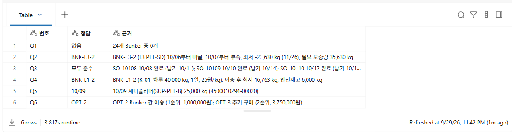
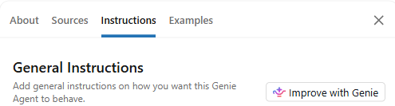
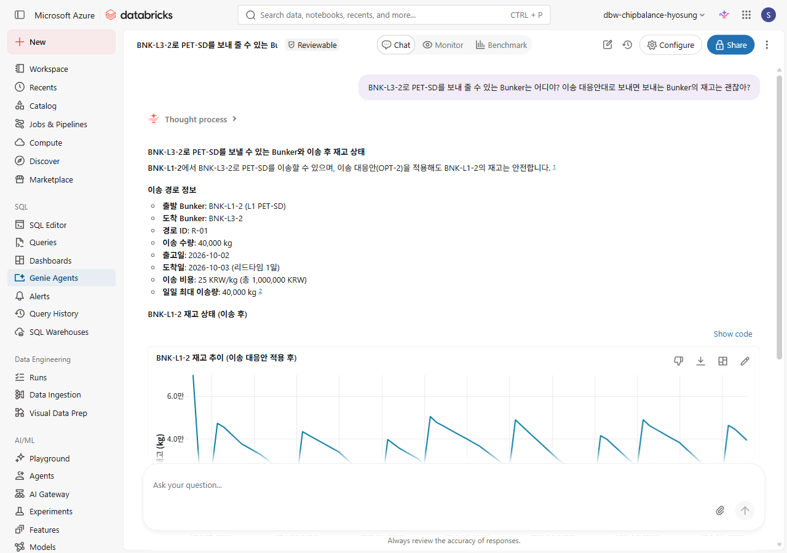

# 07. 정답 계산과 Genie

[목차](../README.md) \| 이전: [06. 긴급 수주와 대응안](06-emergency-order.md) \| 다음: [08. Ontology](08-ontology.md)

Gold는 Fabric Lakehouse(OneLake)에만 있습니다. 이 장에서는 `07_answers`로 OneLake의 Gold에서 질문 6개의 정답을 계산합니다. 이 정답은 09장에서 Fabric의 Ontology agent에 같은 질문을 했을 때의 답과 비교하는 기준 값입니다.

Gold 데이터는 Unity Catalog 관리형 테이블로 저장하지 않습니다. Genie가 Gold를 보려면 OneLake를 Unity Catalog의 Foreign Catalog로 연결해야 합니다. 이 연결은 선택 확장이며 관리자가 미리 설정해 둔 경우에만 쓸 수 있습니다. 아래 "선택 확장: Genie로 같은 질문하기"를 봅니다.

## 1. 정답 계산

1.  `ChipBalance` 폴더에서 `07_answers`를 엽니다.
2.  오른쪽 위 Compute 목록에 **Serverless**가 선택되어 있는지 확인합니다.
3.  위에서부터 **Shift+Enter**로 한 셀씩 실행합니다. 위쪽 **Run all**로 한 번에 실행해도 됩니다. (1~2분)

**예상 결과:** **1. 설정과 Gold 불러오기**에서 `OneLake에서 불러온 Gold: 21개`가 표시되고, **2. Genie 질문의 정답**에서 6행 표가 나옵니다.



| 번호 | 질문 | 정답 |
|---|---|---|
| Q1 | 긴급 오더를 반영하지 않은 현재 계획에서 4분기에 안전재고 아래로 내려가는 Bunker가 있어? | 없음 |
| Q2 | 긴급 오더를 반영하면 어느 Bunker가 언제부터 안전재고 아래로 내려가고, 얼마나 부족해? | BNK-L3-2. 10/06부터 미달, 10/07부터 부족, 최저 -23,630 kg (11/26), 필요 보충량 35,630 kg |
| Q3 | 긴급 오더 때문에 미뤄진 생산의 판매오더는 납기를 지켜? | 모두 준수. SO-10108, SO-10109, SO-10110 |
| Q4 | BNK-L3-2로 PET-SD를 보내 줄 수 있는 Bunker는 어디야? 이송 대응안대로 보내면 보내는 Bunker의 재고는 괜찮아? | BNK-L1-2 (R-01). 이송 후 최저 16,763 kg, 안전재고 6,000 kg 이상 |
| Q5 | BNK-L3-2에 10월 6일 뒤 처음 들어오는 PET-SD 입고는 언제, 어느 공급사에서, 몇 kg이야? | 10/09, SUP-PET-B(세미폴리머), 25,000 kg |
| Q6 | 대응안 4개 가운데 판단 기준을 모두 만족하는 안과 추천안은? | OPT-2(1순위), OPT-3(2순위). 추천안은 OPT-2 |

같은 6개 질문을 09장에서 Fabric의 Ontology agent에도 합니다.

## 선택 확장: Genie로 같은 질문하기

Genie는 Unity Catalog의 테이블을 읽고 질문을 SQL로 바꿉니다. Gold는 OneLake에만 있으므로, OneLake의 Lakehouse를 Unity Catalog의 **Foreign Catalog**로 연결해 두었을 때만 Genie로 질문할 수 있습니다. 복사 없이 메타데이터만 연결합니다. Foreign Catalog는 관리자가 `admin/00_admin_setup` 6단계에서 만들며, 참가자는 `fabric_chipbalance_<참가자>` 카탈로그를 사용합니다. (설정 방법은 [admin README](../admin/README.md) 를 봅니다.)

- **OneLake 테이블 데이터는 읽기 전용입니다.** 이 가이드는 원본 테이블을 바꾸거나 `COMMENT ON`을 실행하지 않습니다. Genie Agent 안의 테이블·열 설명은 별도의 로컬 메타데이터로 편집할 수 있으며, Unity Catalog나 OneLake 원본에 영향을 주지 않습니다. **Configure > Sources**(화면에 따라 **Data**)에서 설명을 보완하고, 공통 업무 규칙은 General Instructions에 적습니다.
- 연결된 Gold의 이름은 `fabric_chipbalance_<참가자>.gold.<테이블>`입니다.
- 질문을 실행하려면 **Serverless 또는 Pro SQL warehouse**와 작성자의 **CAN USE** 권한이 필요합니다. `chipbalance-pro`는 이 가이드의 이름 예시이며 Pro만 필수인 것은 아닙니다. 데이터에는 본인의 `USE CATALOG`, `USE SCHEMA`, `SELECT` 권한도 있어야 합니다.
- OneLake federation용 SQL warehouse는 **SQL 버전 2025.40 이상**이어야 합니다. 클래식 Compute로 Foreign Catalog를 조회할 때는 **Databricks Runtime 18.0 이상, standard access mode**가 필요합니다. 이는 01~07장의 Serverless Notebook으로 Gold를 직접 읽고 쓰는 경로와는 별도의 조건입니다.
- 자세한 연결 방식은 [OneLake catalog federation](https://learn.microsoft.com/azure/databricks/query-federation/onelake)을 따릅니다.

### 1. 테이블과 행 수 먼저 확인

SQL editor에서 지원되는 warehouse를 선택하고 아래 SQL을 실행합니다. `p001`은 본인 번호로 바꿉니다. `SHOW TABLES`는 `gold` 스키마의 테이블 21개를 보여야 합니다.

``` sql
SHOW TABLES IN fabric_chipbalance_p001.gold;

SELECT 'fact_response_option' AS table_name, COUNT(*) AS rows
FROM fabric_chipbalance_p001.gold.fact_response_option
UNION ALL
SELECT 'fact_option_balance', COUNT(*)
FROM fabric_chipbalance_p001.gold.fact_option_balance
UNION ALL
SELECT 'fact_risk_event', COUNT(*)
FROM fabric_chipbalance_p001.gold.fact_risk_event;
```

**예상 결과:** 추가 테이블의 행 수는 순서대로 **4, 460, 1**입니다. 목록에 18개만 보이면 먼저 Fabric Lakehouse의 원본 `gold`에 이 세 테이블이 있는지 확인합니다. 원본은 있는데 Foreign Catalog에 안 보이면 아래 메타데이터 새로 고침 후 `SHOW TABLES`와 행 수 SQL을 다시 실행하고 Genie 데이터 목록을 다시 엽니다.

``` sql
REFRESH FOREIGN CATALOG fabric_chipbalance_p001;
```

`REFRESH FOREIGN`은 원본 Gold를 덮어쓰지 않습니다. 테이블 열 정의가 맞지 않으면 관리자가 해당 `REFRESH FOREIGN TABLE fabric_chipbalance_p001.gold.<테이블>`을 실행해 확인합니다. [명령과 권한](https://learn.microsoft.com/azure/databricks/sql/language-manual/sql-ref-syntax-ddl-refresh-foreign)을 참고합니다. **원본에 세 테이블이 없을 때만** 06장을 실행합니다. 06 재실행은 위험 이벤트 `status`를 `open`으로 덮어쓰므로 단순 목록 캐시 문제를 해결하는 방법으로 쓰지 않습니다.

### 2. Genie Agent 만들기

1.  왼쪽 메뉴에서 **Genie Agents**를 열고 **New**를 누릅니다.
2.  데이터에서 `fabric_chipbalance_<참가자>` 카탈로그의 `gold` 스키마를 열고 확인한 테이블 21개를 모두 선택한 뒤 **Create**를 누릅니다. Agent는 Sources에 연결한 테이블만 조회합니다.
3.  오른쪽 위 **Configure > Settings**(화면에 따라 **About**)에서 이름을 `Chip Balance 원료 수급`으로 바꾸고, Default warehouse를 관리자가 준비한 Serverless 또는 Pro warehouse(예: `chipbalance-pro`)로 지정합니다.

### 3. General Instructions 넣기

Instructions가 없거나 모호하면 Q1의 baseline 질문에 emergency 수치를 섞을 수 있습니다. 시나리오별 Fact가 같은 테이블에 `scenario_id`로 함께 있기 때문입니다. **Configure > Examples > Text**(화면에 따라 **Instructions > General Instructions**)에 다음 내용을 넣고 **Save**를 누릅니다. `<참가자>`를 본인 번호(예: `p001`)로 바꿉니다.

``` text
이 Agent는 Chip Balance 시나리오(PET 칩 원료 수급)를 다룬다.
조회 대상은 fabric_chipbalance_<참가자>.gold.<테이블>이며, gold_fact_*는 Notebook 세션 임시 뷰이므로 사용하지 않는다.
baseline은 긴급 오더를 반영하지 않은 현재 계획, emergency는 긴급 오더를 반영한 계획이다.
scenario_id가 있는 Fact는 fact_plan, fact_order_fulfillment, fact_balance, fact_bunker_summary, fact_response_option, fact_risk_event이다. 이 테이블은 질문의 scenario_id로 필터하고, 서로 조인할 때도 scenario_id를 맞춘다. 현재 계획이나 긴급 오더 미반영 질문은 baseline, 긴급 오더 반영 질문은 emergency로 구분한다.
fact_sales_order에는 scenario_id가 없고 is_urgent로 긴급 오더를 구분한다. fact_option_balance에도 scenario_id가 없고 option_id로 대응안을 선택한다. 나머지 공통 Fact에 scenario_id 조건을 만들지 않는다.
안전재고 아래로 내려간 Bunker는 fabric_chipbalance_<참가자>.gold.fact_bunker_summary의 below_safety_days > 0으로 판단한다.
대응안별 일별 재고는 fact_option_balance를 option_id로 필터한다. 이 테이블은 영향받는 Bunker만 저장하므로 모든 Bunker의 통과 여부는 fact_response_option의 C1~C4와 meets_all로 판단한다. 추천은 recommendation_rank = 1이다.
답변은 한국어로, 정답 값과 근거(Bunker, 날짜, kg)를 함께 보여준다.
```

아래 캡처는 **입력 위치** 예시입니다. 입력 내용은 위 코드 블록을 복사하고 참가자 번호를 바꿔 사용합니다.



### 4. 질문 6개 하기

위 표의 질문 6개를 **하나씩 새 대화**로 묻고, 답을 표의 정답과 비교합니다. 질문마다 1~3분 걸립니다.

**검증 목표:** 표의 정답과 같은 값입니다. (Q2 BNK-L3-2 -23,630 kg, Q4 BNK-L1-2 최저 16,763 kg, Q6 OPT-2 등) Genie는 비결정적이므로 Instructions를 넣어도 정답을 보장하지 않습니다. 답이 다르면 생성된 SQL의 테이블·필터·조인을 확인하고 `07_answers`와 비교합니다. **Examples**에 검증한 SQL을 추가하거나 Agent 안의 설명을 보완한 뒤 새 대화에서 다시 평가합니다. [Agent 생성 조건](https://learn.microsoft.com/azure/databricks/genie-agents/set-up), [품질 개선과 로컬 메타데이터](https://learn.microsoft.com/azure/databricks/genie-agents/tune-quality)를 참고합니다.



## Troubleshooting

- **1. 설정과 Gold 불러오기**에서 오류가 나면 원본 OneLake 테이블이 있는지 먼저 확인합니다. 원본이 없을 때만 05장과 06장을 순서대로 실행합니다. 이 Notebook은 두 장이 OneLake에 저장한 Gold를 읽습니다.
- `service credential` 오류가 나면 01장 **5. OneLake 연결 확인**을 다시 실행합니다.
- 06장을 다시 실행하면 Gold가 바뀌므로 이 Notebook도 다시 실행합니다.

## 다음 단계

[08. Ontology](08-ontology.md)
