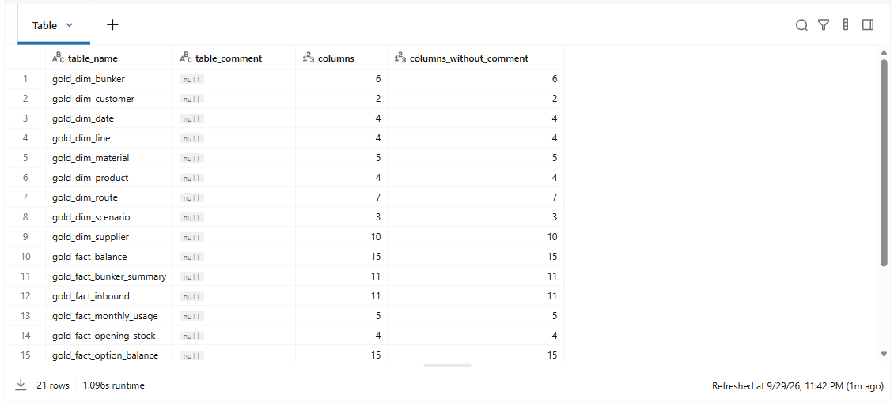
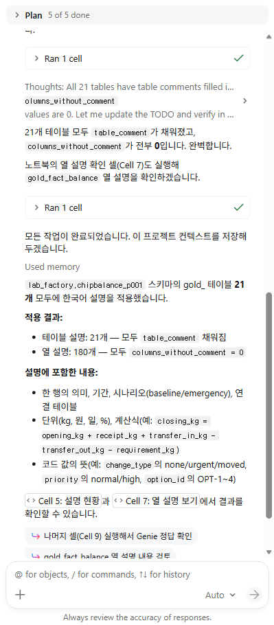
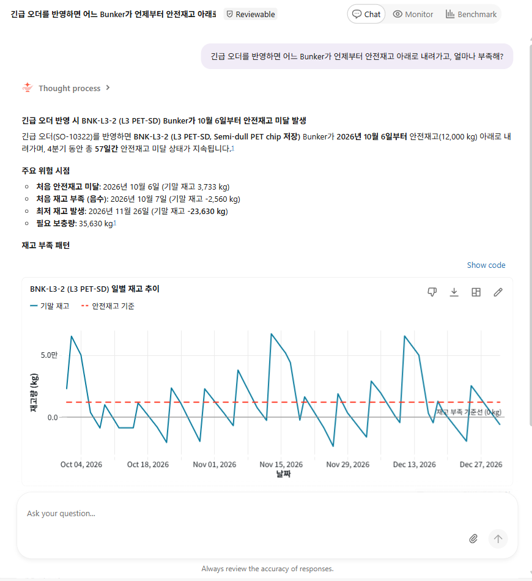
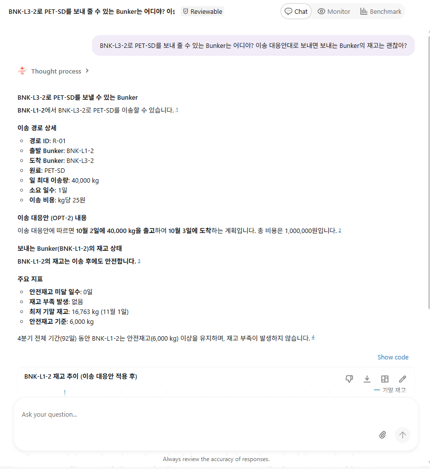
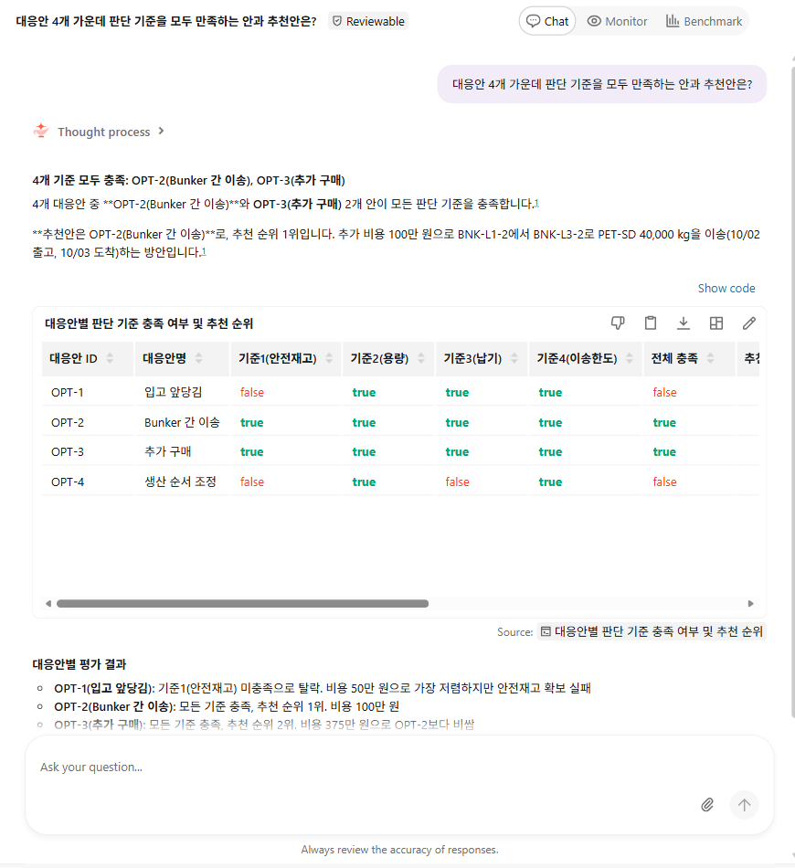

07. Unity Catalog 업데이트 및 Genie 로 인사이트 얻기
=================================

`목차 <../README.rst>`_ | 이전: `06. 긴급 수주와 대응안 <06-emergency-order.rst>`_ | 다음: `08. Ontology <08-ontology.rst>`_

Genie는 자연어 질문을 SQL로 바꿔 답합니다(LLM to SQL). 이때 Unity Catalog의 테이블 설명과 열 설명을 읽고 어떤 테이블과 열을 쓸지 정합니다.
이 장에서는 Genie Code에 프롬프트를 주어 Gold 테이블을 분석하고 설명을 넣게 한 뒤, Genie Agent를 만들어 한국어로 질문하고 정답과 비교합니다.

.. list-table::
   :header-rows: 1
   :widths: 22 78

   * - 도구
     - 하는 일
   * - Genie Code
     - Notebook 오른쪽에서 여는 AI 도우미. 데이터를 조회하고 SQL을 실행해 Unity Catalog에 설명을 넣습니다.
   * - Genie Agent
     - 업무 담당자가 자연어로 질문하는 채팅. 설명을 근거로 SQL을 만들어 실행하고 답과 차트를 보여 줍니다.

1. 설명 현황 확인
--------------------

#. ``ChipBalance`` 폴더에서 ``07_unity_catalog``\ 를 열고, 오른쪽 위 Compute 목록에서 배정받은 Compute를 고릅니다.
#. **1. 설정 불러오기**\ 와 **2. 설명 현황** 셀을 차례로 실행합니다. (**Shift+Enter**)

**예상 결과:** 21행. ``table_comment``\ 가 모두 ``null``\ 이고, ``columns_without_comment``\ 가 ``columns``\ 와 같습니다. 아직 설명이 없습니다.

2. Genie Code로 설명 넣기
----------------------------

#. Notebook 오른쪽 세로 막대에서 **Genie Code** 아이콘을 누릅니다. 오른쪽에 Genie Code 창이 열립니다.
#. 아래 프롬프트를 입력 칸에 붙여 넣고 **Enter**\ 를 누릅니다.

   .. code-block:: text

      lab_factory.chipbalance_p001 스키마에서 이름이 gold_로 시작하는 테이블을 모두 분석해서 Unity Catalog에 한국어 설명을 넣어줘.
      1. 테이블마다 데이터를 조회해서 한 행이 무엇인지, 키 열, 값의 범위와 단위, 다른 gold 테이블과 연결되는 열을 확인해.
      2. 테이블 설명에는 한 행의 의미, 기간, 시나리오(baseline은 현재 계획, emergency는 긴급 오더 반영), 연결되는 테이블을 2~3문장으로 써.
      3. 모든 열에 설명을 넣어. 단위(kg, 원, 일)를 쓰고, 계산 열에는 계산식을 써. 예: closing_kg = opening_kg + receipt_kg + transfer_in_kg - transfer_out_kg - requirement_kg
      4. 코드 값은 뜻을 풀어 써. 예: change_type의 urgent는 긴급 생산, moved는 미룬 생산, none은 그대로
      5. COMMENT ON TABLE과 ALTER TABLE ... ALTER COLUMN ... COMMENT 문으로 적용하고, 끝나면 설명이 없는 테이블과 열이 0개인지 확인해.

   참가자 번호가 ``p001``\ 이 아니면 첫 줄의 ``chipbalance_p001``\ 을 본인 스키마로 바꿉니다.

   .. image:: ../assets/screenshots/d07-genie-code-prompt.png
      :alt: Genie Code 창. 아래 입력 칸에 lab_factory.chipbalance_p001 스키마에서 이름이 gold_로 시작하는 테이블을 모두 분석해서로 시작하는 프롬프트 5줄이 입력되어 있습니다.
      :width: 400

#. Genie Code가 **Plan**\ 을 세우고 단계별로 SQL을 실행합니다. 셀을 실행할 때 승인을 묻는 창이 나오면 내용을 확인하고 실행을 허용합니다. (5~10분)

**예상 결과:** **Plan**\ 이 ``5 of 5 done``\ 이 되고, 테이블 설명 21개와 열 설명이 모두 채워졌다는 요약이 보입니다.
Genie Code의 답은 매번 조금씩 다를 수 있습니다. 설명이 모두 들어갔는지는 3단계에서 확인합니다.

3. 설명 확인
---------------

#. Notebook의 **2. 설명 현황** 셀을 다시 실행합니다.

   **예상 결과:** 21행. ``table_comment``\ 가 모두 채워졌고, ``columns_without_comment``\ 가 모두 ``0``\ 입니다.

   .. image:: ../assets/screenshots/d07-after.png
      :alt: 2. 설명 현황을 다시 실행한 결과. table_comment에 원료 저장 Bunker 마스터, 고객 마스터 같은 한국어 설명이 있고 columns_without_comment는 모두 0입니다.
      :width: 900

#. **3. 열 설명 보기** 셀을 실행합니다.

   **예상 결과:** 15행. ``gold_fact_balance``\ 의 모든 열에 한국어 설명이 있고, ``closing_kg``\ 에는 계산식이 들어 있습니다.

   .. image:: ../assets/screenshots/d07-describe.png
      :alt: 3. 열 설명 보기 결과. gold_fact_balance의 col_name, data_type, comment 15행입니다. closing_kg의 comment는 기말 재고 (kg). closing_kg = opening_kg + receipt_kg + transfer_in_kg - transfer_out_kg - requirement_kg입니다.
      :width: 900

#. 왼쪽 메뉴 **Catalog**\ 에서 ``lab_factory`` > ``chipbalance_p001``\ 을 누릅니다.

   **예상 결과:** **Tables 50** (Bronze 14, Silver 15, Gold 21)이 보이고, Gold 테이블의 **Comment** 열에 설명이 보입니다.

   .. image:: ../assets/screenshots/d07-catalog.png
      :alt: Catalog Explorer의 chipbalance_p001 스키마. Tables 50, Volumes 1이 보이고, 목록 아래쪽 gold_dim_bunker와 gold_dim_customer의 Comment 열에 원료 저장 Bunker, 고객 마스터 설명이 있습니다.
      :width: 1000

4. Genie Agent 만들기
------------------------

#. 왼쪽 메뉴에서 **Genie Agents**\ 를 누르고 오른쪽 위 **New**\ 를 누릅니다.
#. **Connect your data** 창의 검색 칸에 ``chipbalance_p001.gold``\ 를 입력합니다.
#. 목록의 ``gold_``\ 로 시작하는 테이블 21개를 하나씩 눌러 모두 선택합니다. 아래에 ``21/50 tables selected``\ 가 보이면 **Create**\ 를 누릅니다.

   .. image:: ../assets/screenshots/d07-genie-connect.png
      :alt: Connect your data 창. 검색 칸에 chipbalance_p001.gold가 입력되어 있고, gold_로 시작하는 테이블에 모두 체크 표시가 있습니다. 아래에 Selected와 21/50 tables selected, Create 버튼이 있습니다.
      :width: 500

   **예상 결과:** 새 Genie Agent가 열립니다. Genie가 이름과 추천 질문을 자동으로 만듭니다.

#. 오른쪽 위 **Configure**\ 를 누르고 **About** 탭의 **About this agent** 옆 연필 아이콘을 누릅니다.
#. **Edit agent details** 창에서 **Name**\ 을 ``Chip Balance 원료 수급``\ 으로 바꾸고, **Default warehouse**\ 에서 관리자가 만든 ``chipbalance-pro``\ 를 고른 뒤 **Save**\ 를 누릅니다.

   .. image:: ../assets/screenshots/d07-genie-warehouse.png
      :alt: Edit agent details 창. Name은 Chip Balance 원료 수급, Default warehouse는 chipbalance-pro입니다. 오른쪽 아래에 Save 버튼이 있습니다.
      :width: 500

   ``chipbalance-pro``\ 는 Workshop 네트워크 안에서 Unity Catalog 저장소를 읽는 SQL warehouse입니다. 다른 warehouse를 고르면 데이터에 접근하지 못한다는 답이 나옵니다.

#. **Instructions** 탭을 누르고 **General Instructions**\ 에 아래 내용을 붙여 넣은 뒤 **Save**\ 를 누릅니다.

   .. code-block:: text

      * 질문과 답은 한국어로 합니다. 수량은 kg, 금액은 원 단위입니다.
      * scenario_id가 baseline이면 현재 계획, emergency면 10월 1일 접수한 긴급 오더(SO-10322)를 반영한 계획입니다. 질문에 '긴급 오더'가 있으면 emergency, 없으면 baseline으로 답합니다.
      * 안전재고 미달은 기말 재고가 안전재고보다 적은 날(below_safety), 부족은 기말 재고가 0보다 적은 날(shortage)입니다.
      * Bunker 간 이송은 gold_dim_route의 from_bunker_id(보내는 Bunker)에서 to_bunker_id(받는 Bunker)로 갑니다. 대응안을 반영한 재고는 gold_fact_option_balance에 있고, 이송 대응안은 option_id = 'OPT-2'입니다.

   .. image:: ../assets/screenshots/d07-genie-instructions.png
      :alt: Configure 창의 Instructions 탭. General Instructions 편집기에 한국어 지침 4줄이 입력되어 있습니다.
      :width: 450

   테이블과 열의 뜻은 Unity Catalog 설명에 있으므로, 지침에는 업무 용어와 답하는 방식만 씁니다.

5. 한국어로 질문하고 정답과 비교
-----------------------------------

#. **Configure**\ 를 다시 눌러 설정 창을 닫습니다.
#. **Ask your question...** 칸에 아래 질문을 하나씩 입력하고 **Enter**\ 를 누릅니다. 답이 끝나면 오른쪽 위 연필 아이콘(**New chat**)을 눌러 새 대화로 다음 질문을 합니다.
#. ``07_unity_catalog`` Notebook의 **4. Genie 질문의 정답** 셀을 실행하고, Genie 답과 비교합니다.

.. list-table::
   :header-rows: 1
   :widths: 6 50 44

   * - 번호
     - 질문
     - 정답 (Notebook **4. Genie 질문의 정답**)
   * - Q1
     - 긴급 오더를 반영하지 않은 현재 계획에서 4분기에 안전재고 아래로 내려가는 Bunker가 있어?
     - 없음
   * - Q2
     - 긴급 오더를 반영하면 어느 Bunker가 언제부터 안전재고 아래로 내려가고, 얼마나 부족해?
     - BNK-L3-2. 10/06부터 미달, 10/07부터 부족, 최저 -23,630 kg (11/26), 필요 보충량 35,630 kg
   * - Q3
     - 긴급 오더 때문에 미뤄진 생산의 판매오더는 납기를 지켜?
     - 모두 준수. SO-10108, SO-10109, SO-10110
   * - Q4
     - BNK-L3-2로 PET-SD를 보내 줄 수 있는 Bunker는 어디야? 이송 대응안대로 보내면 보내는 Bunker의 재고는 괜찮아?
     - BNK-L1-2 (R-01). 이송 후 최저 16,763 kg, 안전재고 6,000 kg 이상
   * - Q5
     - BNK-L3-2에 10월 6일 뒤 처음 들어오는 PET-SD 입고는 언제, 어느 공급사에서, 몇 kg이야?
     - 10/09, SUP-PET-B(세미폴리머), 25,000 kg
   * - Q6
     - 대응안 4개 가운데 판단 기준을 모두 만족하는 안과 추천안은?
     - OPT-2(1순위), OPT-3(2순위). 추천안은 OPT-2

.. image:: ../assets/screenshots/d07-answers.png
   :alt: 4. Genie 질문의 정답 셀 결과. 번호, 정답, 근거 열이 있는 6행 표입니다. Q1 없음, Q2 BNK-L3-2, Q3 모두 준수, Q4 BNK-L1-2, Q5 10/09, Q6 OPT-2입니다.
   :width: 900

**예상 결과:** Genie가 6개 질문에 모두 정답과 같은 값으로 답합니다. 문장과 차트는 매번 조금씩 다를 수 있습니다.
답 아래 **Show code**\ 나 숫자 링크를 누르면 Genie가 만든 SQL을 볼 수 있습니다.

Q2는 부족한 Bunker와 날짜, 최저 재고, 필요 보충량을 답하고 재고 추이 차트를 그립니다.

Q4는 이송 경로 R-01과, 이송 대응안을 반영한 뒤 보내는 Bunker ``BNK-L1-2``\ 의 최저 재고를 답합니다.

Q6은 판단 기준 C1~C4 충족 여부를 표로 보여 주고 추천안을 답합니다.

나머지 답 화면: `Q1 <../assets/screenshots/d07-genie-q1.png>`_ · `Q3 <../assets/screenshots/d07-genie-q3.png>`_ · `Q5 <../assets/screenshots/d07-genie-q5.png>`_

같은 6개 질문을 09장에서 Fabric의 Ontology agent에도 합니다.

문제가 생기면
----------------

* Genie가 "스토리지 접근 권한 문제로 쿼리를 실행할 수 없다"고 답하면 4단계에서 **Default warehouse**\ 가 ``chipbalance-pro``\ 인지 확인합니다.
* 답이 정답과 다르면 답 아래 **Show code**\ 로 SQL을 확인합니다. 시나리오(``baseline``/``emergency``) 조건이 빠졌으면 질문에 "긴급 오더를 반영하면"처럼 시나리오를 밝혀 다시 묻습니다.
* 05·06장을 다시 실행하면 Gold 테이블을 새로 만들므로 설명이 지워집니다. 이때는 2단계 프롬프트를 다시 실행합니다.

다음 단계
------------

`08. Ontology <08-ontology.rst>`_
