# 08. Ontology

[목차](../README.md) \| 이전: [07. 정답 계산과 Genie](07-genie.md) \| 다음: [09. Ontology agent에 질문하기](09-ontology-agent.md)

Ontology는 업무에서 쓰는 개념(엔터티 타입)과 개념 사이의 관계를 정의하고, 각 개념을 Lakehouse 테이블에 연결(데이터 바인딩)한 모델입니다. 이 장에서는 Ontology agent에 프롬프트를 주어 Gold 테이블로 엔터티 타입 17개와 관계 26개를 만들고, 설명·키·바인딩·관계를 점검합니다. 09장의 Ontology agent가 이 Ontology로 질문에 답합니다.

| 엔터티 타입 | 테이블 (키) | 한 행 |
|----|----|----|
| Line, Bunker, Material, Supplier, Product, Customer | `gold.dim_*` | 라인, 원료 Bunker, 원료, 공급사, 제품, 고객 기준 정보 |
| TransferRoute | `gold.dim_route` (`route_id`) | Bunker 간 이송 경로. 보내는 Bunker와 받는 Bunker |
| Scenario | `gold.dim_scenario` (`scenario_id`) | `baseline`(현재 계획), `emergency`(긴급 수주 반영) |
| SalesOrder, OrderFulfillment | `gold.fact_sales_order`, `gold.fact_order_fulfillment` | 판매오더, 시나리오별 납기 준수 여부 |
| ProductionPlan | `gold.fact_plan` (`plan_key`) | 시나리오별 생산계획 한 건 |
| DailyBalance | `gold.fact_balance` (`balance_key`) | 시나리오·Bunker·날짜별 원료 재고 |
| BunkerRisk | `gold.fact_bunker_summary` (`summary_key`) | 시나리오·Bunker별 미달 일수, 최저 재고, 필요 보충량 |
| InboundDelivery | `gold.fact_inbound` (`inbound_key`) | 입고 예정 한 건 |
| ResponseOption, OptionBalance | `gold.fact_response_option`, `gold.fact_option_balance` | 긴급 수주 대응안 4개와 대응안별 Bunker 재고 |
| RiskEvent | `gold.fact_risk_event` (`event_id`) | 06장에서 감지한 부족 이벤트와 추천 대응안 |

## 시작 전 확인

- 05·06장을 실행해 같은 작업 영역의 Lakehouse에 Gold 테이블 21개를 준비합니다. 이 중 업무 질문에 쓸 17개를 엔터티 타입으로 선택합니다.
- 참가자에게 작업 영역 **Contributor** 이상 권한과 원본 테이블 읽기 권한이 있어야 합니다. 관리자가 **Users can create Fabric items**, **Users can create ontology (preview) items**, Azure OpenAI 기반 Copilot·AI 기능 설정을 참가자에게 허용했는지 확인합니다.
- 전체 실습에 준비된 **활성 유료 Fabric 용량**을 사용합니다. 지역·테넌트 설정은 [관리자 준비 가이드](../admin/README.md)의 "3. Microsoft Fabric"을 따릅니다([Ontology 테넌트 설정](https://learn.microsoft.com/en-us/fabric/iq/ontology/overview-tenant-settings), [Copilot 지역·용량 조건](https://learn.microsoft.com/en-us/fabric/fundamentals/copilot-fabric-overview#available-regions), [Ontology MCP 조건](https://learn.microsoft.com/en-us/fabric/iq/ontology/how-to-use-ontology-mcp-server#prerequisites)).

아래 **예상 결과**는 확인할 목표와 화면 예시입니다. AI가 생성하는 설명·검증 결과와 처리 시간은 달라질 수 있으므로, 완료 문구만 믿지 말고 엔터티·관계·바인딩을 직접 확인합니다.

## 1. Ontology 만들기

1.  Fabric 작업 영역 `chipbalance-p001`에서 **+ New item**을 누릅니다.

2.  **New item** 창의 검색 칸에 `Ontology`를 입력하고 **Ontology (preview)**를 누릅니다.

    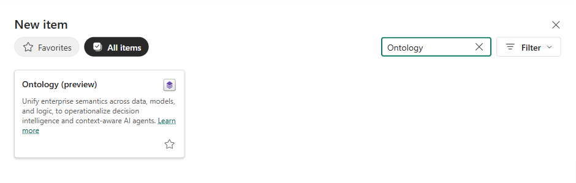

3.  **New Ontology** 창에서 **Name**에 `ont_chipbalance`를 입력하고, **Location**이 `chipbalance-p001`인지 확인한 뒤 **Create**를 누릅니다.

    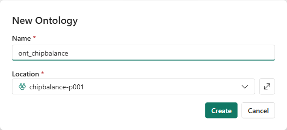

4.  **Welcome to Ontology** 창이 나오면 오른쪽 위 **X**를 눌러 닫습니다.

**예상 결과:** 가운데에 **Get started**와 카드 3개(**Start with Ontology agent**, **Import ontology**, **Learn more**)가 보입니다. 왼쪽 **Explorer**에는 아직 엔터티 타입이 없습니다.

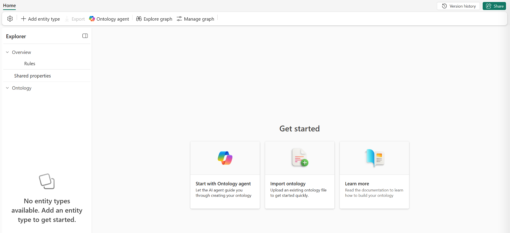

## 2. Ontology agent로 초안 만들기

1.  **Start with Ontology agent** 카드를 누릅니다. 오른쪽에 **Ontology Agent** 창이 열립니다.

    입력 칸 아래 스위치가 **Plan**이면 에이전트는 초안을 만들고 검증만 합니다. **Act**로 바꾸어야 Ontology에 적용합니다.

2.  **Say something** 칸에 아래 프롬프트를 붙여 넣습니다. 참가자 번호가 `p001`이 아니면 첫 줄의 `lh_chipbalance_p001`을 본인 Lakehouse로 바꿉니다.

    ``` text
    lh_chipbalance_p001 Lakehouse의 gold 스키마 테이블로 원료 Chip Balance 온톨로지를 만들어줘.
    업무 범위: 필름 공장의 원료 Chip Bunker 재고, 생산계획, 입고 예정, 긴급 오더 대응안. dbo 스키마와 Files 폴더는 쓰지 마.
    엔터티 타입과 관계 이름은 영어로, 설명과 동의어는 한국어로 써. Bunker는 한국어로 '벙커'라고 써. 각 엔터티 타입에는 테이블의 모든 열을 속성으로 넣고, 괄호 안의 열을 키로 써.
    엔터티 타입:
    - Line: gold.dim_line (line_id)
    - Bunker: gold.dim_bunker (bunker_id)
    - Material: gold.dim_material (material_id)
    - Supplier: gold.dim_supplier (supplier_id)
    - Product: gold.dim_product (product_id)
    - Customer: gold.dim_customer (customer_id)
    - TransferRoute: gold.dim_route (route_id)
    - Scenario: gold.dim_scenario (scenario_id)
    - SalesOrder: gold.fact_sales_order (sales_order_id)
    - OrderFulfillment: gold.fact_order_fulfillment (fulfillment_key)
    - ProductionPlan: gold.fact_plan (plan_key)
    - DailyBalance: gold.fact_balance (balance_key)
    - BunkerRisk: gold.fact_bunker_summary (summary_key)
    - InboundDelivery: gold.fact_inbound (inbound_key)
    - ResponseOption: gold.fact_response_option (option_id)
    - OptionBalance: gold.fact_option_balance (option_balance_key)
    - RiskEvent: gold.fact_risk_event (event_id)
    관계 (이름은 모두 다르게, 출발 → 도착, 연결 열):
    - BunkerOnLine: Bunker → Line (dim_bunker.line_id)
    - BunkerStoresMaterial: Bunker → Material (dim_bunker.material_id)
    - MaterialSuppliedBy: Material → Supplier (dim_material.supplier_id)
    - ProductOnLine: Product → Line (dim_product.line_id)
    - OrderedByCustomer: SalesOrder → Customer (fact_sales_order.customer_id)
    - OrderForProduct: SalesOrder → Product (fact_sales_order.product_id)
    - FulfillmentOfOrder: OrderFulfillment → SalesOrder (fact_order_fulfillment.sales_order_id)
    - FulfillmentInScenario: OrderFulfillment → Scenario (fact_order_fulfillment.scenario_id)
    - PlanForOrder: ProductionPlan → SalesOrder (fact_plan.sales_order_id)
    - PlanOnLine: ProductionPlan → Line (fact_plan.line_id)
    - PlanInScenario: ProductionPlan → Scenario (fact_plan.scenario_id)
    - BalanceOfBunker: DailyBalance → Bunker (fact_balance.bunker_id)
    - BalanceInScenario: DailyBalance → Scenario (fact_balance.scenario_id)
    - RiskOfBunker: BunkerRisk → Bunker (fact_bunker_summary.bunker_id)
    - RiskInScenario: BunkerRisk → Scenario (fact_bunker_summary.scenario_id)
    - InboundToBunker: InboundDelivery → Bunker (fact_inbound.bunker_id)
    - InboundFromSupplier: InboundDelivery → Supplier (fact_inbound.supplier_id)
    - RouteFromBunker: TransferRoute → Bunker (dim_route.from_bunker_id)
    - RouteToBunker: TransferRoute → Bunker (dim_route.to_bunker_id)
    - OptionForBunker: ResponseOption → Bunker (fact_response_option.target_bunker_id)
    - OptionUsesRoute: ResponseOption → TransferRoute (fact_response_option.route_id)
    - OptionBalanceOfOption: OptionBalance → ResponseOption (fact_option_balance.option_id)
    - OptionBalanceOfBunker: OptionBalance → Bunker (fact_option_balance.bunker_id)
    - EventAtBunker: RiskEvent → Bunker (fact_risk_event.bunker_id)
    - EventFromOrder: RiskEvent → SalesOrder (fact_risk_event.sales_order_id)
    - EventRecommends: RiskEvent → ResponseOption (fact_risk_event.recommended_option_id)
    먼저 초안을 만들고 검증 결과와 미리 보기를 보여줘. 적용은 내가 Act 모드로 바꾼 다음에 해.
    ```

    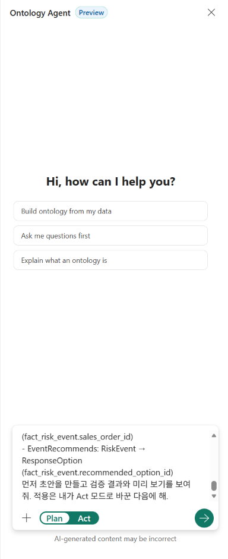

    이 실습은 관계 이름과 방향을 일관되게 읽기 위해 연결 열이 있는 테이블의 엔터티에서 출발하도록 정합니다. 예를 들어 `dim_bunker.line_id`로 잇는 `BunkerOnLine`은 Bunker → Line입니다. 이는 실습의 모델링 규칙이지 Fabric의 필수 제약은 아닙니다. [공식 관계 만들기 예시](https://learn.microsoft.com/en-us/fabric/iq/ontology/how-to-create-relationship-types)는 `DriverId`가 Truck 테이블에 있어도 Driver → Truck으로 정의하고 매핑 테이블을 연결합니다. Graph 적격성은 방향만이 아니라 양쪽 속성·키와 데이터 매핑으로 확인합니다.

3.  오른쪽 아래 화살표를 눌러 보냅니다. 에이전트가 Lakehouse의 열과 샘플 행을 살펴보고 초안을 만든 뒤 검증합니다. (3~5분)

**예상 결과:** "초안과 검증을 완료했습니다"로 시작하는 답에 엔터티 17개, 관계 26개, 이슈 없음이 보입니다. 참고에 나온 4개(`dim_date`, `fact_monthly_usage`, `fact_opening_stock`, `fact_usage_factor`)는 Balance 계산에 쓴 중간 결과이므로 넣지 않습니다. 답의 문장과 제목은 매번 조금씩 다를 수 있습니다. 엔터티 수, 관계 수, 이슈를 확인합니다.

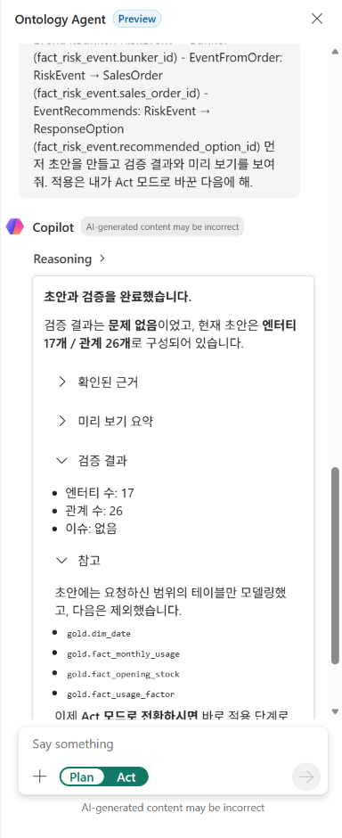

## 3. 미리 보기와 적용

1.  답 아래 **Preview ontology**를 누릅니다. 가운데 캔버스에 초안이 열립니다.

2.  캔버스 왼쪽 아래 **Fit to screen** 아이콘(네 모서리 모양)을 눌러 전체를 봅니다.

    **예상 결과:** 위에 "You are viewing a proposed ontology from the agent. Approve to keep this ontology. This is a read-only view."가 보이고, 캔버스 아래에 `Visible: 17 of 17 entities | 26 of 26 relationships`가 보입니다. 왼쪽 **Explorer**의 **AI Proposal** 아래에 엔터티 타입 17개가 있습니다.

    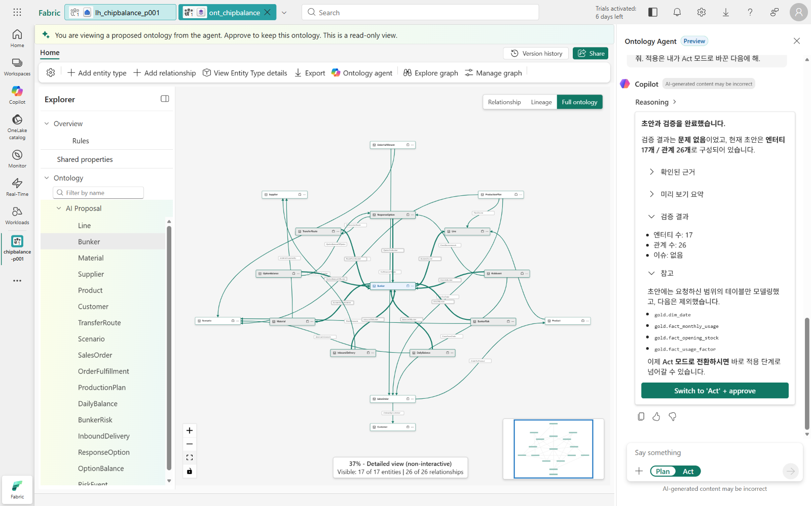

3.  에이전트 창의 **Switch to 'Act' + approve**를 누릅니다. 스위치가 **Act**로 바뀌고 에이전트가 초안을 적용합니다. (2~3분)

**예상 결과:** "적용했습니다. 승인된 온톨로지가 생성되었습니다" 아래 **결과**에 상태 적용 완료, 이슈 없음, 엔터티 타입 17개, 관계 26개가 보입니다. 왼쪽 **Explorer**의 **Entity Types** 아래에 Line부터 RiskEvent까지 17개가 있습니다.

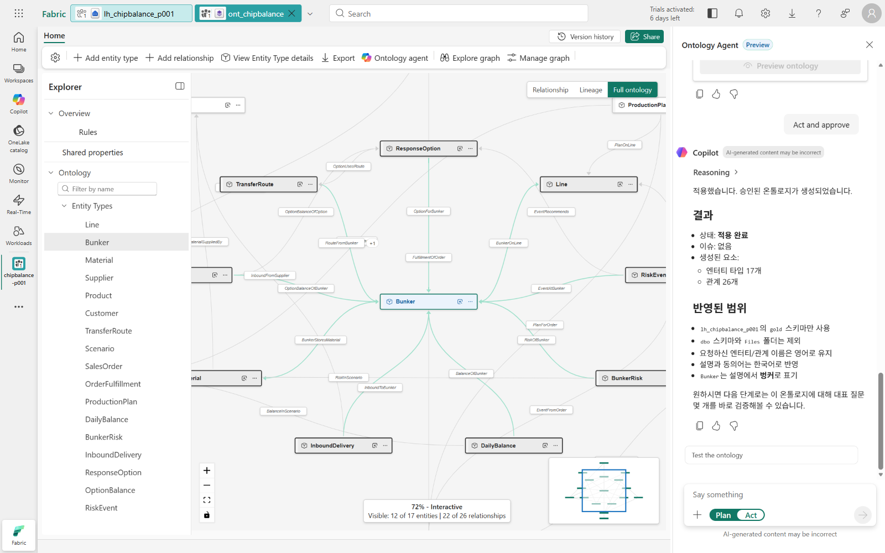

## 4. 엔터티 타입과 관계 점검

09장의 Ontology agent는 엔터티 타입과 관계의 설명·동의어를 읽고 질문의 단어를 엔터티에 연결합니다. 키, 데이터 바인딩, 설명이 제대로 들어갔는지 확인합니다.

1.  오른쪽 위 **X**를 눌러 에이전트 창을 닫습니다.

2.  왼쪽 **Explorer**에서 **Bunker**를 누르고, 리본의 **View Entity Type details**를 누릅니다. 안내 풍선이 나오면 **X**로 닫습니다.

    **예상 결과:** **Configure** 탭에 **Entity type key**가 `bunker_id`이고, 속성 6개의 **Data source**가 모두 `dim_bunker`의 같은 이름 열입니다. **Entity metadata**에 한국어 **Description**과 **Synonyms**(벙커, 원료 벙커 등)가 있습니다. 오른쪽 **Relationships**에는 Bunker에 연결된 관계가 보입니다. 설명과 동의어는 에이전트가 만들므로 문장이 조금씩 다를 수 있습니다.

    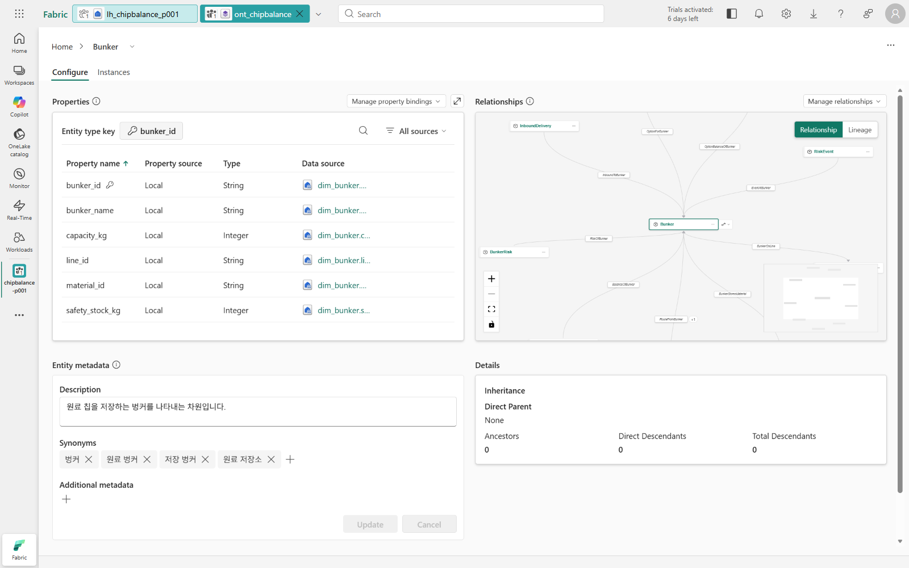

3.  **Instances** 탭을 누릅니다. 안내 풍선이 나오면 **X**로 닫습니다.

    **예상 결과:** `gold.dim_bunker`의 Bunker 24개가 보입니다. `BNK-L3-2`는 `L3 PET-SD`, 용량 `150000`, 안전재고 `12000`입니다. 바인딩한 테이블의 실제 데이터가 엔터티 인스턴스로 읽힙니다.

    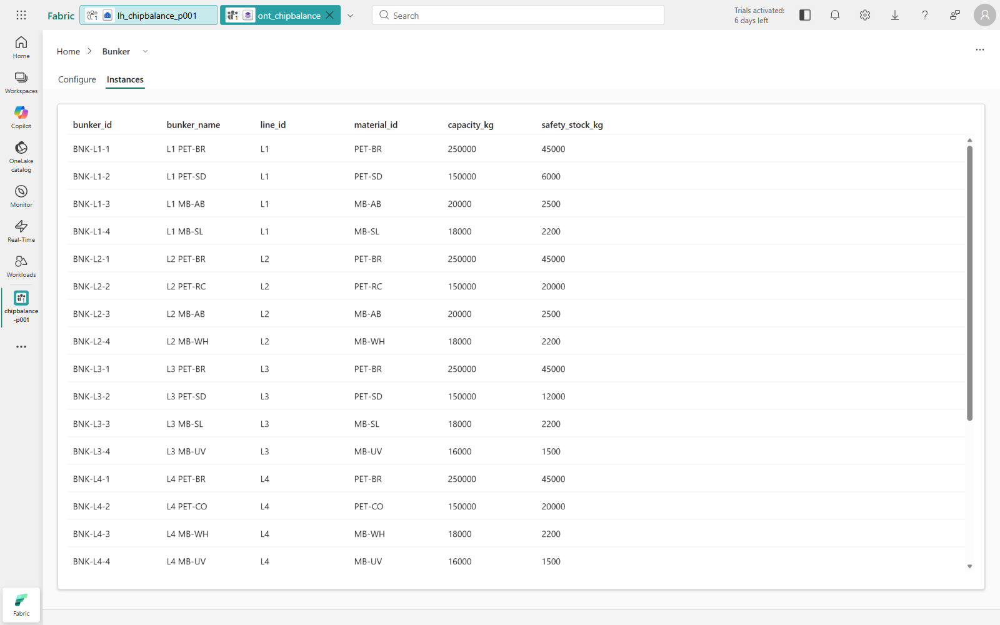

4.  **Configure** 탭으로 돌아가 오른쪽 위 **Manage relationships**를 누르고 목록에서 **BalanceOfBunker**를 누릅니다.

    **예상 결과:** **Origin entity type**이 `DailyBalance`, **Target entity type**이 `Bunker`이고, 두 쪽 **Property**가 모두 `bunker_id`입니다. 일별 재고 한 행이 `bunker_id`로 Bunker 하나에 연결됩니다.

    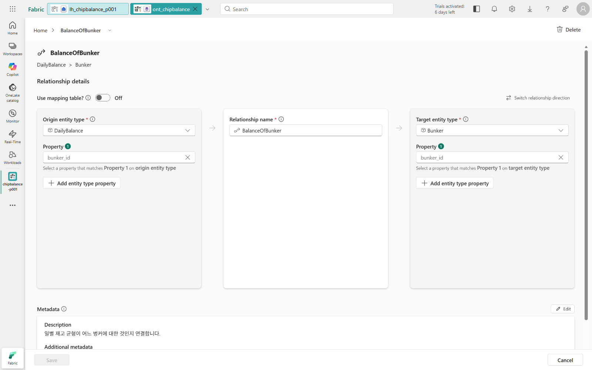

5.  아무것도 바꾸지 않고 오른쪽 아래 **Cancel**을 누른 뒤, 왼쪽 위 **Home**을 누릅니다.

## 5. Graph 만들기 (선택)

Graph는 엔터티 인스턴스를 노드로, 관계를 에지로 저장해 여러 단계의 관계를 따라가며 조회하게 합니다. 별도로 **Materialize**해야 만들어지는 선택 기능이며, 앞 단계의 **Instances** 조회나 Ontology agent의 모든 질문에 필요한 것은 아닙니다. Graph를 만들면 데이터 적재·조회에 용량을 사용합니다. 관계 탐색이 필요할 때 만들고 리본의 **Explore graph**에서 조회합니다.

1.  리본의 **Manage graph**를 누릅니다. **Choose what to project** 화면이 열립니다.

2.  **Entities** 표에서 **Line** 왼쪽 **\>**를 눌러 펼칩니다.

    **예상 결과:** **Use the entire Ontology**가 **Yes**이고, 17개 엔터티가 모두 체크되어 있으며 **Status**가 **Eligible**입니다. Line 아래 관계 `BunkerOnLine`(`dim_bunker`), `ProductOnLine`(`dim_product`), `PlanOnLine`(`fact_plan`)도 **Eligible**입니다. 오른쪽 **Preview**에 노드와 에지가 보입니다.

    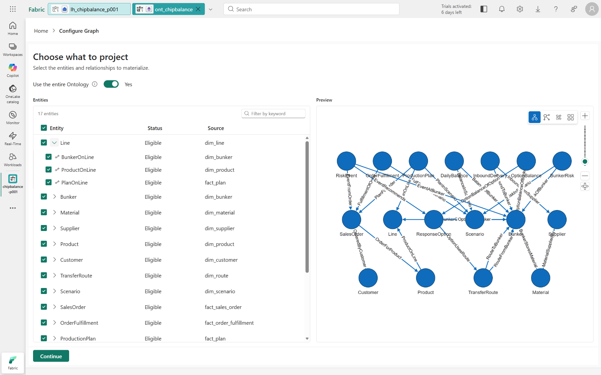

3.  왼쪽 아래 **Continue**를 누르고, **Configure projection** 화면에서 왼쪽 아래 **Materialize**를 누릅니다.

**예상 결과:** 오른쪽 위에 **Creating graph model** 알림이 보이고, 위쪽 탭에 `ont_chipbalance_graph_`로 시작하는 Graph model이 열립니다. 참고 시간은 5~15분이며, 데이터량과 용량 상태에 따라 수분~수시간 걸릴 수 있습니다. 알림만으로 완료를 판단하지 말고 Graph의 노드·에지가 조회되는지 확인합니다.

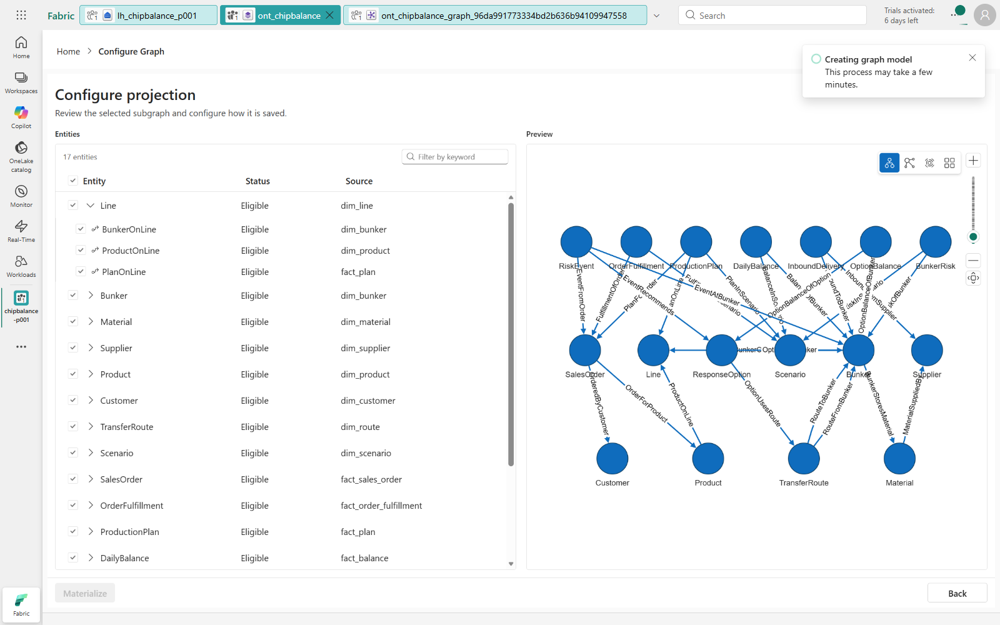

## Troubleshooting

- 초안에 엔터티 타입이 17개보다 적으면 빠진 테이블을 확인합니다. Lakehouse에 `fact_response_option`, `fact_option_balance`, `fact_risk_event`가 있으면 "빠진 테이블을 lh_chipbalance_p001의 gold 스키마에서 다시 찾아서 초안에 추가해줘"라고 요청합니다. 원본 테이블이 실제로 없을 때만 06장을 실행합니다. 06장 재실행은 승인된 위험 이벤트도 `open`으로 덮어쓰므로 단순한 화면 목록 문제에 사용하지 않습니다.
- **Manage graph**에서 관계의 **Source**가 **Not mapped**이면 방향부터 뒤집지 말고 관계 설정을 엽니다.
  - 양쪽 엔터티의 키와 데이터 바인딩, **Origin/Target entity type**의 **Property**를 확인합니다. `BalanceOfBunker`는 DailyBalance의 `bunker_id`와 Bunker의 `bunker_id`를 연결하며, 두 속성의 원본 열과 형식·값이 맞아야 합니다.
  - **Use mapping table?**가 **Off**이면 양쪽 속성을 직접 연결합니다. **On**이면 매핑 테이블의 각 열이 양쪽 속성에 올바르게 연결됐는지 확인하고 **Save**합니다.
  - **Status**가 **Ineligible**이면 마우스를 올려 사유를 봅니다. 키 누락, 미바인딩, 여러 원본 테이블, 지원하지 않는 원본도 원인입니다. 현재 Graph는 Lakehouse·Mirrored Database의 Delta 테이블을 지원합니다([Graph 제한 사항](https://learn.microsoft.com/en-us/fabric/iq/ontology/how-to-use-ontology-graph#limitations)).
- 적용을 요청했는데 아무 변화가 없으면 입력 칸 아래 스위치가 **Act**인지 확인합니다.
- 브라우저를 새로 고치면 에이전트 대화가 사라집니다. 이미 적용한 엔터티 타입과 관계는 Ontology에 남아 있습니다.
- 에이전트가 답하지 않거나 오류를 보이면 같은 대화에 `Try again`을 보냅니다.
- **Instances**에 데이터가 없으면 05장 **3. Fabric Lakehouse에서 Gold 확인**으로 Lakehouse에 `gold` 테이블이 있는지 확인합니다.

## 공식 문서

- [Ontology agent 사용·권한·Plan/Act 모드](https://learn.microsoft.com/en-us/fabric/iq/ontology/how-to-use-ontology-agent)
- [관계 타입과 양쪽 속성·매핑 테이블](https://learn.microsoft.com/en-us/fabric/iq/ontology/how-to-create-relationship-types)
- [선택적 Graph 생성과 제한 사항](https://learn.microsoft.com/en-us/fabric/iq/ontology/how-to-use-ontology-graph)

## 다음 단계

[09. Ontology agent에 질문하기](09-ontology-agent.md)
