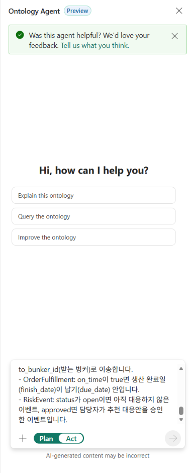
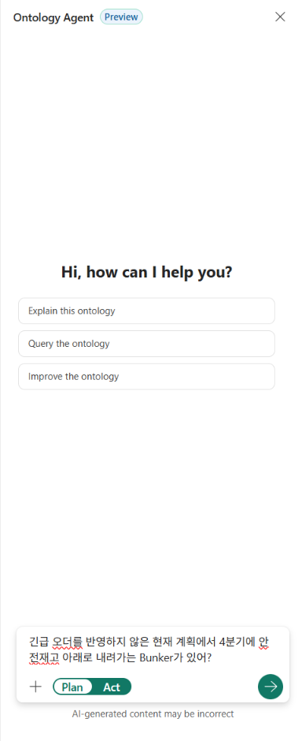

# 09. Ontology agent에 질문하기

[목차](../README.md) \| 이전: [08. Ontology](08-ontology.md) \| 다음: [10. Power BI 보고서](10-power-bi.md)

08장에서 연결한 Ontology에 **원료 부족·납기·대응안을 한국어로 질문하고, 답의 근거를 검증**합니다. 목표는 그럴듯한 설명을 받는 것이 아니라 **6개 질문의 핵심 값이 Notebook의 계산 결과와 맞는지 확인하는 것**입니다.

**업무 규칙을 Description에 저장 → Plan으로 질문 → 정답과 비교 → 조건·쿼리 확인** 순서로 진행합니다. Ontology 항목 안에서 여는 **내장 Ontology agent**만 사용하며, 별도 Fabric Data agent는 만들지 않습니다.

## 시작 전 확인

- 08장에서 `ont_chipbalance`의 **엔터티 타입 17개·관계 26개**, 키와 데이터 바인딩, 실제 Bunker 데이터를 확인했습니다.
- 07장의 `07_answers` Notebook에서 **2. Genie 질문의 정답**을 확인할 수 있습니다. Genie를 만들지 않았어도 이 계산 결과로 비교하면 됩니다.
- 본인 Gold 테이블을 읽을 수 있는 계정과, 실습에 준비된 **활성 유료 Fabric 용량**을 사용합니다. **08장의 Graph 생성은 필수가 아닙니다.**

07장의 Genie와 같은 업무 질문을 다른 근거로 조회합니다. 지침을 넣는 위치부터 구분합니다.

| 구분 | Genie (07장) | Ontology agent (이 장) |
|----|----|----|
| 답의 근거 | Unity Catalog의 테이블·열 설명 | Ontology의 엔터티 타입·관계·설명·동의어 |
| 조회하는 데이터 | Unity Catalog의 `gold_` 테이블 | OneLake에 저장한 `gold` 스키마 (Ontology 데이터 바인딩) |
| 지침을 넣는 곳 | Genie Agent의 **Instructions** | 엔터티 타입의 **Description** |

## 1. 업무 규칙을 Ontology 설명에 넣기

테이블의 `moved`만 보고는 "긴급 오더 때문에 미룬 생산"인지 알기 어렵습니다. 코드의 뜻과 판단 기준을 해당 엔터티 타입의 **Description** 끝에 덧붙여 질문 해석의 참고 근거로 제공합니다. 이 설명은 Ontology 정의의 `entityDescription`에 저장됩니다. **설명이 계산·승인 동작을 실행하는 것은 아닙니다.** 안전재고·판정·추천 순위는 이미 Notebook이 계산한 Gold 값을 조회합니다.

**Rules와 구분:** **Overview > Rules**의 Business rule도 자연어 메타데이터이지 실행 규칙이 아닙니다. 현재 `ask_ontology`는 이 Rules를 답에 반영하지 않습니다. 따라서 이번 단계에서는 Rules를 등록하는 대신 **기존 Description을 유지한 채** 아래 내용을 덧붙입니다. Description을 넣어도 AI가 조건을 정확히 쓰는지는 따로 검증해야 합니다([Rules의 역할](https://learn.microsoft.com/en-us/fabric/iq/ontology/how-to-use-rules#limitations-and-considerations), [현재 질의 제한](https://learn.microsoft.com/en-us/fabric/iq/ontology/how-to-use-ontology-agent#current-limitations)).

1.  본인 작업 영역의 `ont_chipbalance`를 열고 **Home** 화면에서 리본의 **Ontology agent**를 누릅니다. 오른쪽에 **Ontology Agent** 창이 열립니다.

2.  입력 칸 아래 스위치에서 **Act**를 누릅니다. 흰색으로 표시된 쪽이 선택된 모드입니다.

3.  아래 요청을 붙여 넣고 오른쪽 아래 화살표를 눌러 보냅니다.

    ``` text
    아래 업무 규칙을 해당 엔터티 타입의 설명 끝에 한국어로 덧붙여줘. 이름, 키, 속성, 데이터 바인딩, 관계는 바꾸지 마.
    - Scenario: scenario_id가 baseline이면 현재 계획, emergency면 10월 1일 접수한 긴급 오더(SO-10322)를 반영한 계획입니다. 질문에 시나리오가 없으면 baseline으로 답합니다.
    - ProductionPlan: change_type이 urgent면 긴급 오더 생산, moved면 긴급 오더 때문에 뒤로 미룬 생산(original_plan_date는 미루기 전 날짜), none이면 그대로인 생산입니다.
    - DailyBalance, OptionBalance: below_safety는 기말 재고(closing_kg)가 안전재고보다 적은 날, shortage는 기말 재고가 0보다 적은 날입니다.
    - ResponseOption: 긴급 오더의 대응안 4개(OPT-1–OPT-4)입니다. 판단 기준 C1 안전재고(c1_safety_pass), C2 용량(c2_capacity_pass), C3 납기(c3_due_date_pass), C4 이송 한도(c4_route_limit_pass)를 모두 만족하면 meets_all이 true이고, 그 안들에만 추가 비용이 낮은 순서로 recommendation_rank를 붙입니다. 1순위가 추천안입니다.
    - OptionBalance: 대응안(option_id)을 반영한 벙커별 일자 재고입니다. 이송 대응안은 OPT-2입니다.
    - TransferRoute: from_bunker_id(보내는 벙커)에서 to_bunker_id(받는 벙커)로 이송합니다.
    - OrderFulfillment: on_time이 true면 생산 완료일(finish_date)이 납기(due_date) 안입니다.
    - RiskEvent: status가 open이면 아직 대응하지 않은 이벤트, approved면 담당자가 추천 대응안을 승인한 이벤트입니다.
    ```

    

4.  답이 끝나면 **변경 요약**을 확인합니다. 참고 시간은 5–15분이며, 응답과 용량 상태에 따라 달라집니다.

    **확인할 결과:** 설명만 덧붙였고 이름·키·속성·데이터 바인딩·관계는 바꾸지 않았다는 요약과, 수정한 엔터티 타입 **8개**(Scenario, ProductionPlan, DailyBalance, OptionBalance, ResponseOption, TransferRoute, OrderFulfillment, RiskEvent)가 보입니다. `OptionBalance` 규칙은 프롬프트에 두 번 나오지만 같은 타입 하나에 추가됩니다.

    

5.  왼쪽 **Explorer**에서 **ProductionPlan**을 누르고 **View Entity Type details → Configure**를 엽니다. **Description** 끝에 `change_type`의 `urgent`, `moved`, `none` 규칙과 `original_plan_date`의 뜻이 붙었는지 확인합니다. 같은 방법으로 나머지 7개 타입의 설명도 확인합니다.

**다음 단계로 넘어갈 조건:** 완료 답뿐 아니라 **실제 Description에 문장이 저장**되어 있어야 합니다. 기존 설명은 남아 있고, 키·속성·바인딩·관계는 08장에서 확인한 상태를 유지해야 합니다.

## 2. 한국어로 질문하고 정답과 비교

1.  브라우저를 새로 고칩니다(**F5**). 에이전트 대화가 지워지고 새 대화로 시작합니다.

2.  리본의 **Ontology agent**를 누르고, 스위치가 **Plan**인지 확인합니다. 다른 모드이면 **Plan**을 누릅니다. 지금은 데이터를 조회·검증하는 단계로, Ontology에 변경을 적용하지 않습니다.

3.  **Say something** 칸에 아래 질문을 Q1부터 하나씩 입력하고 화살표를 눌러 보냅니다. 답이 끝나면 다음 질문을 같은 대화에 이어서 합니다.

4.  **각 답을 받은 뒤** `07_answers` Notebook의 **2. Genie 질문의 정답**과 아래 표를 대조합니다. 핵심 값이나 대상 범위가 다르면 3단계와 Troubleshooting으로 확인한 뒤 다음 질문으로 넘어갑니다.

    

| 번호 | 질문 | 정답 (Notebook **2. Genie 질문의 정답**) |
|----|----|----|
| Q1 | 긴급 오더를 반영하지 않은 현재 계획에서 4분기에 안전재고 아래로 내려가는 Bunker가 있어? | 없음 |
| Q2 | 긴급 오더를 반영하면 어느 Bunker가 언제부터 안전재고 아래로 내려가고, 얼마나 부족해? | BNK-L3-2. 10/06부터 미달, 10/07부터 부족, 최저 -23,630 kg (11/26), 필요 보충량 35,630 kg |
| Q3 | 긴급 오더 때문에 미뤄진 생산의 판매오더는 납기를 지켜? | 3건 모두 준수. SO-10108: 10/08 완료·10/11 납기, SO-10109: 10/10 완료·10/14 납기, SO-10110: 10/12 완료·10/15 납기 |
| Q4 | BNK-L3-2로 PET-SD를 보내 줄 수 있는 Bunker는 어디야? 이송 대응안대로 보내면 보내는 Bunker의 재고는 괜찮아? | BNK-L1-2 (R-01). 이송 후 최저 16,763 kg, 안전재고 6,000 kg 이상 |
| Q5 | BNK-L3-2에 10월 6일 뒤 처음 들어오는 PET-SD 입고는 언제, 어느 공급사에서, 몇 kg이야? | 10/09, SUP-PET-B(세미폴리머), 25,000 kg |
| Q6 | 대응안 4개 가운데 판단 기준을 모두 만족하는 안과 추천안은? | OPT-2(1순위), OPT-3(2순위). 추천안은 OPT-2 |

**검증 기준:** AI 응답은 첫 답의 정확성을 보장하지 않으며 문장·도구 호출·처리 시간은 달라질 수 있습니다. 질문 하나의 참고 시간은 20초–1분입니다. 정답과 다른 최초 답은 완료로 처리하지 않습니다. 조건을 밝혀 다시 물은 경우에도 **수정된 답과 쿼리를 다시 대조**합니다.

**Q2 — 미달과 부족을 구분합니다.** 안전재고 미달은 10/06부터, 재고가 음수가 되는 부족은 10/07부터입니다. 최저 재고 **-23,630 kg**와 안전재고까지의 필요 보충량 **35,630 kg**는 다른 값입니다. 아래 응답 예시처럼 Bunker·날짜·최저 재고·보충량을 함께 확인합니다.


**Q4 — 보내는 Bunker도 확인합니다.** 경로 R-01의 출발지는 `BNK-L1-2`, 도착지는 `BNK-L3-2`입니다. 출발지 재고는 현재 계획이 아니라 **이송 대응안 OPT-2를 반영한 OptionBalance**로 확인합니다. 최저 16,763 kg가 안전재고 6,000 kg 이상이어야 합니다.


**Q6 — 통과안 전체와 1순위 추천안을 구분합니다.** C1–C4를 모두 만족하는 안은 **OPT-2와 OPT-3**, 그중 1순위 추천안은 **OPT-2**입니다. 아래는 `ResponseOption` 4행을 유지하고 Bunker를 `LEFT JOIN`으로 연결하도록 조건을 명시해 **재질문한 실제 응답의 결론 부분**입니다. 첫 답이 항상 이렇게 나온다는 뜻은 아니며, 누락이 있으면 Troubleshooting의 확인용 요청으로 다시 조회합니다.


나머지 답 화면: [Q1](../assets/screenshots/d09-q1.png) · [Q3](../assets/screenshots/d09-q3.png) · [Q5](../assets/screenshots/d09-q5.png)

**Q3도 건수만 믿지 않습니다.** `moved` 생산계획의 **중복 없는 판매오더 3건**을 대상으로, `emergency` 시나리오의 완료일·납기·`on_time`을 확인합니다. 생산계획 행 수나 다른 시나리오의 이행 행을 섞으면 "모두 준수"라는 말은 같아도 근거가 틀릴 수 있습니다.

## 3. 답의 근거 확인

1.  답 위의 **Reasoning**을 눌러 에이전트가 거친 단계와 실행한 쿼리를 펼칩니다.

2.  조회 대상과 조건을 확인합니다. 시나리오는 `baseline`/`emergency`, 재고는 질문에 맞는 Bunker·기간·대응안인지 봅니다. 쿼리가 길어도 우선 **조회 테이블, 필터, JOIN 조건**에 집중합니다.

3.  아래 기준과 정답 표를 대조합니다. 다르면 조건을 명시해 다시 묻습니다. Q3·Q6의 확인용 요청은 Troubleshooting에 있습니다.

    | 질문 | 쿼리에서 확인할 조건 |
    |----|----|
    | Q1·Q2 | Q1은 `baseline`, Q2는 `emergency`. `below_safety`와 `shortage`를 구분 |
    | Q3 | `ProductionPlan.change_type = moved`, 중복 없는 `sales_order_id`. ProductionPlan과 OrderFulfillment 모두 `emergency` |
    | Q4 | TransferRoute의 출발·도착 Bunker, `OptionBalance.option_id = OPT-2`, 출발지 `BNK-L1-2`의 재고 |
    | Q5 | 도착지 `BNK-L3-2`, 원료 `PET-SD`, 10/06 **뒤** 최초 입고. 날짜·공급사·수량 |
    | Q6 | ResponseOption 4행을 유지하고 C1–C4·`meets_all`·`recommendation_rank` 확인. 비어 있는 출발지 Bunker 때문에 대응안을 제외하지 않음 |

아래 화면은 Ontology와 함께 만들어진 **child Eventhouse**에서 `sql_request`로 Lakehouse의 `gold` 테이블을 조회한 예입니다. 별도 Eventhouse를 여기서 만드는 단계가 아닙니다. 에이전트는 바인딩과 질문에 따라 SQL·KQL·DAX·GQL 실행 경로를 고르므로 모든 답이 같은 경로를 쓰지는 않습니다. Graph 관계 탐색은 Graph model이 있을 때 사용합니다([공식 질의 설명](https://learn.microsoft.com/en-us/fabric/iq/ontology/how-to-use-ontology-agent#query-the-ontology)).


**판단 순서:** 질문 범위가 맞는지 → 쿼리 조건이 맞는지 → 조회 값이 Notebook과 맞는지 확인합니다. 에이전트의 설명만으로 Gold 데이터나 추천 순위를 바꾸지 않습니다.

## 이 장의 완료 기준

- 8개 엔터티 타입의 **Description에 업무 규칙이 저장**되어 있고, 08장의 키·속성·바인딩·관계는 유지됩니다.
- Q1–Q6의 핵심 값이 Notebook과 일치하는지 확인했습니다. **Q3은 중복 없는 판매오더 3건**, **Q6은 통과안 2개와 추천안 1개**를 확인했습니다.
- 답이 달랐다면 시나리오·필터·JOIN을 확인하고 재질문한 결과까지 검증했습니다. 해결되지 않은 질문은 완료로 처리하지 않습니다.

이 결과는 **계산 근거를 검토한 것**이며 발주·이송·승인을 실행한 것이 아닙니다.

## Troubleshooting

- 답이 시나리오를 잘못 골랐으면 질문에 "긴급 오더를 반영하지 않은 현재 계획"이나 "긴급 오더를 반영하면"처럼 시나리오를 밝혀 다시 묻습니다.
- 첫 질문으로 Q6을 하면 대응안을 알려 달라고 되묻기도 합니다. Q1부터 차례로 묻거나, "긴급 오더 대응안 4개(OPT-1–OPT-4) 가운데"처럼 대상을 밝혀 묻습니다.
- Q3의 판매오더 수가 3건보다 많으면 생산계획 행 수를 세거나 시나리오가 다른 이행 행까지 연결했는지 확인합니다. 다음 요청으로 다시 확인합니다. 완료일·납기도 정답 표와 대조합니다.

  ``` text
  moved 생산계획의 sales_order_id를 중복 없이 구하고, ProductionPlan과 OrderFulfillment 모두 emergency로 제한해 판매오더별 완료일·납기·on_time을 보여줘
  ```

- Q6에서 OPT-3가 빠지면 **Reasoning**의 Bunker 연결을 확인합니다. 이송 외 대응안의 `source_bunker_id`는 비어 있으므로 그 열로 Bunker와 `INNER JOIN`하면 제외됩니다. 다음 요청으로 확인합니다. 최초 오류 답은 정답으로 처리하지 않습니다.

  ``` text
  ResponseOption 4행을 모두 유지하고 Bunker는 LEFT JOIN으로 연결해 C1–C4, meets_all, 추천 순위와 비용을 다시 보여줘
  ```

  재조회 후 OPT-2·OPT-3의 `meets_all = true`와 순위 1·2를 확인합니다. OPT-3를 참고로만 적었다면 통과안 목록에도 포함하도록 요청합니다.
- 대화를 처음부터 다시 하려면 브라우저를 새로 고칩니다(**F5**). 1단계에서 넣은 설명은 Ontology에 남아 있습니다.
- 1단계 요청 뒤 아무 변화가 없으면 스위치가 **Act**인지 확인하고 다시 보냅니다.
- 설명을 넣었는데 답이 다르면 해당 엔터티의 **Description**에 문장이 저장됐는지, 쿼리가 올바른 속성과 조건을 썼는지 확인합니다. Rules에만 같은 문장을 넣어도 `ask_ontology`의 현재 제한은 해결되지 않습니다. 설명 이외의 변경이 보고되면 08장의 프롬프트를 기준으로 키·속성·바인딩·관계를 확인하고 복구한 뒤 질문합니다.
- 조회 오류가 나면 질문을 Bunker·시나리오·기간별로 나눠 다시 묻고, 본인 계정으로 원본 테이블을 읽을 수 있는지와 08장의 데이터 바인딩을 확인합니다.

## 공식 문서

- [Ontology agent 사용과 현재 제한](https://learn.microsoft.com/en-us/fabric/iq/ontology/how-to-use-ontology-agent)
- [자연어 Business rules와 MCP 조회](https://learn.microsoft.com/en-us/fabric/iq/ontology/how-to-use-rules)

## 다음 단계

[10. Power BI 보고서](10-power-bi.md)에서 같은 Gold 계산 결과를 수급 현황과 대응안 비교 화면으로 만듭니다.
