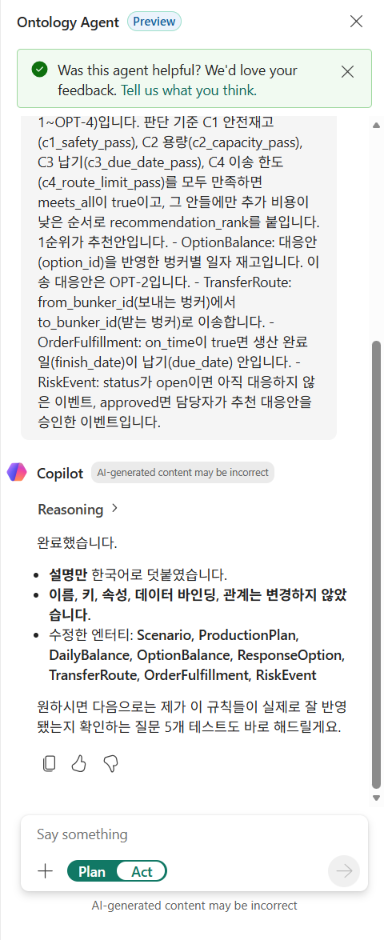
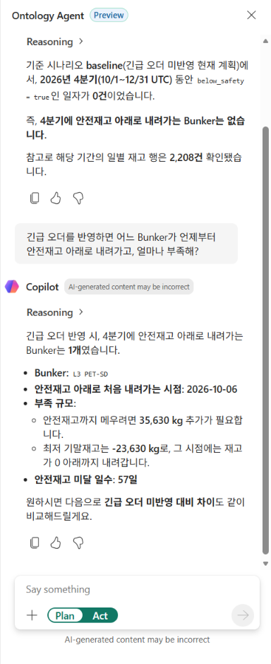
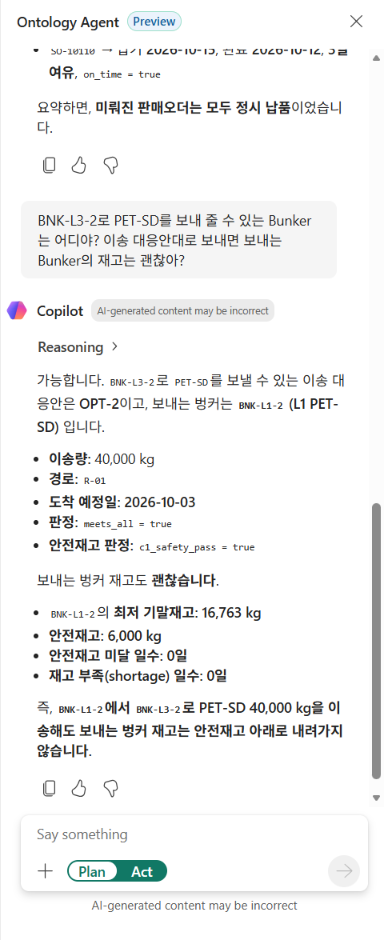
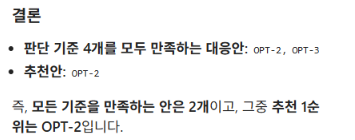
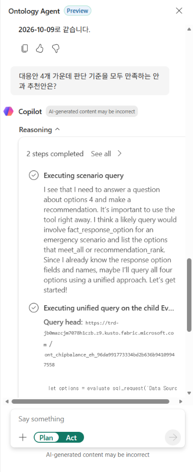

09. Ontology agent에 질문하기
===============================

`목차 <../README.rst>`_ | 이전: `08. Ontology <08-ontology.rst>`_ | 다음: `10. Power BI 보고서 <10-power-bi.rst>`_

Ontology agent는 Ontology의 엔터티 타입, 관계, 설명을 근거로 질문을 쿼리로 바꿔 Lakehouse의 Gold를 조회하고 답합니다.
이 장에서는 업무 규칙을 Ontology 설명에 넣은 뒤, 07장에서 Genie에 한 질문을 Ontology agent에 하고 정답과 비교합니다.

.. list-table::
   :header-rows: 1
   :widths: 20 40 40

   * - 구분
     - Genie (07장)
     - Ontology agent (이 장)
   * - 답의 근거
     - Unity Catalog의 테이블·열 설명
     - Ontology의 엔터티 타입·관계·설명·동의어
   * - 조회하는 데이터
     - Unity Catalog의 ``gold_`` 테이블
     - OneLake에 저장한 ``gold`` 스키마 (Ontology 데이터 바인딩)
   * - 지침을 넣는 곳
     - Genie Agent의 **Instructions**
     - 엔터티 타입의 **Description**

1. 업무 규칙을 Ontology 설명에 넣기
--------------------------------------

코드 값의 뜻(예: ``change_type``\ 의 ``moved``\ 는 미룬 생산)과 판단 기준은 테이블 열만 봐서는 알 수 없습니다.
이런 업무 규칙을 해당 엔터티 타입의 설명에 넣으면 Ontology agent가 질문의 단어를 정확한 조건으로 바꿉니다.

#. ``ont_chipbalance``\ 의 **Home** 화면에서 리본의 **Ontology agent**\ 를 누릅니다. 오른쪽에 **Ontology Agent** 창이 열립니다.
#. 입력 칸 아래 스위치에서 **Act**\ 를 누릅니다. 흰색으로 표시된 쪽이 선택된 모드입니다.
#. 아래 요청을 붙여 넣고 오른쪽 아래 화살표를 눌러 보냅니다.

   .. code-block:: text

      아래 업무 규칙을 해당 엔터티 타입의 설명 끝에 한국어로 덧붙여줘. 이름, 키, 속성, 데이터 바인딩, 관계는 바꾸지 마.
      - Scenario: scenario_id가 baseline이면 현재 계획, emergency면 10월 1일 접수한 긴급 오더(SO-10322)를 반영한 계획입니다. 질문에 시나리오가 없으면 baseline으로 답합니다.
      - ProductionPlan: change_type이 urgent면 긴급 오더 생산, moved면 긴급 오더 때문에 뒤로 미룬 생산(original_plan_date는 미루기 전 날짜), none이면 그대로인 생산입니다.
      - DailyBalance, OptionBalance: below_safety는 기말 재고(closing_kg)가 안전재고보다 적은 날, shortage는 기말 재고가 0보다 적은 날입니다.
      - ResponseOption: 긴급 오더의 대응안 4개(OPT-1~OPT-4)입니다. 판단 기준 C1 안전재고(c1_safety_pass), C2 용량(c2_capacity_pass), C3 납기(c3_due_date_pass), C4 이송 한도(c4_route_limit_pass)를 모두 만족하면 meets_all이 true이고, 그 안들에만 추가 비용이 낮은 순서로 recommendation_rank를 붙입니다. 1순위가 추천안입니다.
      - OptionBalance: 대응안(option_id)을 반영한 벙커별 일자 재고입니다. 이송 대응안은 OPT-2입니다.
      - TransferRoute: from_bunker_id(보내는 벙커)에서 to_bunker_id(받는 벙커)로 이송합니다.
      - OrderFulfillment: on_time이 true면 생산 완료일(finish_date)이 납기(due_date) 안입니다.
      - RiskEvent: status가 open이면 아직 대응하지 않은 이벤트, approved면 담당자가 추천 대응안을 승인한 이벤트입니다.

   .. image:: ../assets/screenshots/d09-rules-prompt.png
      :alt: Ontology Agent 창. 입력 칸에 업무 규칙 요청의 끝부분 OrderFulfillment와 RiskEvent 규칙이 보이고, 아래 스위치는 Act가 선택되어 있습니다.
      :width: 400

**예상 결과:** "완료했습니다" 아래에 설명만 덧붙였고 이름·키·속성·데이터 바인딩·관계는 바꾸지 않았다는 내용과, 수정한 엔터티 8개(Scenario, ProductionPlan, DailyBalance, OptionBalance, ResponseOption, TransferRoute, OrderFulfillment, RiskEvent)가 보입니다. (5~15분)

왼쪽 **Explorer**\ 에서 **ProductionPlan**\ 을 누르고 **View Entity Type details**\ 를 누르면, **Description** 끝에 ``업무 규칙: change_type이 urgent면 ...``\ 이 붙은 것을 볼 수 있습니다.

2. 한국어로 질문하고 정답과 비교
-----------------------------------

#. 브라우저를 새로 고칩니다(**F5**). 에이전트 대화가 지워지고 새 대화로 시작합니다.
#. 리본의 **Ontology agent**\ 를 누르고, 스위치가 **Plan**\ 인지 확인합니다. Plan 모드에서는 조회만 하고 Ontology를 바꾸지 않습니다.
#. **Say something** 칸에 아래 질문을 Q1부터 하나씩 입력하고 화살표를 눌러 보냅니다. 답이 끝나면 다음 질문을 같은 대화에 이어서 합니다.
#. ``07_unity_catalog`` Notebook의 **4. Genie 질문의 정답**\ 과 비교합니다.

   .. image:: ../assets/screenshots/d09-q1-prompt.png
      :alt: Ontology Agent 창. Hi, how can I help you? 아래 입력 칸에 긴급 오더를 반영하지 않은 현재 계획에서 4분기에 안전재고 아래로 내려가는 Bunker가 있어? 질문이 입력되어 있고, 스위치는 Plan이 선택되어 있습니다.
      :width: 400

.. list-table::
   :header-rows: 1
   :widths: 6 50 44

   * - 번호
     - 질문
     - 정답 (Notebook **4. Genie 질문의 정답**)
   * - Q1
     - 긴급 오더를 반영하지 않은 현재 계획에서 4분기에 안전재고 아래로 내려가는 Bunker가 있어?
     - 없음
   * - Q2
     - 긴급 오더를 반영하면 어느 Bunker가 언제부터 안전재고 아래로 내려가고, 얼마나 부족해?
     - BNK-L3-2. 10/06부터 미달, 10/07부터 부족, 최저 -23,630 kg (11/26), 필요 보충량 35,630 kg
   * - Q3
     - 긴급 오더 때문에 미뤄진 생산의 판매오더는 납기를 지켜?
     - 모두 준수. SO-10108, SO-10109, SO-10110
   * - Q4
     - BNK-L3-2로 PET-SD를 보내 줄 수 있는 Bunker는 어디야? 이송 대응안대로 보내면 보내는 Bunker의 재고는 괜찮아?
     - BNK-L1-2 (R-01). 이송 후 최저 16,763 kg, 안전재고 6,000 kg 이상
   * - Q5
     - BNK-L3-2에 10월 6일 뒤 처음 들어오는 PET-SD 입고는 언제, 어느 공급사에서, 몇 kg이야?
     - 10/09, SUP-PET-B(세미폴리머), 25,000 kg
   * - Q6
     - 대응안 4개 가운데 판단 기준을 모두 만족하는 안과 추천안은?
     - OPT-2(1순위), OPT-3(2순위). 추천안은 OPT-2

**예상 결과:** 6개 질문에 모두 정답과 같은 값으로 답합니다. 질문 하나에 20초~1분 걸리고, 문장은 매번 조금씩 다를 수 있습니다.

Q2는 부족한 Bunker, 처음 미달하는 날, 필요 보충량, 최저 재고, 미달 일수를 답합니다.

Q4는 이송 대응안 OPT-2의 경로와, 이송한 뒤 보내는 Bunker ``BNK-L1-2``\ 의 최저 재고를 답합니다.

Q6은 판단 기준을 모두 만족하는 안과 추천 순위를 답합니다.

나머지 답 화면: `Q1 <../assets/screenshots/d09-q1.png>`_ · `Q3 <../assets/screenshots/d09-q3.png>`_ · `Q5 <../assets/screenshots/d09-q5.png>`_

3. 답의 근거 확인
--------------------

답 위의 **Reasoning**\ 을 누르면 에이전트가 거친 단계와 실행한 쿼리가 펼쳐집니다.
Ontology agent는 Ontology와 함께 만들어진 Eventhouse에서 ``sql_request``\ 로 Lakehouse의 ``gold`` 테이블을 조회합니다.

숫자가 정답과 다르면 **Reasoning**\ 의 쿼리에서 시나리오(``baseline``/``emergency``)와 조건을 확인합니다.

Troubleshooting
---------------

* 답이 시나리오를 잘못 골랐으면 질문에 "긴급 오더를 반영하지 않은 현재 계획"이나 "긴급 오더를 반영하면"처럼 시나리오를 밝혀 다시 묻습니다.
* 첫 질문으로 Q6을 하면 대응안을 알려 달라고 되묻기도 합니다. Q1부터 차례로 묻거나, "긴급 오더 대응안 4개(OPT-1~OPT-4) 가운데"처럼 대상을 밝혀 묻습니다.
* 대화를 처음부터 다시 하려면 브라우저를 새로 고칩니다(**F5**). 1단계에서 넣은 설명은 Ontology에 남아 있습니다.
* 1단계 요청 뒤 아무 변화가 없으면 스위치가 **Act**\ 인지 확인하고 다시 보냅니다.

다음 단계
------------

`10. Power BI 보고서 <10-power-bi.rst>`_
