# 10. Power BI 보고서

[목차](../README.md) \| 이전: [09. Ontology agent에 질문하기](09-ontology-agent.md) \| 다음: [11. Operations agent](11-operations-agent.md)

Lakehouse의 Gold 테이블로 Direct Lake semantic model을 만들고, 관계와 측정값을 넣은 뒤 보고서를 만듭니다. 1페이지는 직접 배치하고, 2페이지는 Copilot에게 말로 요청해 만든 뒤 Copilot에게 질문해 인사이트를 얻습니다. Direct Lake는 OneLake의 Delta 테이블을 가져오기(Import) 없이 바로 읽는 저장 모드입니다.

| 페이지 | 보여 주는 것 |
|----|----|
| 원료 수급 현황 | 현재 계획과 긴급 수주에서 안전재고 아래로 내려가는 Bunker 수, 처음 미달하는 날, 필요 보충량. 선택한 Bunker의 날짜별 기말 재고와 안전재고 |
| 긴급 오더 대응안 | 대응안 4개의 판단 기준(C1~C4) 결과와 추천 순위, 추천안과 추가 비용 |

이 장에서 쓰는 파일은 00장에서 압축을 푼 폴더의 `fabric` 폴더에 있습니다.

- `fabric\sm_chipbalance.tmdl` — 관계와 측정값을 만드는 TMDL 스크립트
- `fabric\chipbalance-theme.json` — 보고서 테마(색, 글꼴 크기, 배경, 테두리)

**시작 전:** 06장까지 완료해 Gold 테이블 21개가 있어야 합니다. 본인의 참가자 번호로 작업 영역과 Lakehouse를 선택합니다(`p001`은 예시). 전체 실습에 준비된 활성 유료 Fabric 용량을 사용하며, Power BI Pro 또는 PPU 라이선스와 모델·보고서 작성 권한, Copilot 설정이 필요합니다.

## 1. Semantic model 만들기

1.  Fabric 작업 영역 `chipbalance-p001`에서 Lakehouse `lh_chipbalance_p001`을 엽니다.

2.  리본의 **New semantic model**을 누릅니다.

3.  **New semantic model** 창에 아래와 같이 입력하고 **Confirm**을 누릅니다.

    - **Direct Lake semantic model name**: `sm_chipbalance`
    - **Workspace**: `chipbalance-p001`
    - 테이블: `gold` 아래에서 7개를 체크합니다. `dim_bunker`, `dim_date`, `dim_scenario`, `fact_balance`, `fact_bunker_summary`, `fact_option_balance`, `fact_response_option`

    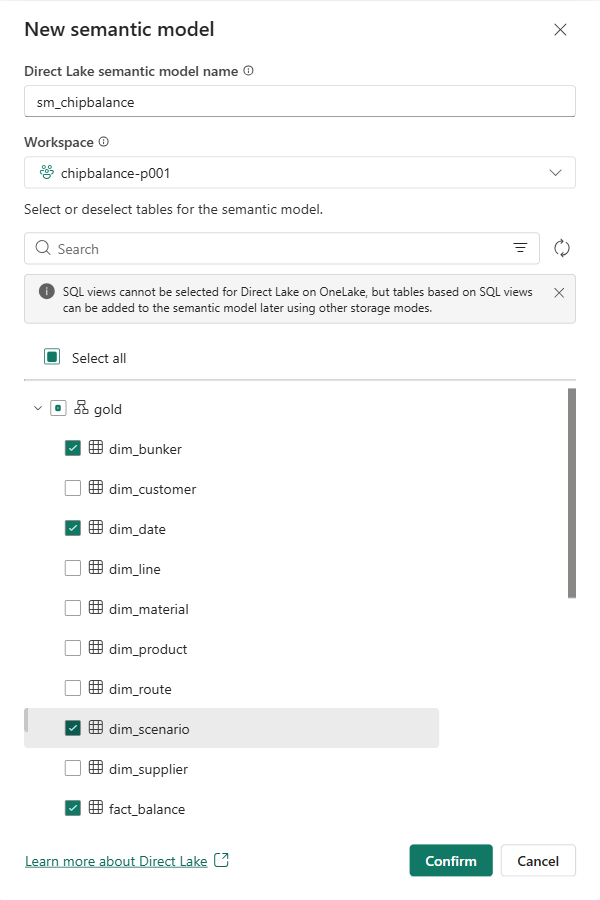

**예상 결과:** `sm_chipbalance`가 **Model view**로 열립니다. 오른쪽 **Data** 창에 테이블 7개가 있고, 오른쪽 위는 **Editing**입니다. (1분 이내)

## 2. 관계와 측정값 넣기

TMDL(Tabular Model Definition Language)은 semantic model의 테이블, 관계, 측정값을 글로 적는 형식입니다. `sm_chipbalance.tmdl`은 관계 8개와 측정값 19개를 만듭니다. 측정값 안에 시나리오(`baseline`/`emergency`)와 추천안(`recommendation_rank = 1`) 조건이 들어 있어, 시각적 개체에 측정값만 넣으면 필요한 숫자가 나옵니다.

| 측정값 | 뜻 |
|----|----|
| 현재 계획 재고 (kg), 긴급 오더 재고 (kg) | 시나리오별 기말 재고 |
| 안전재고 (kg) | Bunker의 안전재고 |
| 미달 Bunker 수 (현재 계획), 미달 Bunker 수 (긴급 오더) | 4분기에 안전재고 아래로 내려가는 날이 있는 Bunker 수. 슬라이서에서 고른 Bunker와 관계없이 전체를 셉니다. |
| 첫 미달일 (긴급 오더), 필요 보충량 (kg) | 긴급 수주에서 처음 안전재고 아래로 내려가는 날, 4분기 내내 안전재고를 지키려면 더 있어야 하는 양 |
| 추천안 적용 후 재고 (kg) | 추천안(추천 순위 1)을 반영한 기말 재고 |
| 기준 충족 대응안 수, 추천안, 추천안 추가 비용 (원) | 판단 기준을 모두 만족한 대응안 수, 추천안과 추가 비용 |
| C1 안전재고, C2 용량, C3 납기, C4 이송 한도 | 대응안별 판단 기준 결과. 만족하면 ✅, 만족하지 못하면 ❌ |
| 추천 순위, 추가 비용 (원), 첫 도착일, 판단 | 대응안별 추천 순위, 추가 비용, 첫 입고·도착일, 만족하지 못한 기준 |

1.  화면 아래 **TMDL View (Preview)** 탭을 누릅니다. **Edit your model with TMDL** 안내가 나오면 **Try it now**를 누릅니다.

2.  00장에서 압축을 푼 폴더의 `fabric\sm_chipbalance.tmdl`을 메모장으로 열고, **Ctrl+A**, **Ctrl+C**로 전체를 복사합니다.

3.  TMDL 편집기의 1행을 누르고 **Ctrl+V**로 붙여 넣습니다. 1행이 `createOrReplace`입니다.

    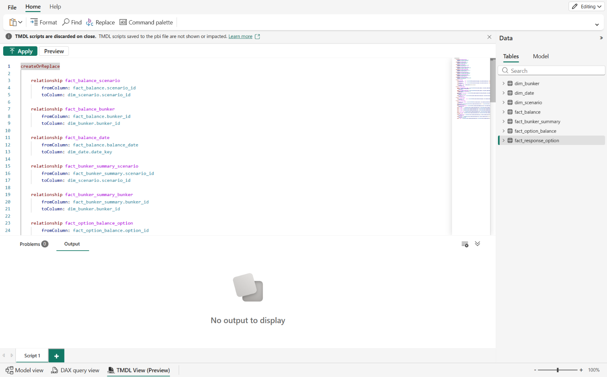

4.  편집기 위 **Apply**를 누릅니다.

    **예상 결과:** 편집기 위에 **Changes applied to the model.**이 보이고, 아래 **Output**에 `[success] Successfully applied TMDL script.`가 나옵니다. 아래 **Script 1** 탭에 초록색 체크가 붙습니다.

    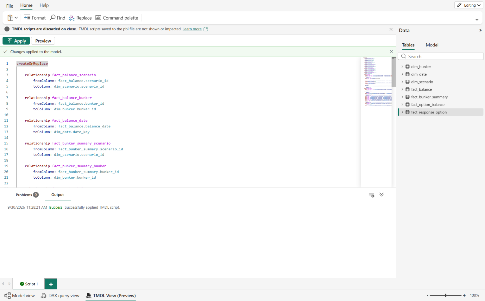

5.  화면 아래 **Model view** 탭을 누릅니다. 리본에서 **Refresh** 아래 화살표를 누르고 **Data**를 누른 뒤, **Refresh** 확인 창에서 **Refresh**를 누릅니다. Direct Lake의 새로 고침은 원본 파일의 최신 상태를 반영하는 작업이며 Import처럼 행을 복사하는 작업은 아닙니다. 완료 알림을 확인합니다(시간은 용량 상태에 따라 달라집니다).

    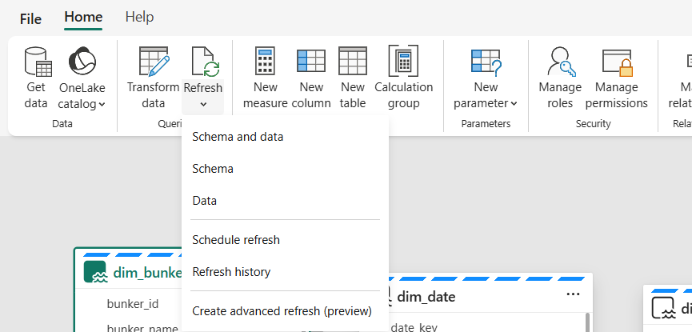

6.  오른쪽 **Properties** 창과 **Data** 창 위의 **»**를 눌러 접고, 화면 오른쪽 아래 **Fit to page** 아이콘을 누릅니다.

**예상 결과:** 테이블 7개가 한 줄로 보입니다. `dim_bunker`, `dim_date`, `dim_scenario`가 `fact_` 테이블과 관계선으로 이어지고, `fact_option_balance`와 `fact_response_option`도 관계선으로 이어집니다.

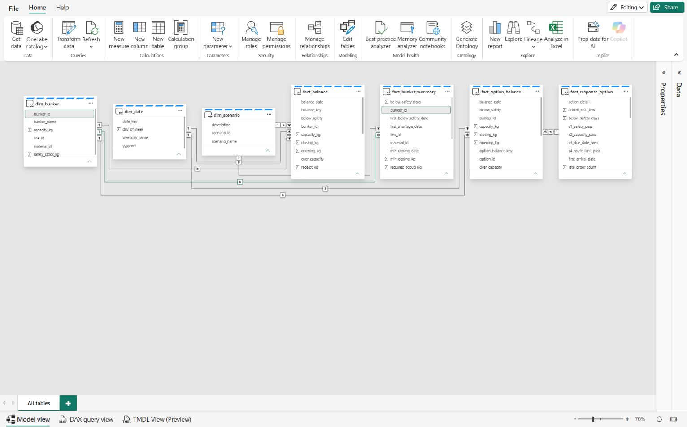

## 3. 보고서 만들기와 테마 적용

1.  **Model view**의 리본에서 **New report**를 누릅니다. 새 브라우저 탭에 빈 보고서가 편집 화면으로 열립니다. 로그인 창이 나오면 같은 계정으로 로그인합니다.

2.  위쪽 **View** 메뉴에서 **Theme**를 누릅니다. 테마 목록이 먼저 열리면 **Open theme format pane**(한국어 UI: **테마 서식 창을 엽니다.**)을 누릅니다. 오른쪽 **Visualizations** 창에 **Theme settings**가 열립니다.

3.  **Theme** 아래 **Custom theme name** 오른쪽 **...**를 누르고 **Import**를 누릅니다.

    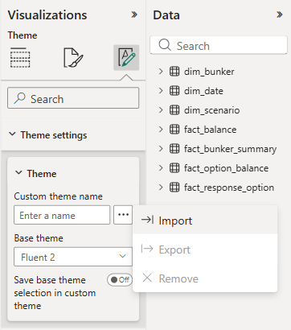

4.  파일 선택 창에서 `fabric\chipbalance-theme.json`을 엽니다.

    **예상 결과:** **Custom theme name**이 `Chip Balance`가 되고, 페이지 배경이 연한 회색이 됩니다. 테마는 계열 색(첫째 파랑, 둘째 빨강, 셋째 회색), 글꼴 크기, 시각적 개체의 흰 배경과 테두리, 표 머리글 색을 정합니다.

5.  캔버스 빈 곳을 누르고 **Visualizations** 창의 가운데 아이콘(**Format page**)을 누릅니다. **Canvas settings**를 펼쳐 크기가 `1920 x 1080 (Full HD)`인지 확인합니다. 이 장의 위치와 크기 값은 이 페이지 크기를 기준으로 합니다.

## 4. 1페이지: 원료 수급 현황

시각적 개체를 넣을 때마다 위치와 크기를 맞춥니다. 시각적 개체를 선택하고 **Visualizations** 창의 가운데 아이콘(**Format visual**)을 누른 뒤, **General** 탭 → **Properties**의 **Size**(**Height**, **Width**)와 **Position**(**Horizontal**, **Vertical**)에 값을 입력합니다. 필드는 **Data** 창에서 테이블을 펼치고 필드 왼쪽 체크 상자를 눌러 넣습니다. 체크한 순서대로 들어갑니다.

1.  아래쪽 **Page 1** 탭을 두 번 누르고 `원료 수급 현황`을 입력한 뒤 **Enter**를 누릅니다.

2.  **카드** — 캔버스 빈 곳을 누르고 **Visualizations** 창의 **Build visual**에서 **Card**를 누릅니다. `fact_bunker_summary`에서 아래 측정값을 차례로 체크합니다.

    `미달 Bunker 수 (현재 계획)`, `미달 Bunker 수 (긴급 오더)`, `첫 미달일 (긴급 오더)`, `필요 보충량 (kg)`

    위치와 크기: Height `160`, Width `1856`, Horizontal `32`, Vertical `124`

3.  **슬라이서** — 캔버스 빈 곳을 누르고 **Slicer**를 누른 뒤, `dim_bunker`의 `bunker_id`를 체크합니다.

    - **Format visual** → **Visual** 탭 → **Slicer settings**에서 **Options**의 **Style**을 **Dropdown**으로, **Selection**의 **Single select**를 **On**으로 합니다.
    - 위치와 크기: Height `104`, Width `320`, Horizontal `1568`, Vertical `12`

    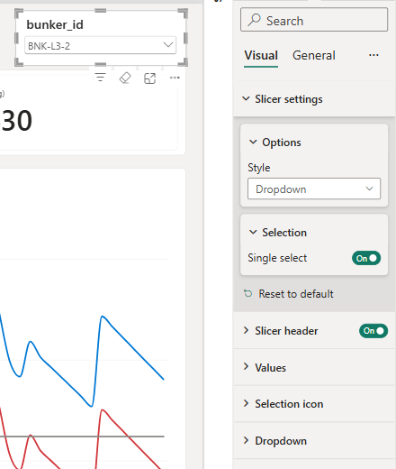

4.  슬라이서를 선택한 채로 캔버스 오른쪽의 접힌 **Filters** 창을 눌러 펼칩니다. **Filters on this visual**의 `bunker_id` 카드에서 **Select all**을 체크하고 **(Blank)**의 체크를 풉니다.

    **(Blank)**가 보이는 경우에만 체크를 풉니다. 빈 항목은 데이터의 null 값이나 관계 키 불일치 등에 의해 나타날 수 있으며, 모든 Direct Lake 차원에서 반드시 생기는 항목은 아닙니다.

    **예상 결과:** 카드 제목 아래에 `is not (Blank)`가 보입니다.

    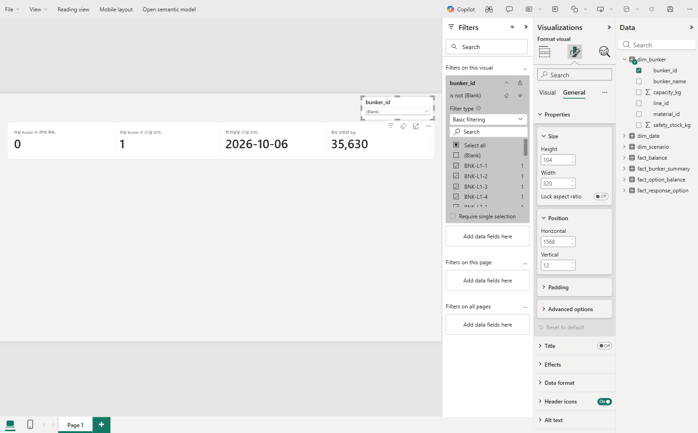

5.  슬라이서의 드롭다운을 열고 `BNK-L3-2`를 고릅니다.

6.  **묶은 세로 막대형 차트** — 캔버스 빈 곳을 누르고 **Clustered column chart**를 누릅니다. 아래 필드를 차례로 체크합니다. **Y-axis**에 넣은 순서대로 파랑, 빨강 막대가 됩니다.

    - `fact_balance`의 `현재 계획 재고 (kg)`, `긴급 오더 재고 (kg)` → **Y-axis**
    - `dim_date`의 `date_key` → **X-axis**

    필드가 다른 칸에 들어가면 위 칸으로 끌어 옮깁니다. 날짜 계층이 들어간 경우 필드 메뉴에서 **date_key** 자체를 선택하고 날짜 오름차순으로 정렬합니다. 잔고는 날짜별 값이므로 날짜를 빼고 여러 날의 기말재고를 합산하지 않습니다.

    **Format visual** → **General** 탭 → **Title**을 펼치고, **Title**의 **Text**에 아래 제목을 입력합니다. 그 아래 **Subtitle**은 **Off**로 합니다.

    ``` text
    선택한 Bunker의 기말 재고 (kg): 현재 계획 · 긴급 오더 (점선: 안전재고)
    ```

    위치와 크기: Height `736`, Width `1856`, Horizontal `32`, Vertical `308`

    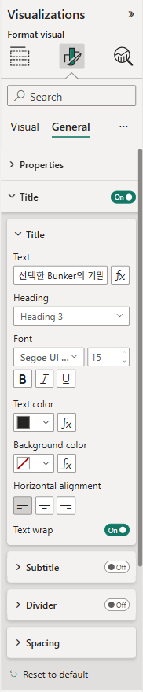

    **Visual** 탭의 **Columns** → **Layout**에서 **Space between categories**를 `10`으로 합니다. 막대가 굵어집니다.

7.  **안전재고 점선** — 차트를 선택한 채로 **Visualizations** 창의 오른쪽 아이콘(**Analytics**)을 누릅니다.

    - **Y-Axis Constant Line**을 펼치고 **+ Add line**을 누릅니다. 생긴 줄의 연필 아이콘을 눌러 이름을 `안전재고`로 바꿉니다.

    - **Line**의 **Value** 오른쪽 **fx**를 누릅니다. **Format style**은 **Field value**로 두고, **What field should we base this on?**에서 **All data** → `fact_balance` → `안전재고 (kg)`를 고른 뒤 **OK**를 누릅니다.

      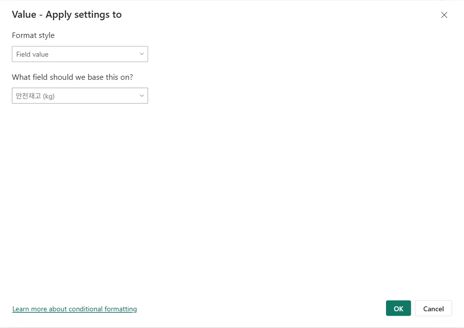

    - **Color**는 검정, **Transparency**는 `0`으로 합니다. **Line style**은 **Dashed** 그대로 둡니다.

    - **Data label**을 **On**으로 하고, 펼쳐서 **Horizontal position**은 **Right**, **Style**은 **Both**, **Color**는 검정으로 합니다.

    **예상 결과:** 차트에 검은 점선과 `안전재고: 12,000`이 보입니다. 슬라이서에서 고른 Bunker의 안전재고 높이에 선이 그어집니다.

    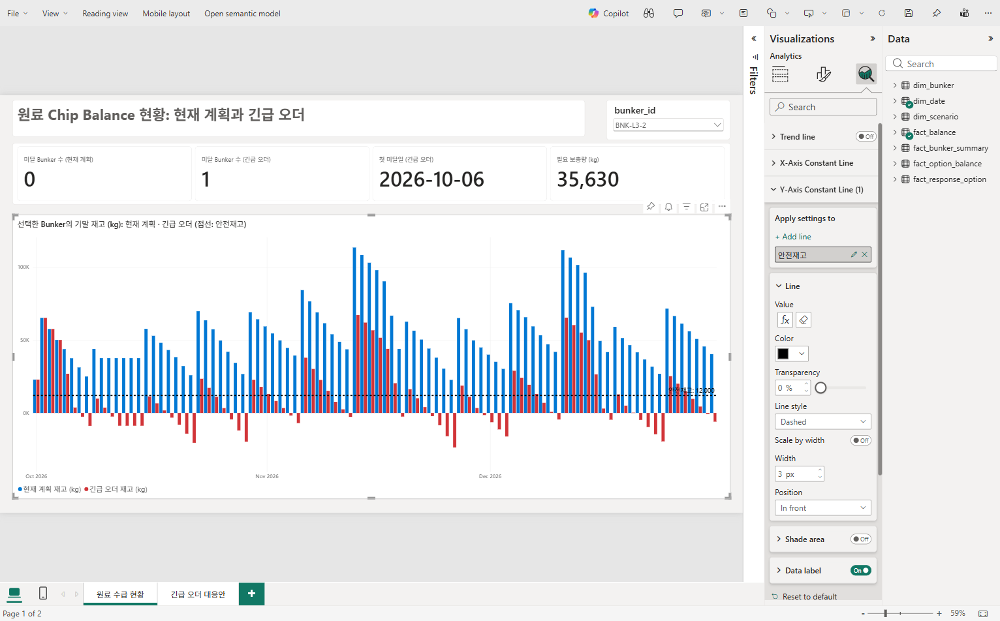

8.  **제목** — 위쪽 도구 모음의 **Text box**를 누르고 `원료 Chip Balance 현황: 현재 계획과 긴급 오더`를 입력합니다. 글자를 모두 선택하고, 텍스트 도구 모음에서 글꼴 크기를 `28`로 하고 **B**(굵게)를 누릅니다.

    텍스트 상자를 선택하면 오른쪽 창이 **Format text box**가 됩니다. **General** → **Properties**에 위치와 크기를 입력합니다: Height `96`, Width `1480`, Horizontal `32`, Vertical `12`

    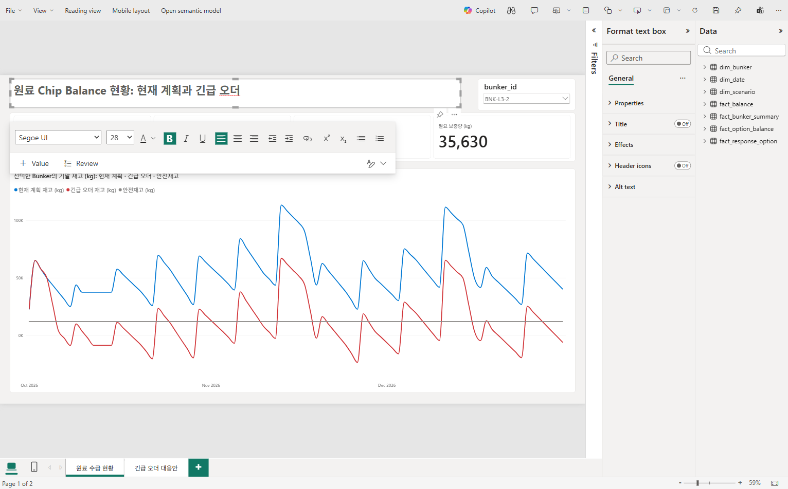

**예상 결과:** 카드에 `0`, `1`, `2026-10-06`, `35,630`이 보입니다. 현재 계획에서는 안전재고 아래로 내려가는 Bunker가 없고, 긴급 수주를 반영하면 1개가 10월 6일부터 미달하며 35,630 kg이 더 필요합니다. 차트에서 파란 막대(현재 계획)는 모두 점선(안전재고) 위에 있고, 빨간 막대(긴급 수주)는 10월 6일부터 점선 아래로 내려가며 0 아래로 내려가는 날도 있습니다.

시각적 개체를 누르면 **Build visual**에 넣은 필드가 보입니다. 카드와 차트의 필드를 확인합니다.

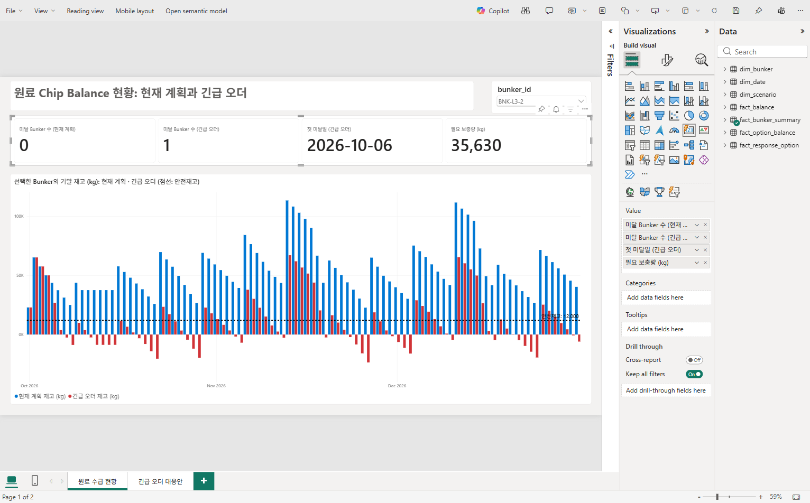

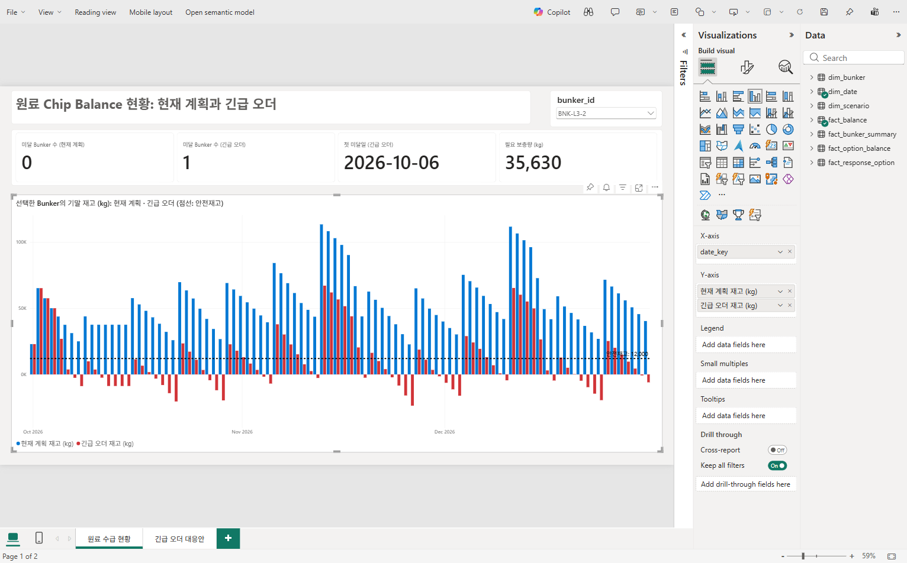

## 5. 저장

1.  위쪽 도구 모음의 **Save this report**(디스크 아이콘)를 누릅니다.

2.  **Save your report** 창의 왼쪽 목록에서 `chipbalance-p001`을 고르고, **Enter a name for your report**에 `rpt_chipbalance`를 입력한 뒤 **Save**를 누릅니다.

    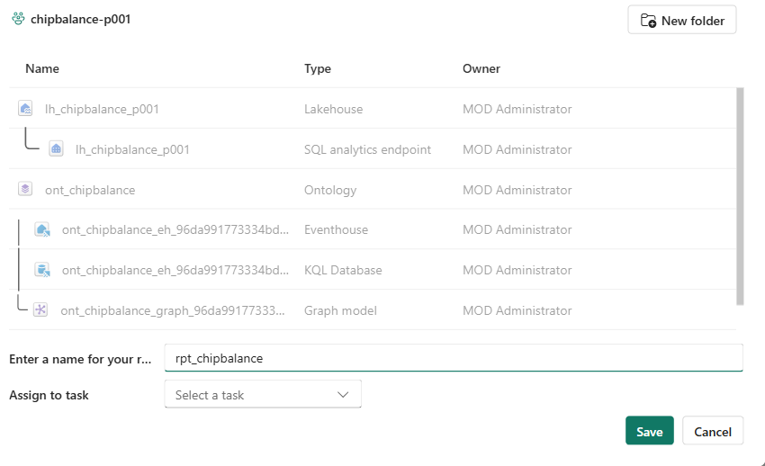

**예상 결과:** 오른쪽 위에 **Report saved** 알림이 보입니다. 보고서가 읽기 보기로 바뀌면 위쪽 **Edit**를 눌러 편집을 이어 갑니다.

## 6. Copilot으로 대응안 페이지 만들기

2페이지는 직접 배치하지 않고 Power BI 보고서의 Copilot에게 말로 요청해 만듭니다. 관리자가 전체 실습의 유료 용량·지원 지역·Copilot 테넌트 설정을 준비합니다. [관리자 준비 가이드](../admin/README.md)의 Copilot 항목과 [공식 요구 사항](https://learn.microsoft.com/power-bi/create-reports/copilot-introduction#requirements-at-a-glance)을 확인합니다.

1.  위쪽 도구 모음의 **Copilot**을 눌러 오른쪽에 Copilot 창을 엽니다.

    보고서가 편집 보기인지 확인합니다. 모델의 Q&A 기능과 암시적 측정값(implicit measures)을 꺼 놓은 환경에서는 보고서 생성이 제한될 수 있으므로, 관리자는 [보고서 생성 제한](https://learn.microsoft.com/power-bi/create-reports/copilot-create-reports#considerations-and-limitations)을 확인합니다.

2.  아래 입력 칸에 다음을 입력하고 Enter를 누릅니다.

    ``` text
    긴급 오더 대응안 4개의 판단 기준(C1 안전재고, C2 용량, C3 납기, C4 이송 한도) 결과와 추천 순위, 추천안과 추가 비용을 보여주는 보고서 페이지를 만들어줘. fact_response_option 테이블을 중심으로 사용해.
    ```

3.  페이지 생성이 완료될 때까지 기다립니다. 표·차트·카드의 종류와 배치는 생성 결과에 따라 다릅니다. 기존 `원료 수급 현황` 페이지를 유지하고 새 대응안 페이지가 생겼는지 확인합니다.

4.  카드를 선택하고 **Build visual**의 값이 기존 측정값에 연결되어 있는지 확인합니다. **기준 충족 대응안 수**는 `기준 충족 대응안 수`, 추천안은 `추천안`, 비용은 `추천안 추가 비용 (원)` 측정값을 써야 합니다. 맞는 숫자가 보이는 것만으로 바인딩을 확인한 것으로 간주하지 않으며, 값 `2`를 직접 입력하거나 상수로 만든 카드를 사용하지 않습니다. 잘못된 집계는 아래 Troubleshooting의 측정값 보완 요청으로 수정합니다.

5.  **Ctrl+S**로 저장하고, 보고서를 다시 열어 카드·표의 값과 겹침 여부를 확인합니다.

**예상 결과:** 대응안 4개의 판단 기준과 추천 순위, 추가 비용이 보이는 페이지가 추가됩니다. 위치와 구성은 Copilot이 정하므로 사람마다 다를 수 있고, 필드 이름이 `Count of option_id`처럼 원시 이름으로 보일 수 있습니다.

표에서 대응안 ID 4개, C1~C4, 추천 순위와 추가 비용을 06장 결과와 비교합니다. ID·추천 순위가 Count나 Sum으로 집계되어 판단이 어려우면 Copilot에게 `대응안별 option_id, c1_safety_pass, c2_capacity_pass, c3_due_date_pass, c4_route_limit_pass, recommendation_rank, added_cost_krw를 집계하지 않은 표로 보여줘`라고 보완 요청합니다. 시각적 개체의 생김새보다 이 값이 맞는지 확인합니다.

아래는 후속 측정값 요청과 카드 배치 보정을 마치고 저장·다시 열어 확인한 실제 화면입니다. 최초 생성 결과가 항상 이 구성·값으로 나오는 것은 아닙니다.

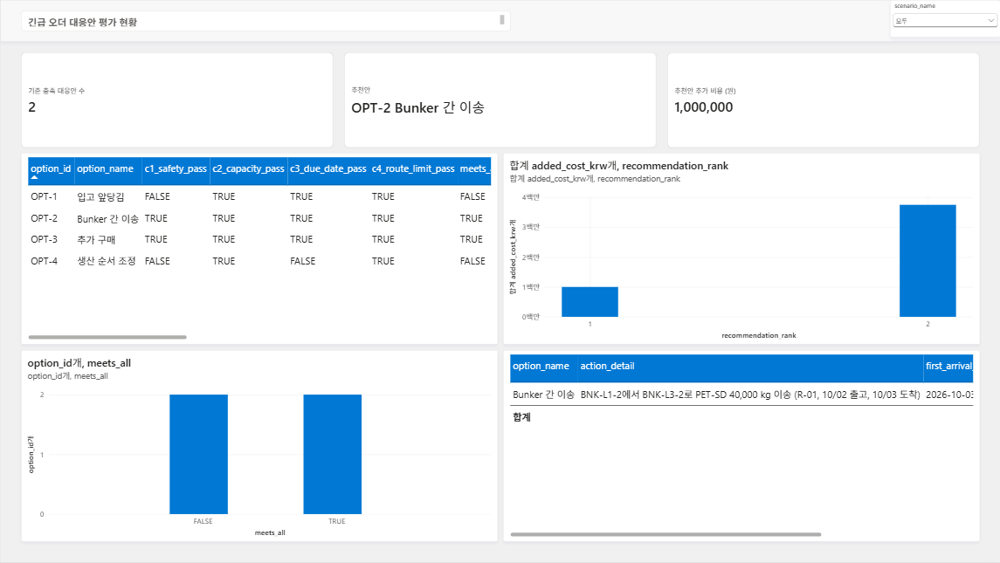

## 7. Copilot에게 질문하고 인사이트 얻기

Copilot 창에서 보고서와 데이터에 대해 바로 물을 수 있습니다. 이 실습에서는 답을 비교하기 쉽도록 **질문을 한 번에 하나씩** 합니다. 여러 질문을 항상 처리하지 못한다는 제한은 아닙니다.

1.  새 대화에서 `추천 순위 1위 대응안과 그 추가 비용은?`을 묻습니다.

    **예상 결과:** `OPT-2: Bunker 간 이송`, 추가 비용 `1,000,000`원. 06장과 같습니다.

2.  이어서 `이 보고서 페이지의 핵심 인사이트를 요약해줘`를 묻습니다.

    **비교할 기준:** 4개 대응안 가운데 `OPT-2`, `OPT-3`만 네 기준을 모두 만족하고, 추천 1순위 `OPT-2`(1,000,000원), 2순위 `OPT-3`(3,750,000원)입니다. `OPT-1`은 안전재고(C1), `OPT-4`는 안전재고(C1)와 납기(C3)를 지키지 못해 제외됩니다. 표현은 달라도 수치·기준 결과가 다르면 정답으로 처리하지 않습니다.

    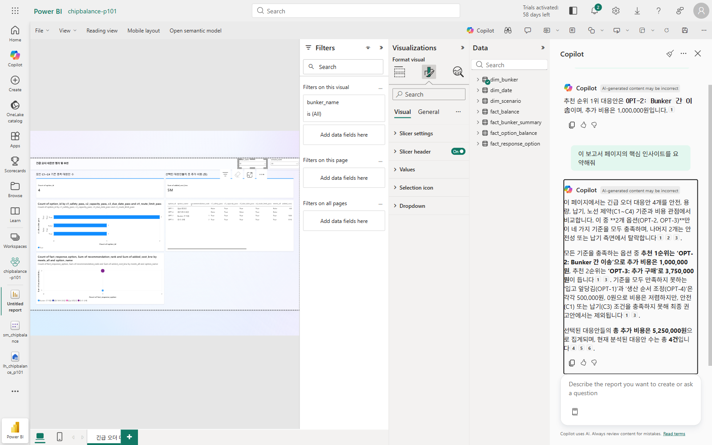

Copilot의 답은 생성된 내용이므로 Ontology agent와 마찬가지로 06장 값과 비교해 확인합니다.

## Troubleshooting

- **Apply** 뒤 오류가 나면 아래 **Problems** 탭에서 오류가 난 줄을 확인합니다. 테이블이 없다는 오류이면 **Model view** 리본의 **Edit tables**에서 1단계의 테이블 7개가 모두 체크되어 있는지 확인하고 다시 **Apply**를 누릅니다.
- 시각적 개체에 관계를 다시 계산해야 한다는 오류가 보이면 2단계의 **Refresh** → **Data**를 다시 실행하고, 1분 뒤 보고서 탭을 새로 고칩니다.
- Semantic model이 **Viewing**으로 열리면 오른쪽 위 **Viewing**을 누르고 **Editing**을 고릅니다.
- TMDL 스크립트 탭은 창을 닫으면 사라집니다. **Apply**로 적용한 관계와 측정값은 모델에 남습니다.
- 슬라이서 목록에 **(Blank)**가 보이면 4단계의 `is not (Blank)` 필터를 확인합니다.
- 막대 색이 다르면 **Y-axis**의 필드 순서를 확인합니다. 필드를 끌어서 순서를 바꿀 수 있습니다.
- 점선이 0에 그어지면 **Y-Axis Constant Line**의 **Value**에 **fx**로 `안전재고 (kg)`를 지정했는지 확인합니다.
- 시각적 개체가 겹쳐 선택하기 어려우면 먼저 위치와 크기를 입력해 자리를 옮깁니다.
- Copilot이 비활성화되면 작업 영역의 용량이 활성 유료 F2 이상인지, 참가자가 Copilot 허용 그룹에 속하는지, 지역·테넌트 설정이 맞는지 확인합니다. 새 용량·증설을 Copilot이 인식하는 데 최대 24시간이 걸릴 수 있습니다.
- AI 생성 표나 답이 06장과 다르면 테이블·필터·집계를 확인하고 다시 요청합니다. 화면 생성 성공만으로 업무 결과가 정확하다고 판단하지 않습니다.
- **기준 충족 대응안 수**라는 제목의 카드가 `option_id` 개수인 `4`를 표시하면 잘못된 집계입니다. `판단 기준 표 4개 대응안은 유지하고, 기준 충족 대응안 수 카드에는 기존 fact_response_option[기준 충족 대응안 수] 측정값을 사용해줘. 추천안과 추천안 추가 비용 (원) 측정값도 카드로 보여줘`로 수정합니다. **Build visual**에서 기존 측정값 바인딩을 확인하고 실제 값 `2`, `OPT-2 Bunker 간 이송`, `1,000,000`을 비교한 뒤 저장합니다. 정답 수치를 프롬프트에 넣어 카드값만 맞추지 않습니다.
- Copilot이 추가한 카드가 겹치면 **View → Selection pane**(한국어 UI: **보기 → 선택 창**)에서 카드 이름을 선택하고 **Format visual → General → Properties**의 크기·위치를 조정합니다. 예를 들어 1920×1080 페이지의 카드 3개는 높이 `184`, 너비 `600`, 세로 `100`, 가로 `40`·`660`·`1280`으로 나란히 놓을 수 있습니다. 저장·새로고침 후 값과 겹침 여부를 다시 확인합니다.

## 다음 단계

[11. Operations agent](11-operations-agent.md)
