# 11. Operations agent

[목차](../README.md) \| 이전: [10. Power BI 보고서](10-power-bi.md) \| 다음: [12. Foundry agent](12-foundry-agent.md)

06장에서 만든 위험 이벤트(`gold.fact_risk_event`)를 이 장의 명령으로 Eventhouse에 보냅니다. Operations agent는 Lakehouse를 직접 감시하지 않고 Eventhouse의 `RiskEventStatus`를 감시합니다. 상태가 `open`이 되면 Teams로 담당자에게 알리고, 추천 대응안 `OPT-2`의 승인을 요청합니다. 담당자가 Teams에서 승인하면 Notebook `nb_record_decision`이 실행되어 승인 내역을 남깁니다. 자동 수집 파이프라인을 구성하는 단계는 아닙니다.

**시작 전:** 본인의 작업 영역에 06장의 Gold 테이블이 있어야 합니다. 전체 실습에 준비된 **활성 유료 Fabric 용량**을 사용합니다. 참가자는 작업 영역 Contributor 이상과 KQL 데이터베이스·Notebook·Lakehouse의 작업 권한, Teams 라이선스와 앱 사용 권한이 필요합니다. [공식 요구 사항](https://learn.microsoft.com/fabric/real-time-intelligence/operations-agent#prerequisites)과 [관리자 준비 가이드](../admin/README.md)를 확인합니다.

| 항목 | 역할 |
|----|----|
| Eventhouse `eh_chipbalance` | 위험 이벤트의 상태가 바뀔 때마다 `RiskEventStatus` 테이블에 한 행씩 쌓습니다. |
| Operations agent `oa_chipbalance` | `RiskEventStatus`를 5분마다 조회해 `event_status`가 `open`이 된 이벤트를 찾고, Teams로 알립니다. |
| Notebook `nb_record_decision` | 담당자가 승인하면 실행됩니다. `RiskEventStatus`에 `approved` 행을 추가하고, Lakehouse에 승인 내역을 남깁니다. 발주나 이송 지시는 하지 않습니다. |

Operations agent는 Eventhouse의 KQL 데이터베이스를 데이터 원본으로 읽습니다. 시간 열(`status_time`)로 새로 들어온 행을 구분하므로, 상태가 바뀔 때마다 행을 추가합니다.

이 장에서 쓰는 파일은 00장에서 압축을 푼 폴더의 `fabric` 폴더에 있습니다.

- `fabric\nb_record_decision.ipynb` — 승인 기록 Notebook

Operations agent의 기본 수신자는 에이전트를 만든 사람입니다. 이 실습에서는 **Agent behavior**의 수신자가 본인인지 확인하고, Fabric과 같은 계정으로 Teams(웹 또는 데스크톱)에 로그인합니다. 다른 수신자·채널 지정은 이 실습에 포함하지 않습니다. 조치는 수신자가 아니라 에이전트 생성자의 위임된 권한으로 실행됩니다([조치·수신자 설정](https://learn.microsoft.com/fabric/real-time-intelligence/operations-agent-actions)).

## 1. Eventhouse 만들기

1.  작업 영역 `chipbalance-p001`에서 **+ New item**을 누릅니다. 검색 상자에 `Eventhouse`를 입력하고 **Eventhouse**를 고릅니다. 한국어 UI에서 검색 결과가 없으면 `이벤트하우스`로 검색합니다.

    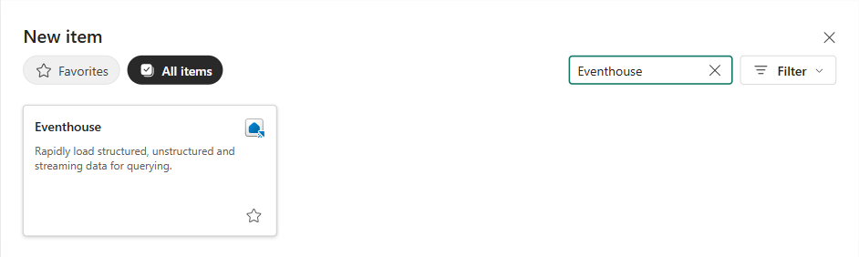

2.  **Eventhouse name**에 `eh_chipbalance`를 입력하고 **Create**를 누릅니다.

    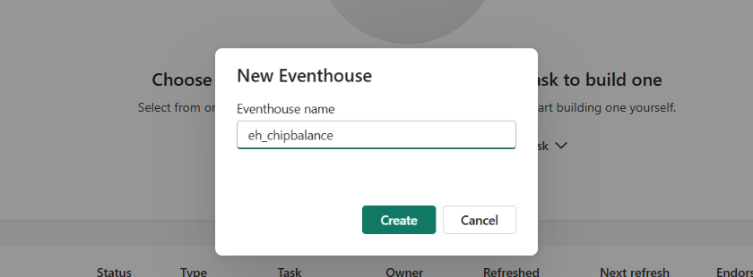

**예상 결과:** Eventhouse가 열리고, 같은 이름의 KQL 데이터베이스 `eh_chipbalance`가 만들어집니다. (1분 이내)

## 2. RiskEventStatus 테이블 만들기

1.  KQL 데이터베이스 `eh_chipbalance`에 연결된 Queryset `eh_chipbalance_queryset`을 엽니다. Queryset이 자동으로 생기지 않았으면 데이터베이스에서 **New KQL queryset**을 만들고, 쿼리 대상 데이터베이스가 `eh_chipbalance`인지 확인합니다.

2.  편집 창의 내용을 지우고 아래 명령을 붙여 넣은 뒤 **Run**을 누릅니다.

    ``` text
    .create-merge table RiskEventStatus (
        event_id: string,
        status_time: datetime,
        event_status: string,
        bunker_id: string,
        sales_order_id: string,
        required_topup_kg: long,
        first_below_safety_date: datetime,
        recommended_option_id: string,
        recommended_action: string)
    ```

    | 열 | 뜻 |
    |----|----|
    | `event_id` | 위험 이벤트 ID |
    | `status_time` | 상태가 바뀐 시각 |
    | `event_status` | 상태. `open`(대응 전), `approved`(담당자 승인) |
    | `bunker_id`, `sales_order_id` | 부족해지는 Bunker와 원인이 된 판매오더 |
    | `required_topup_kg`, `first_below_safety_date` | 필요 보충량과 처음 안전재고 아래로 내려가는 날 |
    | `recommended_option_id`, `recommended_action` | 06장에서 정한 추천 대응안과 조치 내용 |

**예상 결과:** 결과 창에 `RiskEventStatus` 한 행이 보이고, 왼쪽 **Tables** 아래에 `RiskEventStatus`가 생깁니다.

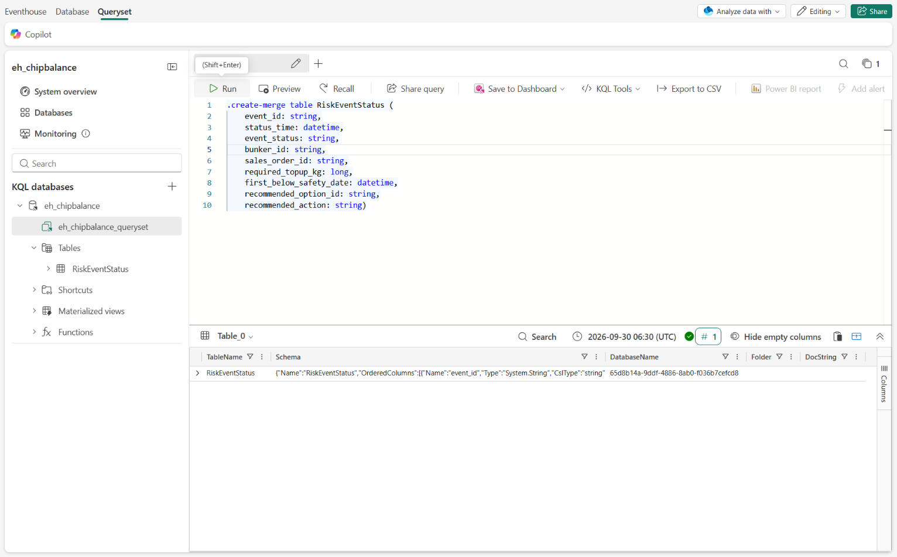

## 3. 승인 기록 Notebook 가져오기

`nb_record_decision`은 Operations agent가 넘겨 주는 `event_id`와 `option_id`로 아래 순서대로 실행됩니다. Eventhouse는 이름(`eh_chipbalance`)으로 찾으므로 주소를 입력하지 않습니다.

| 단계 | 하는 일 |
|---|---|
| 1. 매개 변수 | `event_id`, `option_id`를 받습니다. 셀에 **Parameters** 표시가 있습니다. |
| 2. 위험 이벤트 확인 | `gold.fact_risk_event`에서 승인할 위험 이벤트를 읽습니다. |
| 3. Eventhouse에 승인 상태 추가 | `RiskEventStatus`에 `approved` 행을 추가합니다. |
| 4. Lakehouse에 승인 기록 남기기 | `dbo.chip_decision_log`에 승인 내역을 남기고, `gold.fact_risk_event`의 `status`를 `approved`로 바꿉니다. |
| 5. 결과 확인 | 세 곳의 결과를 보여 줍니다. |

1.  작업 영역에서 **Import** → **Notebook** → **From this computer**를 고릅니다.

    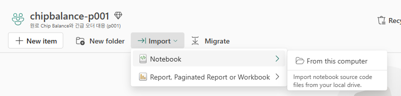

2.  오른쪽 **Import status** 창에서 **Upload**를 누르고 `fabric\nb_record_decision.ipynb`를 고릅니다.

    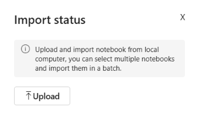

    **예상 결과:** 오른쪽 위에 **Imported successfully**가 보이고, 작업 영역에 `nb_record_decision`이 생깁니다.

    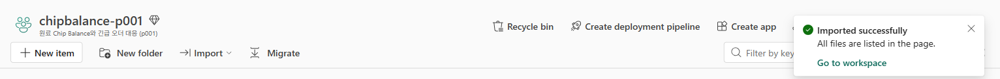

3.  `nb_record_decision`을 엽니다. 왼쪽 **Explorer**의 **Add data items** → **From OneLake catalog**를 고릅니다.

    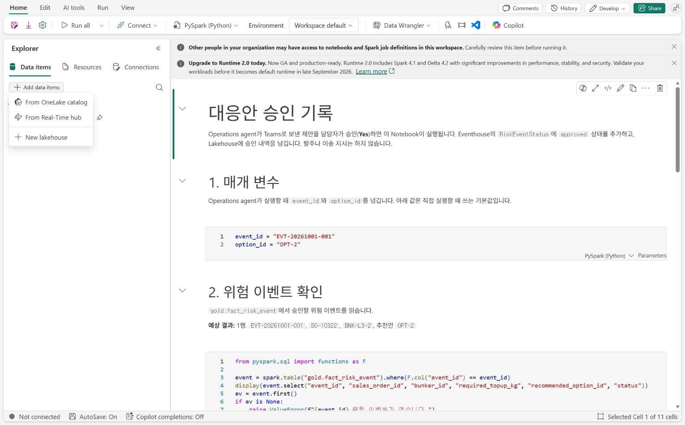

4.  검색 상자에 `lh_chipbalance`를 입력합니다. Lakehouse 아이콘이 있는 `lh_chipbalance_p001`(첫 번째 행)을 체크하고 **Add**를 누릅니다.

    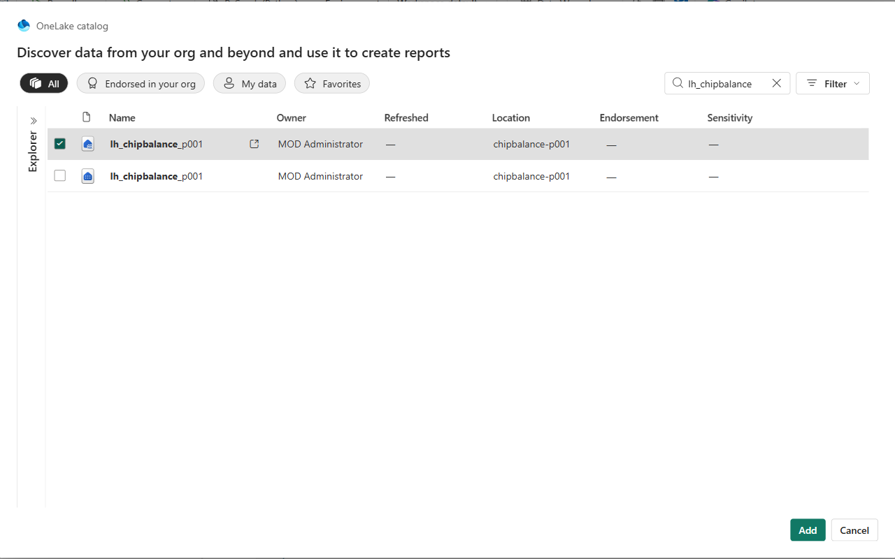

**예상 결과:** **Explorer**의 **OneLake** 아래에 본인의 `lh_chipbalance_p001`이 보이고 **기본 Lakehouse**로 지정되어 있습니다. 기본 표시가 없으면 Lakehouse의 **…**에서 **Set as default**를 선택합니다. `gold.fact_risk_event`와 `dbo.chip_decision_log`가 이 Lakehouse로 해석되어야 합니다. Notebook은 여기서 실행하지 않습니다. 담당자가 승인하면 Operations agent가 실행합니다.

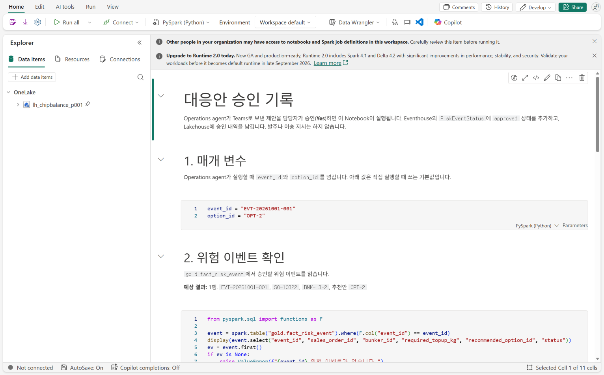

## 4. Operations agent 만들기

1.  작업 영역에서 **+ New item**을 누르고 **Operations agent**(한국어 UI: **운영 에이전트**)를 고릅니다. 검색할 때도 화면의 언어에 맞는 이름을 사용합니다. **Name**에 `oa_chipbalance`를 입력하고 **Create**를 누릅니다.

    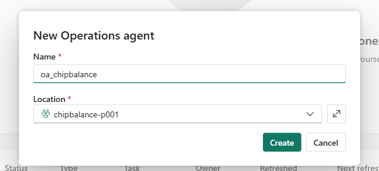

    **Welcome to operations agents** 창이 열리면 오른쪽 위 **X**를 눌러 닫습니다.

2.  **Agent instructions**에 아래 지침을 붙여 넣습니다. 감시할 열을 `RiskEventStatus.event_status`처럼 테이블 이름과 함께 적어야 Operations agent가 규칙을 만들 때 열을 찾습니다.

    ``` text
    필름 공장 Chip Balance의 원료 부족 위험 이벤트를 감시합니다.

    감시 대상: KQL 데이터베이스 eh_chipbalance의 RiskEventStatus 테이블
    - 위험 이벤트 ID: RiskEventStatus.event_id
    - 상태가 바뀐 시각: RiskEventStatus.status_time
    - 상태: RiskEventStatus.event_status ("open" 또는 "approved")
    - 추천 대응안 ID: RiskEventStatus.recommended_option_id
    - 알림에 넣을 값: RiskEventStatus.bunker_id, RiskEventStatus.sales_order_id, RiskEventStatus.required_topup_kg, RiskEventStatus.first_below_safety_date, RiskEventStatus.recommended_action

    규칙: 위험 이벤트(event_id)의 event_status가 "open"이 되면 담당자에게 Teams로 알리고 RecordDecision 조치를 추천합니다.
    RecordDecision의 event_id에는 RiskEventStatus.event_id를, option_id에는 RiskEventStatus.recommended_option_id를 넣습니다.
    메시지는 한국어로 씁니다.
    ```

3.  **Knowledge**에서 **Add data** 옆의 아래 화살표를 누르고 **Add from OneLake catalog**를 고릅니다. 검색 상자에 `eh_chipbalance`를 입력하고 `eh_chipbalance`를 고른 뒤 **Add**를 누릅니다.

    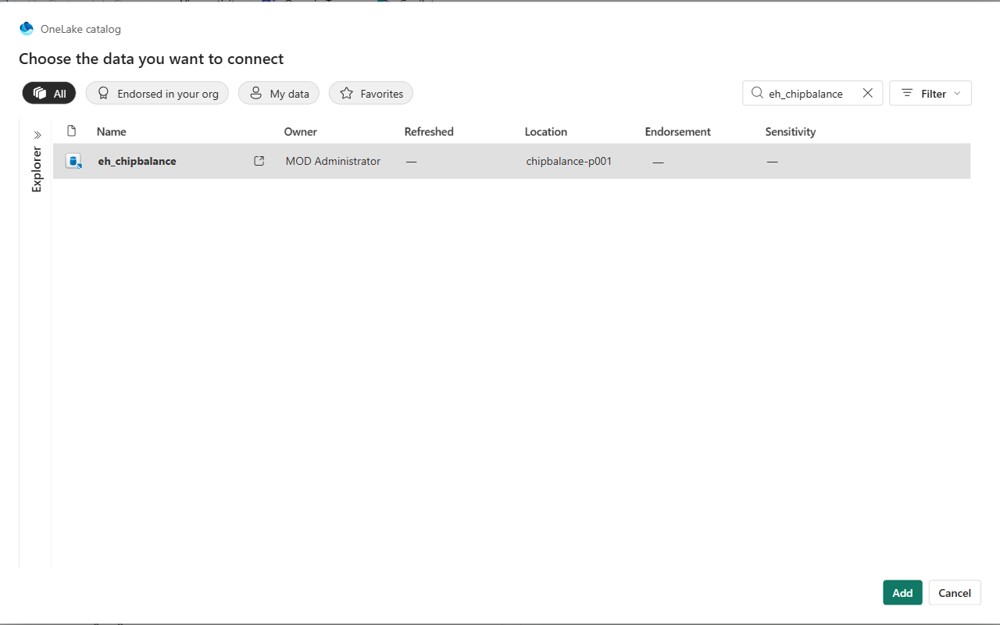

    **예상 결과:** **Knowledge**에 `eh_chipbalance`가 **KQL Database** 형식으로 보입니다.

4.  **Actions**의 **Add action**을 누르고, **Select action type**에서 **Fabric item**을 고릅니다.

    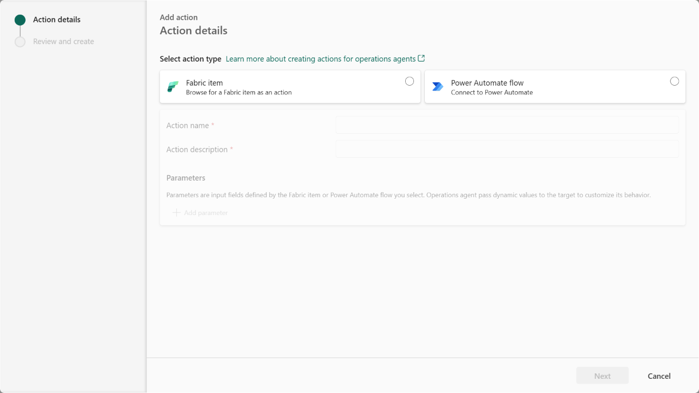

5.  **Fabric item**의 **Browse**를 누릅니다. 검색 상자에 `nb_record_decision`을 입력하고 `nb_record_decision`을 고른 뒤 **Add**를 누릅니다.

    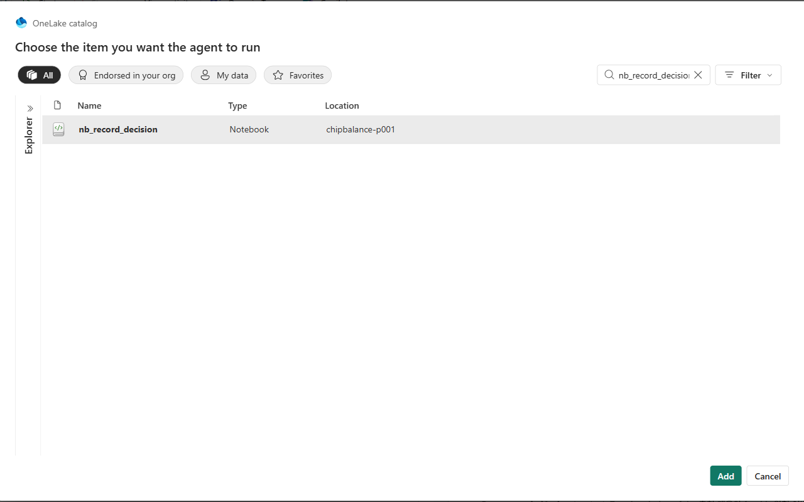

6.  아래와 같이 입력하고 **Next**를 누릅니다. **Parameters**의 `event_id`와 `option_id`는 Notebook의 매개 변수 셀에서 자동으로 채워집니다. **Description**만 입력합니다.

    | 입력란 | 값 |
    |----|----|
    | **Action name** | `RecordDecision` |
    | **Action description** | `담당자가 승인한 대응안을 기록합니다. RiskEventStatus에 approved 상태를 추가하고 Lakehouse에 승인 내역을 남깁니다.` |
    | `event_id`의 **Description** | `승인할 위험 이벤트의 event_id` |
    | `option_id`의 **Description** | `승인할 대응안 ID. 위험 이벤트의 recommended_option_id를 넣습니다.` |

    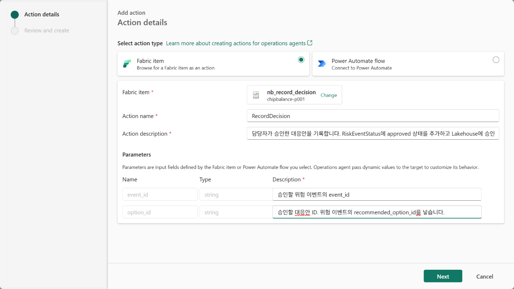

7.  **Review and create**에서 내용을 확인하고 **Create**를 누릅니다.

    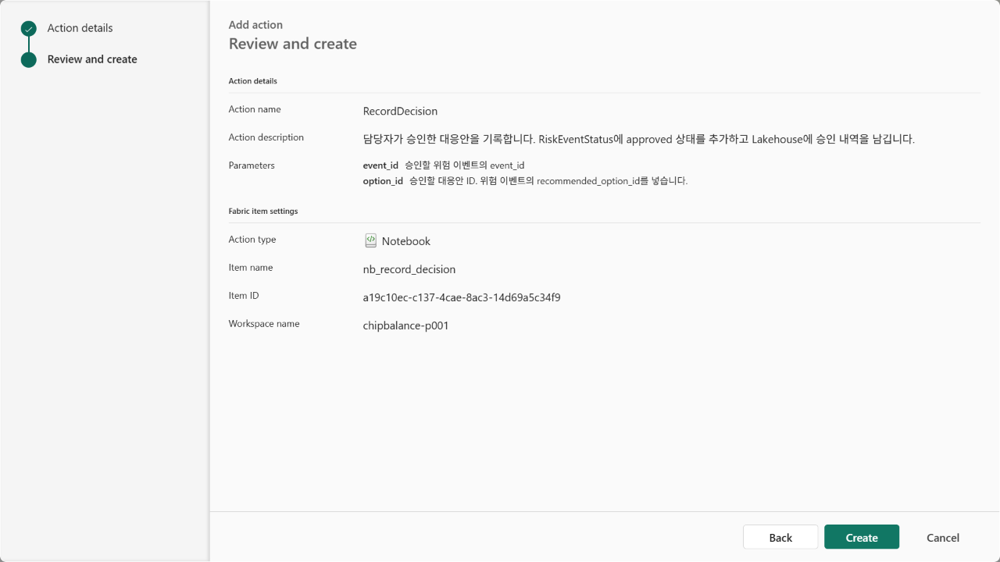

    **예상 결과:** **Actions**에 `RecordDecision`이 **Action connected** 상태로 보입니다.

8.  도구 모음 왼쪽의 저장 아이콘을 누릅니다.

## 5. Playbook 만들기

Playbook은 Operations agent가 지침과 데이터를 읽고 만드는 감시 규칙입니다. 규칙마다 KQL 쿼리와 조건이 들어 있습니다.

1.  **Agent setup**의 **Generate playbook**을 누릅니다. (2~3분)

    **예상 결과:** 오른쪽 **Agent playbook**에 **Business term glossary**가 보입니다. **Class**는 `RiskEvent`(Table: `RiskEventStatus`)이고, `EventId`, `BunkerId`, `RecommendedOptionId` 같은 속성이 `RiskEventStatus`의 열과 연결되어 있습니다.

    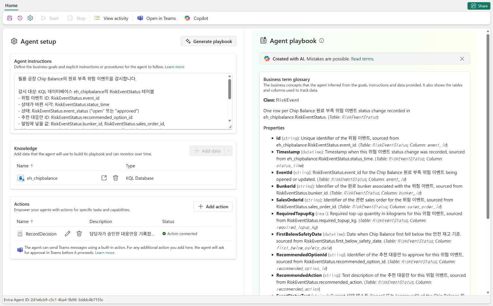

2.  **Agent playbook**을 아래로 내려 **Rules**의 규칙을 펼칩니다.

    **확인할 기준:** KQL 쿼리가 `RiskEventStatus`의 `status_time`을 조회 구간으로 거르고, 객체 ID가 `event_id`에 연결되어 있어야 합니다. 조건은 `event_status`가 `open`으로 **변할 때**입니다(`Changes To` 또는 `Becomes`처럼 전이를 뜻하는 표시). `Is open`처럼 현재 상태를 매번 평가하는 조건이면 반복 알림이 생길 수 있습니다. 규칙·속성 이름과 개수는 생성 결과에 따라 다르므로 실제 열 연결과 조건을 확인합니다.

    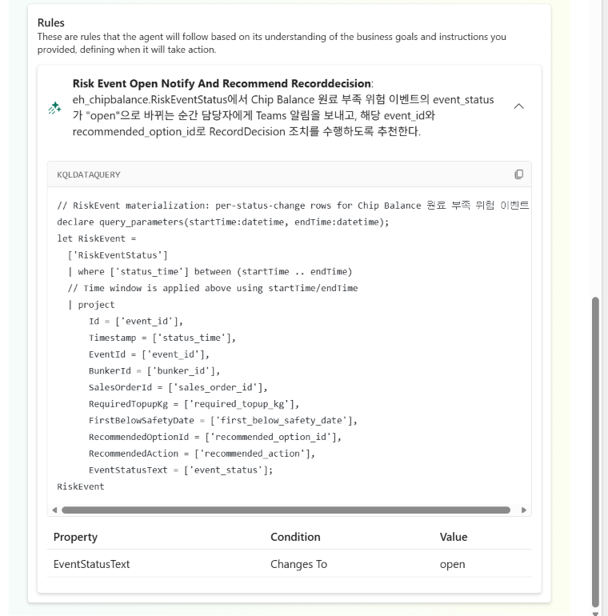

3.  저장 아이콘을 누릅니다.

**예상 결과:** 오른쪽 위에 **Configuration saved successfully**가 보이고, 도구 모음의 **Start**를 누를 수 있습니다.

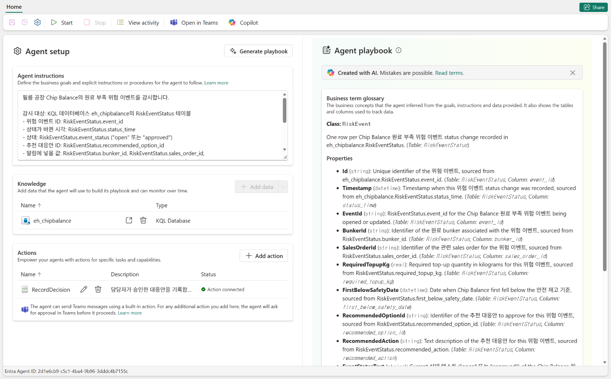

## 6. 에이전트를 시작하고 위험 이벤트 보내기

1.  도구 모음의 **Start**를 누릅니다. **Stop**을 누를 수 있게 되면 감시가 시작된 것입니다.

2.  `eh_chipbalance_queryset`으로 가서 편집 창의 내용을 지우고 아래 명령을 실행합니다. 06장의 위험 이벤트를 `open` 상태로 보냅니다. 아래는 제공된 데이터의 예시이므로 `gold.fact_risk_event`의 `event_id`, 추천 대응안과 수치가 같은지 확인합니다. 데이터가 다르면 현재 행의 값으로 고칩니다.

    ``` text
    .set-or-append RiskEventStatus <|
    print event_id = "EVT-20261001-001", status_time = now(), event_status = "open",
          bunker_id = "BNK-L3-2", sales_order_id = "SO-10322", required_topup_kg = 35630,
          first_below_safety_date = datetime(2026-10-06), recommended_option_id = "OPT-2",
          recommended_action = "BNK-L1-2에서 BNK-L3-2로 PET-SD 40,000 kg 이송 (R-01, 10/02 출고, 10/03 도착)"
    ```

**예상 결과:** 결과 창의 **RowCount**가 `1`입니다.

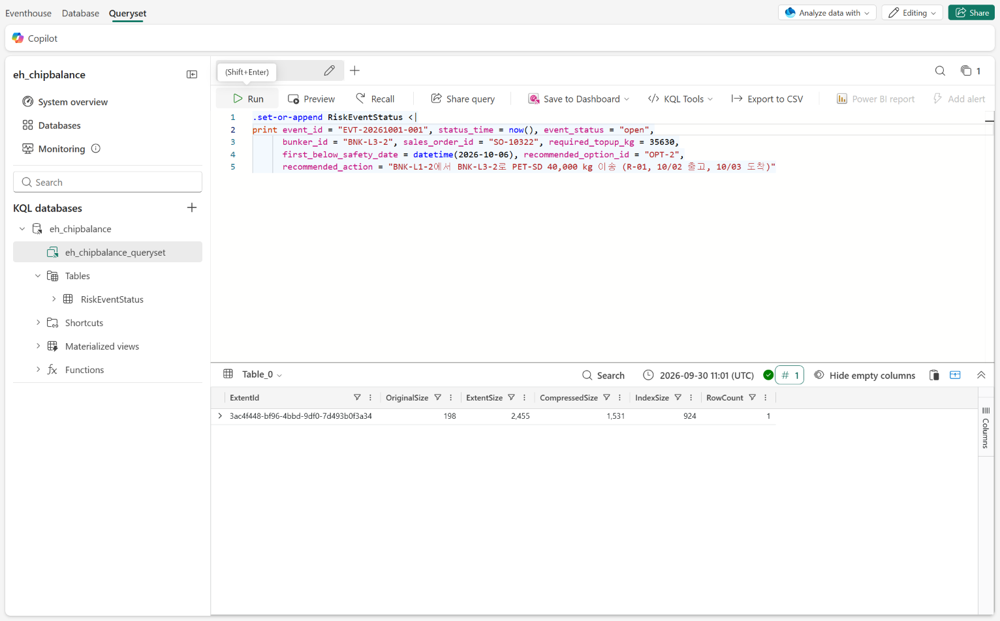

## 7. Teams 제안 확인·근거 검토·승인

1.  Teams에서 **Fabric operations agent** 채팅을 엽니다. 에이전트는 약 5분마다 조회하며 메시지 생성·전송 시간이 추가될 수 있습니다. 5분 이내 도착을 보장하지는 않습니다.

    **예상 결과:** `oa_chipbalance`가 보낸 메시지에 위험 이벤트 `EVT-20261001-001`과 추천 대응안 `OPT-2`가 있고, **Recommended action**에 `RecordDecision`이 있습니다. 메시지 문장은 AI가 만들므로 조금 다를 수 있습니다.

    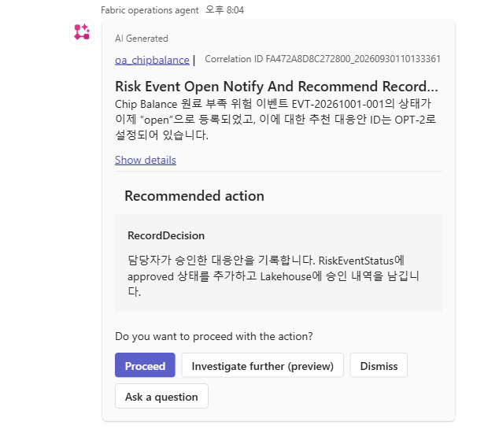

2.  **Show details**를 눌러 근거를 확인합니다.

    **예상 결과:** **EventStatusText**는 `open`, **EventId**는 `EVT-20261001-001`, **RecommendedOptionId**는 `OPT-2`, **Data Source**는 `eh_chipbalance`입니다.

    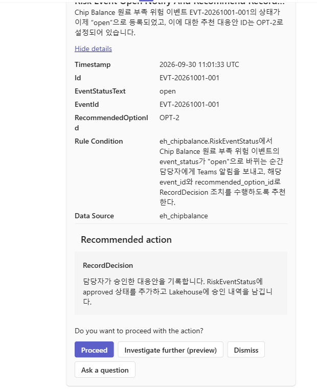

3.  **아직 Proceed·Confirm을 누르지 않습니다.** 제안을 열어 둔 채 [12. Foundry agent](12-foundry-agent.md)의 **1~5단계**로 이동해 같은 `OPT-2`의 근거를 확인합니다. 검토가 끝나면 이 장의 아래 4번으로 돌아옵니다. 에이전트나 위험 이벤트를 새로 만들거나 다시 보내지 않습니다.

4.  **Proceed**를 누릅니다. **Confirm details for RecordDecision**에서 `event_id`가 `EVT-20261001-001`, `option_id`가 `OPT-2`인지 확인하고 **Confirm**을 누릅니다.

    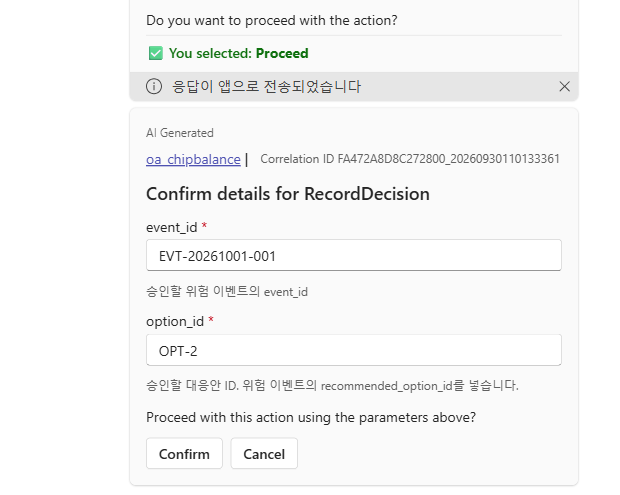

**예상 결과:** **Action submitted** 메시지가 옵니다. 이때 `nb_record_decision`이 실행됩니다.

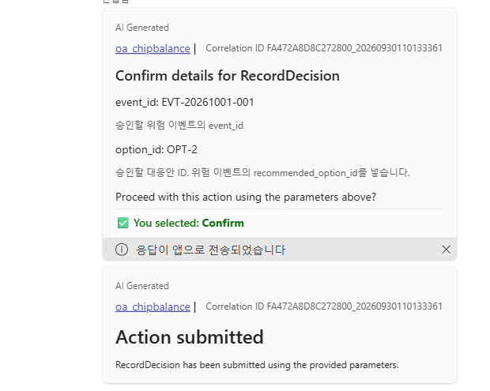

## 8. 결과 확인

1.  약 2분 뒤 `eh_chipbalance_queryset`에서 아래 쿼리를 실행합니다.

    ``` text
    RiskEventStatus
    | project status_time, event_id, event_status, recommended_option_id, bunker_id, required_topup_kg
    | order by status_time asc
    ```

    **예상 결과:** 최초 1회 실행에서는 2행입니다. 같은 `EVT-20261001-001`에 6단계의 `open` 행과 Notebook의 `approved` 행이 시간 순서로 있습니다. 재실행했다면 상태 이력·승인 로그가 추가되어 행 수가 늘 수 있습니다.

    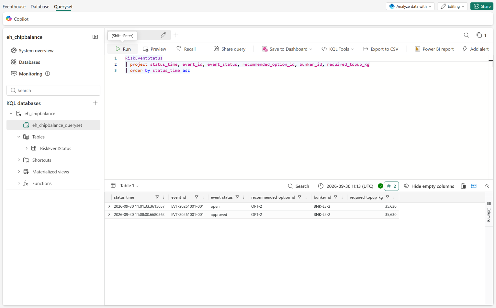

2.  Notebook은 Lakehouse에도 기록합니다. `dbo.chip_decision_log`에 `EVT-20261001-001`, `OPT-2`, `approved` 행이 생기고, `gold.fact_risk_event`의 `status`가 `approved`가 됩니다.

3.  `oa_chipbalance`로 돌아가 도구 모음의 **Stop**을 누릅니다. 에이전트는 멈추기 전까지 5분마다 조회하며 용량을 씁니다.

## Troubleshooting

- 실습 도중 Fabric 용량이 일시 중지되면 Azure의 **상태**와 **활동 로그**를 확인합니다. 조직 자동화가 중지한 용량은 임의로 재개하지 말고 관리자에게 확인합니다. 용량을 사용할 수 있는 시간 안에 결과 확인과 Operations agent의 **Stop**을 마칩니다. 실행 목록의 성공이나 Eventhouse 조회만으로 Lakehouse 승인 기록·위험 이벤트 상태·agent 중지까지 확인한 것으로 간주하지 않습니다.
- **Generate playbook** 뒤 **No playbook generated**와 함께 데이터를 어디서 읽을지 알 수 없다는 안내가 보이면, 지침에 `RiskEventStatus.event_status`처럼 테이블 이름과 열 이름이 들어 있는지, **Knowledge**가 `eh_chipbalance`인지 확인합니다. 저장한 뒤 다시 **Generate playbook**을 누릅니다.
- 데이터 원본이 요청을 제한하고 있다는 안내(rate-limiting)가 보이면 1~2분 뒤 다시 **Generate playbook**을 누릅니다.
- **Start**를 누를 수 없으면 Playbook을 만든 뒤 저장했는지 확인합니다.
- Teams 채팅 목록에 **Fabric operations agent**가 없으면 Teams 왼쪽 **앱**에서 `Fabric Operations Agent`를 검색해 추가합니다.
- 10분이 지나도 메시지가 오지 않으면 에이전트가 시작 상태인지(**Stop**을 누를 수 있는지), 6단계 명령을 **Start** 뒤에 실행했는지 확인합니다. 도구 모음의 **View activity**에서 규칙이 실행된 기록을 볼 수 있습니다.
- 승인 요청은 3일 안에 응답하지 않으면 만료됩니다.
- Notebook 실행이 실패하면 Fabric 왼쪽 **Monitor**에서 `nb_record_decision` 실행 기록을 열어 오류를 확인합니다. 3단계에서 `lh_chipbalance_p001`을 추가했는지 확인합니다.
- `Action submitted`는 실행 요청 접수이지 완료 알림이 아닙니다. Monitor의 완료 상태와 Eventhouse·Lakehouse의 세 결과를 모두 확인합니다. 두 저장소에 대한 갱신은 단일 트랜잭션이 아니므로 실패한 셀과 각 저장소의 상태를 먼저 확인한 뒤 재시도합니다.
- `option_id` 불일치 오류이면 조치에 전달된 값과 현재 이벤트의 `recommended_option_id`를 비교합니다. 추천안과 다른 값을 승인 기록에 남기지 않습니다.
- 반복 실습에서는 **Stop**으로 에이전트를 멈춘 뒤, **실습 전용** `RiskEventStatus` 이력이 필요 없을 때만 `.clear table RiskEventStatus data`로 지웁니다. Lakehouse의 이벤트·승인 로그와 agent의 전이 상태는 별개입니다. 에이전트를 다시 시작하고 6단계를 실행하되, 새 알림이 생기지 않으면 **View activity / Activity log**에서 조건·객체 상태를 확인합니다.

## 다음 단계

12장의 근거 검토를 마친 뒤 이 장의 승인·결과 확인·Stop까지 끝냈으면 [13. 마무리](13-finish.md)로 갑니다. [12. Foundry agent](12-foundry-agent.md)의 Work IQ 참고 단계는 선택 사항이며, 이미 만든 Foundry 프로젝트와 에이전트를 다시 만들지 않습니다.
