# 12. Foundry agent

[목차](../README.md) \| 이전: [11. Operations agent](11-operations-agent.md) \| 다음: [13. 마무리](13-finish.md)

11장에서 Operations agent가 Teams로 대응안 `OPT-2`를 제안했습니다. 이 장에서는 Microsoft Foundry에 에이전트 `fa-chipbalance`를 만들고, **Fabric IQ** 도구로 08장의 Ontology `ont_chipbalance`를 연결합니다. 담당자는 승인하기 전에 이 에이전트에게 대응안의 근거를 묻습니다. 승인은 그대로 Teams에서 합니다.

| 항목 | 역할 |
|----|----|
| Foundry 프로젝트 `chipbalance-p001` | 에이전트, 모델 배포, 도구 연결을 모아 두는 작업 공간입니다. |
| 에이전트 `fa-chipbalance` | 한국어 지침에 따라 질문에 답합니다. 화면 예시의 모델은 `gpt-5`이며, 실제 배포는 관리자 안내를 따릅니다. |
| Fabric IQ 도구 (`ont_chipbalance`) | 질문을 Ontology에 넘겨 엔터티·관계와 연결된 데이터로 답을 받아 옵니다. 연결에 인증한 사용자의 위임된 Fabric 권한으로 읽습니다. |

에이전트 이름에는 영문, 숫자, `-`만 쓸 수 있습니다. 그래서 `fa_chipbalance`가 아니라 `fa-chipbalance`로 만듭니다.

## 시작 전 확인

- 08장에서 적용·게시한 `ont_chipbalance`와 09장의 업무 설명을 준비합니다. 연결에 인증할 사용자는 Ontology뿐 아니라 바인딩된 Lakehouse 등 각 데이터 원본도 읽을 수 있어야 합니다.
- Ontology MCP에는 **유료 Fabric F2 이상** 또는 **Fabric이 활성화된 Power BI Premium P1 이상** 용량이 필요합니다. Trial 용량으로 대체하지 않습니다([Ontology MCP 조건](https://learn.microsoft.com/en-us/fabric/iq/ontology/how-to-use-ontology-mcp-server#prerequisites)). Fabric 지역·테넌트 설정은 [관리자 준비 가이드](../admin/README.md)의 "3. Microsoft Fabric"을 확인합니다.
- 프로젝트를 만들 Azure 권한, 프로젝트의 **Foundry User** 역할, 연결을 만들 **Foundry Project Manager** 역할과 사용 가능한 모델 배포·할당량을 관리자에게 확인합니다. OAuth에 참여하는 사용자·에이전트 실행 ID에도 필요한 Foundry 역할이 있어야 합니다([Fabric IQ 사전 조건](https://learn.microsoft.com/en-us/azure/foundry/agents/how-to/tools/fabric-iq#prerequisites)).
- 관리자가 준비한 **BYO Entra 앱 또는 managed OAuth** 위임 인증 연결을 사용합니다. Foundry와 Fabric에 같은 계정으로 로그인하는 것만으로 연결 인증·동의가 끝나는 것은 아닙니다. 연결이 없으면 먼저 [관리자 준비 가이드](../admin/README.md)의 "4. Microsoft Foundry"에 따라 준비합니다. **BYO Entra**를 쓰는 관리자는 Power BI Service의 위임 권한 `Item.Execute.All`, `Item.Read.All`, 관리자 동의, Foundry가 제공하는 OAuth redirect URI 등록까지 완료해야 합니다. 준비된 managed OAuth 연결을 쓰는 참가자는 앱을 직접 만들지 않습니다([공식 인증 안내](https://learn.microsoft.com/en-us/azure/foundry/agents/how-to/tools/fabric-iq#authentication-and-security)).

화면의 기본 모델·버튼·도구 표시와 AI 응답은 환경에 따라 달라질 수 있습니다. 아래 시간은 참고값이며, 답의 숫자와 실제 도구 출력을 검증합니다.

## 1. Foundry 프로젝트 만들기

1.  브라우저에서 <https://ai.azure.com> 을 열고 Fabric과 같은 계정으로 로그인합니다. 오른쪽 위 **새 Foundry** 스위치가 켜져 있는지 확인합니다.

2.  **모든 리소스** 화면 오른쪽 위의 **프로젝트 만들기**를 누릅니다.

3.  **프로젝트 만들기** 창에서 아래와 같이 입력하고 **만들기**를 누릅니다.

    | 필드 | 값 |
    |----|----|
    | **프로젝트 이름** | `chipbalance-p001` 입력 |
    | **고급 옵션** \> **Foundry 리소스** | `fdy-chipbalance-p001` 입력 |
    | **지역** | 관리자가 지정한 Agent Service·모델 지원 지역 선택. 캡처 예시는 `Sweden Central` |
    | **구독**, **리소스 그룹** | 관리자가 알려 준 값 선택 |
    | **Foundry에서 제공하는 모든 항목을 탐색할 수 있도록 권장 리소스를 설정합니다.** | 끔. 추적 기록용 App Insights 리소스를 만들지 않습니다. |

    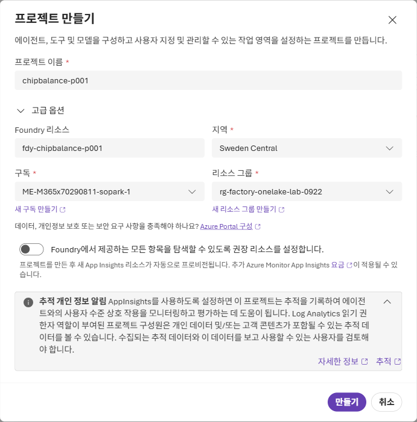

4.  **프로젝트를 만드는 중** 창이 닫히고 **모두 완료했습니다. 에이전트를 구성해 보겠습니다.**가 보이면 **그럼 시작합시다.**를 누릅니다.

**예상 결과:** 위쪽에 `chipbalance-p001`이 보이고, **환영합니다** 아래에 **에이전트 빌드** 카드와 **프로젝트 엔드포인트**가 있습니다. (2~3분)

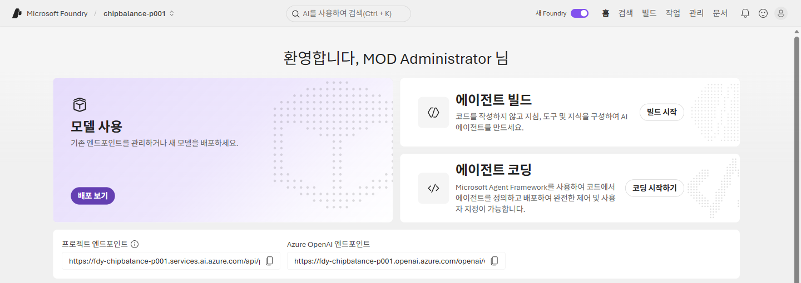

## 2. 에이전트 만들기

1.  **에이전트 빌드** 카드의 **빌드 시작**을 누릅니다.

2.  **에이전트 만들기** 창의 **에이전트 이름**에 `fa-chipbalance`를 입력합니다. **상호 작용 모드**는 **텍스트**를 그대로 두고 **만들기**를 누릅니다.

    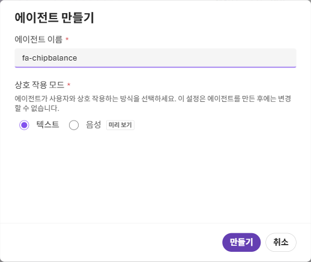

**예상 결과:** `fa-chipbalance`의 **플레이그라운드**가 열립니다. 화면 예시에는 **모델** `gpt-5`와 **웹 검색** 도구가 있습니다. 기본 모델과 자동 배포 여부는 환경에 따라 다릅니다. 모델 선택·배포 안내가 나오면 관리자가 확인한 모델 배포를 선택하고, 완료 후 **모델**에 표시된 배포를 확인합니다. `gpt-5` 자동 배포나 할당량 확보를 가정하지 않습니다. 참고 시간은 1~2분입니다([모델·지역·도구 지원](https://learn.microsoft.com/en-us/azure/foundry/agents/concepts/limits-quotas-regions#supported-models)).

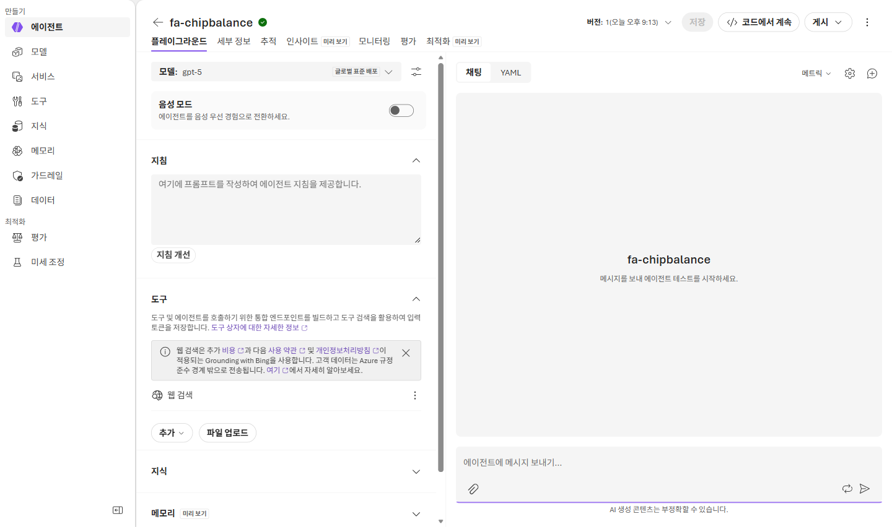

## 3. 지침 넣기

1.  **지침** 입력 칸에 아래 내용을 붙여 넣습니다.

    ``` text
    너는 필름 공장의 원료 칩 수급 대응안 검토 도우미다. Operations agent가 Teams로 제안한 대응안을 담당자가 승인하기 전에 근거를 확인하도록 돕는다.
    - 생산계획, 벙커 재고, 오더, 대응안 같은 데이터 질문은 반드시 Fabric IQ 도구(ont_chipbalance)로 조회하고, 조회한 값만 근거로 답한다. 도구 결과에 없는 숫자는 만들지 않는다.
    - 답에는 근거로 쓴 엔터티와 핵심 값(벙커, 날짜, kg)을 적는다.
    - 승인이나 거절은 하지 않는다. 결정은 담당자가 Teams에서 한다.
    - 한국어로 짧게 답한다.
    ```

2.  **도구**에 **웹 검색**이 있으면 오른쪽 **⋮**를 누르고 **제거**를 고릅니다. 이 에이전트는 인터넷이 아니라 Ontology만 근거로 답합니다.

## 4. Fabric IQ 도구로 Ontology 연결하기

1.  **도구** 아래의 **추가**를 누르고 **도구 추가**를 고릅니다.

    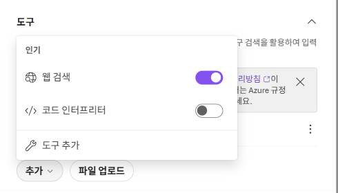

2.  **도구 선택** 창의 **구성됨** 탭에서 **Fabric IQ(OneLake 카탈로그)**를 고르고 **도구 추가**를 누릅니다.

    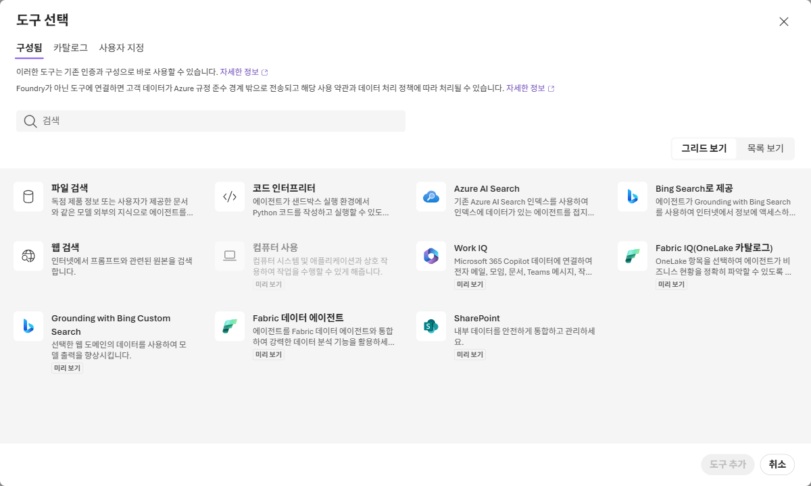

3.  **OneLake 카탈로그** 창의 **키워드로 필터링**에 `ont_chipbalance`를 입력합니다. 위치가 `chipbalance-p001`인 `ont_chipbalance`를 고르고 **추가**를 누릅니다.

    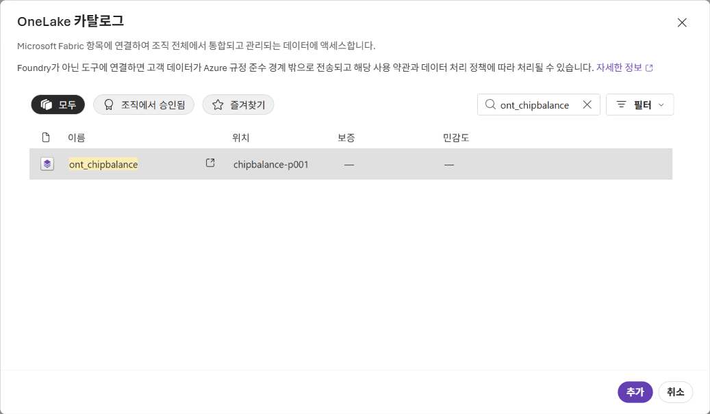

4.  연결 선택이나 인증 안내가 나오면 관리자가 준비한 Ontology용 **BYO Entra/managed OAuth** 연결을 선택하고, 안내에 따라 Fabric 원본을 읽을 사용자로 로그인·동의합니다. 연결이 없거나 관리자 동의가 필요하면 설정을 먼저 완료합니다. 항목 선택만으로 인증이 완료됐다고 판단하지 않습니다.

5.  오른쪽 위의 **저장**을 누릅니다.

**예상 결과:** **도구**에 **Fabric IQ (ontchipbalance)** 하나만 있고, **지침**에 3단계 내용이 들어 있습니다. **버전** 번호가 하나 올라갑니다.

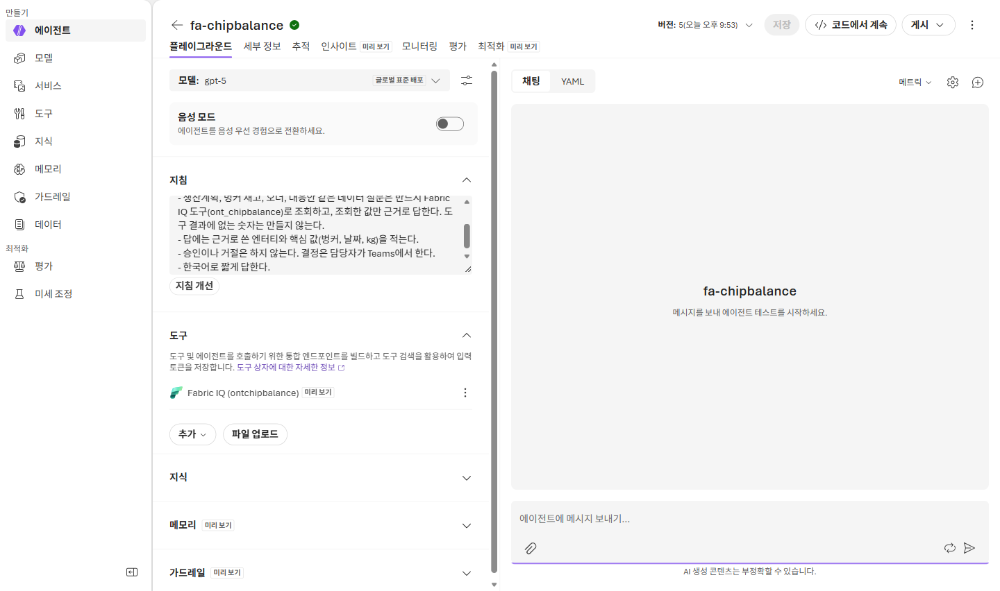

## 5. 에이전트에 질문하기

1.  오른쪽 채팅 창의 **에이전트에 메시지 보내기...**에 아래 질문을 입력하고 보냅니다.

    ``` text
    OPT-2(BNK-L1-2 → BNK-L3-2 PET-SD 40,000 kg 이송)를 반영하면 BNK-L1-2의 최저 기말재고는 몇 kg이고, 안전재고 이상인가요?
    ```

    첫 호출에 `CONSENT_REQUIRED`가 나오면 오류에 표시된 동의 URL을 열어 인증·동의를 완료한 뒤 같은 질문을 다시 보냅니다. 사용자 동의는 관리자 동의나 데이터 원본 권한을 대신하지 않습니다.

    **검증 목표:** 최저 기말재고 16,763 kg(2026-11-01), 안전재고 6,000 kg으로 안전재고 이상인지 확인합니다. 근거는 **ResponseOption** `OPT-2`(BNK-L1-2 → BNK-L3-2, 40,000 kg, 첫 도착일 2026-10-03), **Bunker** BNK-L1-2의 안전재고, **OptionBalance**의 일자별 기말재고이며, 화면 예시에는 근거 표시 `ontchipbalance`가 있습니다. 07장 정답 Notebook과 09장 Q4의 핵심 값에 비교합니다. AI 응답이 항상 맞는 것은 아니므로 다음 단계에서 도구 출력을 확인합니다. 전체 대화의 참고 시간은 1~2분이며, 개별 MCP 호출에는 별도 시간 제한이 있습니다.

    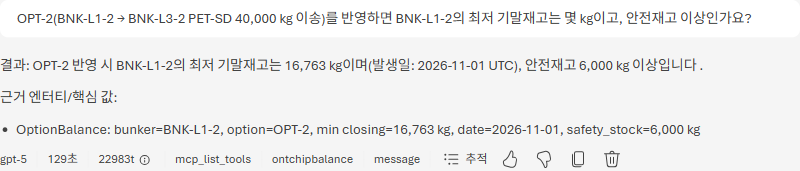

2.  답 아래의 **추적**을 누르고, 왼쪽 목록에서 **ontchipbalance: ask_ontology**를 고릅니다.

    **예상 결과:** 에이전트가 Fabric IQ 도구의 `ask_ontology`로 질문을 Ontology에 넘겼고, **출력**에 Ontology가 데이터에서 찾은 결론(최저 기말재고 16,763 kg, 일자 2026-11-01, 안전재고 6,000 kg, 안전재고 이상)이 들어 있습니다. 에이전트는 이 결과를 근거로 답했습니다.

    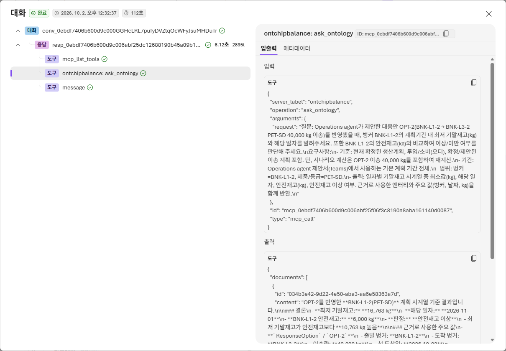

3.  오른쪽 위 **X**를 눌러 추적 창을 닫습니다.

Fabric IQ 도구는 질문에 따라 Ontology의 엔터티 정의를 읽거나(`list_ontology_entities`), 질문을 Ontology에 넘겨 연결된 데이터로 답을 받습니다(`ask_ontology`).

## 6. (참고) Work IQ 도구 붙이기

같은 **도구 추가** 화면에서 **Work IQ**를 붙이면 에이전트가 Microsoft 365의 메일, Teams 메시지, 일정 같은 업무 맥락도 찾습니다. 요구 조건은 연결 경로에 따라 다릅니다. **Work IQ API(A2A·REST·MCP)**는 **Copilot Credits 사용량 기반 과금**을 활성화해야 하며, 이 경로를 커넥터 라이선스 조건과 혼동하지 않습니다. 커넥터 기반 Microsoft 365 도구는 선택한 커넥터에 따라 호출 사용자에게 Microsoft 365 Copilot 라이선스를 요구할 수 있습니다([공식 사전 조건](https://learn.microsoft.com/en-us/azure/foundry/agents/how-to/tools/work-iq#prerequisites)). 이 실습에서는 추가 과금·권한·테넌트 설정을 진행하지 않고 선택 화면만 확인합니다.

1.  **도구** 아래의 **추가** \> **도구 추가**를 누르고, **도구 선택** 창에서 **Work IQ**를 고른 뒤 **도구 추가**를 누릅니다.

    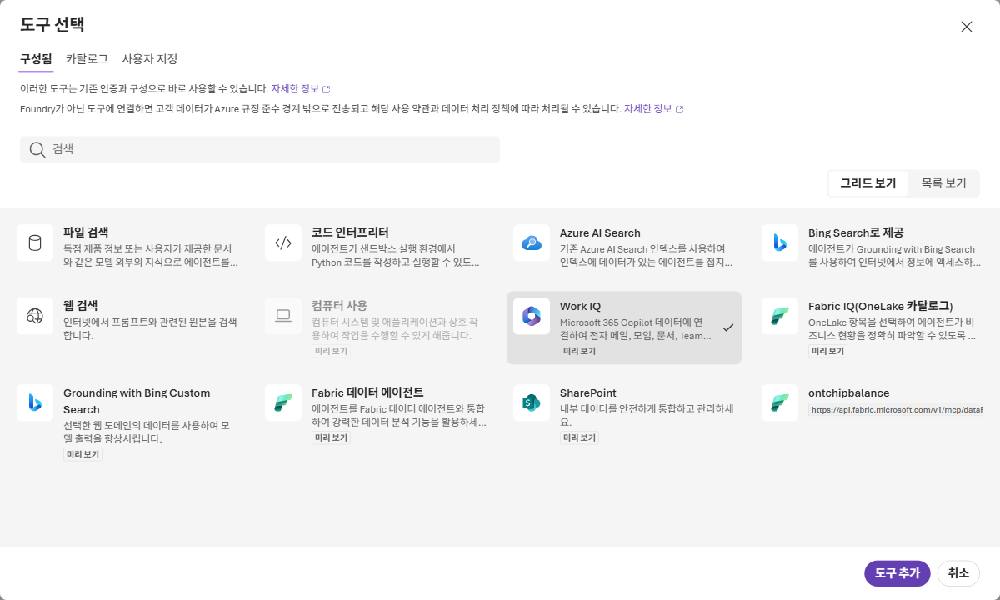

2.  **Work IQ 도구 추가** 창에서 도구 선택 화면을 살펴봅니다. 예를 들어 **Work IQ Teams**와 **Work IQ Mail**을 고르면 각각 **새 연결 만들기**가 보입니다. **새 연결 만들기**나 **추가**는 누르지 않습니다.

    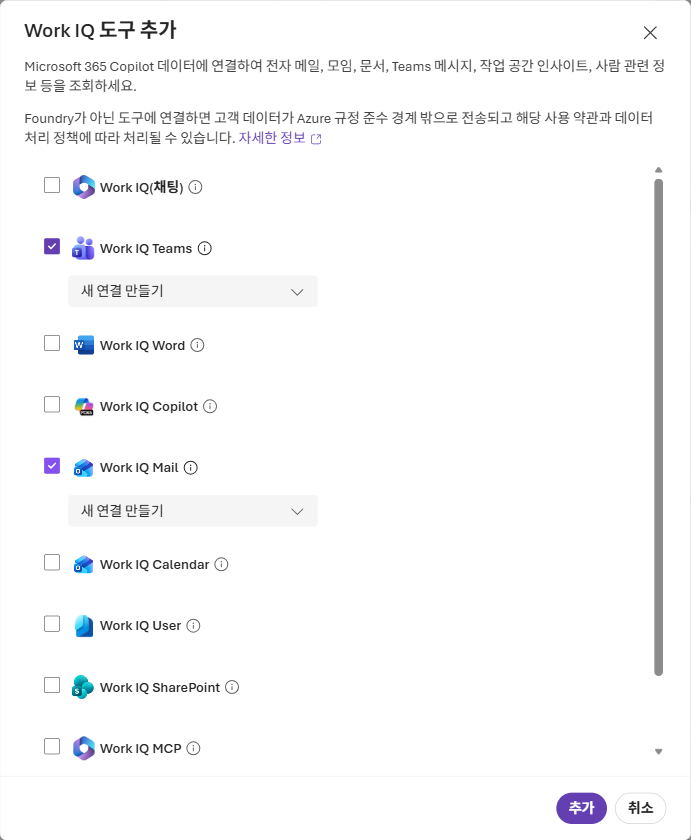

3.  **취소**를 누릅니다. **도구**에는 **Fabric IQ (ontchipbalance)** 하나만 남깁니다.

## Troubleshooting

- **프로젝트 만들기**에서 권한 오류가 나면 관리자에게 리소스 그룹 권한을 확인합니다([관리자 준비 가이드](../admin/README.md)의 "4. Microsoft Foundry").
- **에이전트 이름**에 `_`를 넣으면 만들 수 없습니다. `fa-chipbalance`처럼 `-`를 씁니다.
- 모델 배포가 실패하거나 `gpt-5`가 선택되지 않으면 관리자에게 해당 구독·지역의 모델 사용 권한, 할당량, Agent Service·MCP 지원을 확인합니다. 자동 배포를 반복하지 말고 준비된 지원 모델 배포를 선택합니다.
- **OneLake 카탈로그**에 `ont_chipbalance`가 없으면 올바른 테넌트·계정인지, `chipbalance-p001`과 Ontology에 접근할 수 있는지, 08장 적용·게시가 완료됐는지 확인합니다.
- `401` 또는 연결 인증 오류는 관리자가 BYO Entra 앱의 관리자 동의·scope·redirect URI와 연결 설정을 확인합니다. `403`이면 Foundry 역할과 인증 사용자의 Ontology·각 Fabric 데이터 원본 읽기 권한을 따로 확인합니다.
- `CONSENT_REQUIRED`는 첫 OAuth 사용 때 나올 수 있습니다. 반환된 URL에서 사용자 동의를 완료하고 재시도합니다. 계속 실패하면 연결 설정과 관리자 동의를 확인합니다.
- `404` 또는 `Not Found`이면 선택한 작업 영역·Ontology와 연결의 엔드포인트가 맞는지, 정의가 게시됐는지 확인합니다([Fabric IQ 문제 해결](https://learn.microsoft.com/en-us/azure/foundry/agents/how-to/tools/fabric-iq#troubleshoot)).
- 질문을 보냈는데 **추적**에 `ontchipbalance: ask_ontology`가 없으면 **도구**에 **Fabric IQ (ontchipbalance)**가 있는지, **저장**을 눌렀는지 확인하고 오른쪽 위 **새 채팅**에서 다시 묻습니다.
- MCP 호출이 시간 초과되면 질문의 Bunker·대응안·기간을 좁히거나 안전재고 조회와 최저 재고 조회를 나눠 재시도합니다. Foundry의 **비스트리밍 MCP 호출 제한은 100초**이며, **Ontology 엔드포인트는 동기 호출**입니다. 모델의 background mode를 켜는 것만으로 이 제한을 해결할 수 없습니다. Fabric IQ의 장기 background 실행 지원은 Data agent 엔드포인트에만 해당합니다([MCP 제한](https://learn.microsoft.com/en-us/azure/foundry/agents/how-to/tools/model-context-protocol#known-limitations), [항목별 실행 방식](https://learn.microsoft.com/en-us/azure/foundry/agents/how-to/tools/fabric-iq#find-your-fabric-iq-server-details)).
- 도구 출력이 비어 있거나 숫자가 다르면 08장의 속성·데이터 바인딩과 09장의 설명을 확인하고, 정답 Notebook의 값과 비교합니다. 확인되지 않은 답으로 Teams 승인을 진행하지 않습니다.

## 공식 문서

- [Fabric IQ 연결·인증·문제 해결](https://learn.microsoft.com/en-us/azure/foundry/agents/how-to/tools/fabric-iq)
- [Foundry MCP 호출과 제한 사항](https://learn.microsoft.com/en-us/azure/foundry/agents/how-to/tools/model-context-protocol)
- [Work IQ 연결 경로별 과금·라이선스 조건](https://learn.microsoft.com/en-us/azure/foundry/agents/how-to/tools/work-iq#prerequisites)

## 다음 단계

[13. 마무리](13-finish.md)
